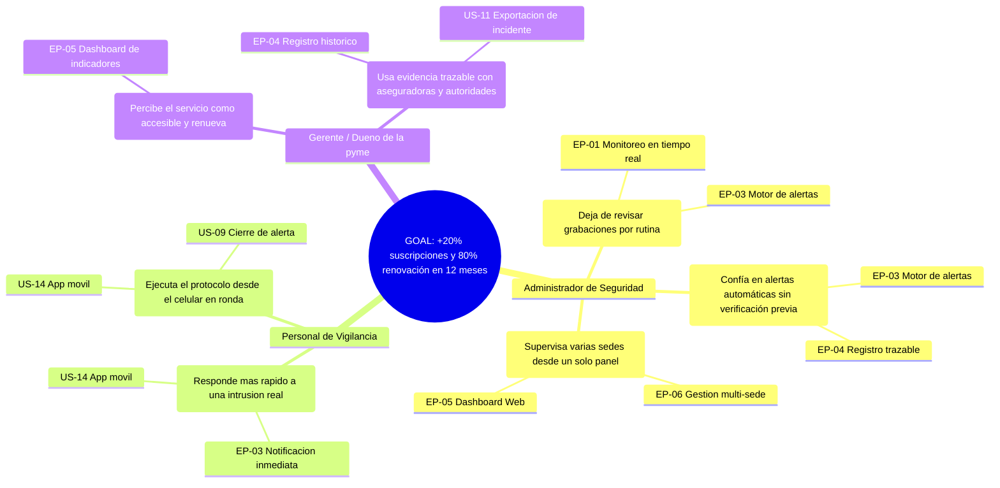

<div align="center">

<h3>Universidad Peruana de Ciencias Aplicadas</h3>

<br>

<strong>Ingeniería de Software - 2026-02</strong><br>
<strong>1ASI0572 - Desarrollo de Soluciones IOT</strong><br>
<strong>NRC: 8729</strong><br>
<strong>Profesor: Marco Antonio Leon Baca</strong><br>

<br><strong>Informe del Trabajo Final</strong><br><br>

<strong>Startup: Centinela Labs </strong><br>
<strong>Producto: SECURIOT </strong><br>


### Team Members:

Hurtado Balcazar Rommel Daniel     u202517474


<strong> 19 de Septiembre de 2026</strong><br>
</div>
<div style="page-break-after: always;"></div>

# Registro de Versiones del Informe

| Versión | Fecha | Autor | Descripción de modificación |
|---|---|---|---|

# Project Report Collaboration Insights

URL del repositorio: _Pendiente de agregar_

_Pendiente de desarrollo._

# Contenido

- [Registro de Versiones del Informe](#registro-de-versiones-del-informe)
- [Project Report Collaboration Insights](#project-report-collaboration-insights)
- [Student Outcome](#student-outcome)
- [Capítulo I: Introducción](#capítulo-i-introducción)
  - [1.1. Startup Profile](#11-startup-profile)
    - [1.1.1. Descripción de la Startup](#111-descripción-de-la-startup)
    - [1.1.2. Perfiles de integrantes del equipo](#112-perfiles-de-integrantes-del-equipo)
  - [1.2. Solution Profile](#12-solution-profile)
    - [1.2.1. Antecedentes y problemática](#121-antecedentes-y-problemática)
    - [1.2.2. Lean UX Process](#122-lean-ux-process)
      - [1.2.2.1. Lean UX Problem Statements](#1221-lean-ux-problem-statements)
      - [1.2.2.2. Lean UX Assumptions](#1222-lean-ux-assumptions)
      - [1.2.2.3. Lean UX Hypothesis Statements](#1223-lean-ux-hypothesis-statements)
      - [1.2.2.4. Lean UX Canvas](#1224-lean-ux-canvas)
  - [1.3. Segmentos objetivo](#13-segmentos-objetivo)
- [Capítulo II: Requirements Elicitation & Analysis](#capítulo-ii-requirements-elicitation--analysis)
  - [2.1. Competidores](#21-competidores)
    - [2.1.1. Análisis competitivo](#211-análisis-competitivo)
    - [2.1.2. Estrategias y tácticas frente a competidores](#212-estrategias-y-tácticas-frente-a-competidores)
  - [2.2. Entrevistas](#22-entrevistas)
    - [2.2.1. Diseño de entrevistas](#221-diseño-de-entrevistas)
    - [2.2.2. Registro de entrevistas](#222-registro-de-entrevistas)
    - [2.2.3. Análisis de entrevistas](#223-análisis-de-entrevistas)
  - [2.3. Needfinding](#23-needfinding)
    - [2.3.1. User Personas](#231-user-personas)
    - [2.3.2. User Task Matrix](#232-user-task-matrix)
    - [2.3.3. User Journey Mapping](#233-user-journey-mapping)
    - [2.3.4. Empathy Mapping](#234-empathy-mapping)
  - [2.4. Big Picture EventStorming](#24-big-picture-eventstorming)
  - [2.5. Ubiquitous Language](#25-ubiquitous-language)
- [Capítulo III: Requirements Specification](#capítulo-iii-requirements-specification)
  - [3.1. User Stories](#31-user-stories)
  - [3.2. Impact Mapping](#32-impact-mapping)
  - [3.3. Product Backlog](#33-product-backlog)
- [Capítulo IV: Solution Software Design](#capítulo-iv-solution-software-design)
  - [4.1. Strategic-Level Domain-Driven Design](#41-strategic-level-domain-driven-design)
    - [4.1.1. Design-Level EventStorming](#411-design-level-eventstorming)
      - [4.1.1.1. Candidate Context Discovery](#4111-candidate-context-discovery)
      - [4.1.1.2. Domain Message Flows Modeling](#4112-domain-message-flows-modeling)
      - [4.1.1.3. Bounded Context Canvases](#4113-bounded-context-canvases)
    - [4.1.2. Context Mapping](#412-context-mapping)
    - [4.1.3. Software Architecture](#413-software-architecture)
      - [4.1.3.1. Software Architecture System Landscape Diagram](#4131-software-architecture-system-landscape-diagram)
      - [4.1.3.2. Software Architecture Context Level Diagrams](#4132-software-architecture-context-level-diagrams)
      - [4.1.3.3. Software Architecture Container Level Diagrams](#4133-software-architecture-container-level-diagrams)
      - [4.1.3.4. Software Architecture Deployment Diagrams](#4134-software-architecture-deployment-diagrams)
  - [4.2. Tactical-Level Domain-Driven Design](#42-tactical-level-domain-driven-design)
    - [4.2.1. Bounded Context: <Nombre del Bounded Context>](#421-bounded-context-nombre-del-bounded-context)
      - [4.2.1.1. Domain Layer](#4211-domain-layer)
      - [4.2.1.2. Interface Layer](#4212-interface-layer)
      - [4.2.1.3. Application Layer](#4213-application-layer)
      - [4.2.1.4. Infrastructure Layer](#4214-infrastructure-layer)
      - [4.2.1.5. Bounded Context Software Architecture Component Level Diagrams](#4215-bounded-context-software-architecture-component-level-diagrams)
      - [4.2.1.6. Bounded Context Software Architecture Code Level Diagrams](#4216-bounded-context-software-architecture-code-level-diagrams)
      - [4.2.1.6.1. Bounded Context Domain Layer Class Diagrams](#42161-bounded-context-domain-layer-class-diagrams)
      - [4.2.1.6.2. Bounded Context Database Design Diagram](#42162-bounded-context-database-design-diagram)
- [Capítulo V: Solution UI/UX Design](#capítulo-v-solution-uiux-design)
  - [5.1. Style Guidelines](#51-style-guidelines)
    - [5.1.1. General Style Guidelines](#511-general-style-guidelines)
    - [5.1.2. Web, Mobile and IoT Style Guidelines](#512-web-mobile-and-iot-style-guidelines)
  - [5.2. Information Architecture](#52-information-architecture)
    - [5.2.1. Organization Systems](#521-organization-systems)
    - [5.2.2. Labeling Systems](#522-labeling-systems)
    - [5.2.3. SEO Tags and Meta Tags](#523-seo-tags-and-meta-tags)
    - [5.2.4. Searching Systems](#524-searching-systems)
    - [5.2.5. Navigation Systems](#525-navigation-systems)
  - [5.3. Landing Page UI Design](#53-landing-page-ui-design)
    - [5.3.1. Landing Page Wireframe](#531-landing-page-wireframe)
    - [5.3.2. Landing Page Mock-up](#532-landing-page-mock-up)
  - [5.4. Applications UX/UI Design](#54-applications-uxui-design)
    - [5.4.1. Applications Wireframes](#541-applications-wireframes)
    - [5.4.2. Applications Wireflow Diagrams](#542-applications-wireflow-diagrams)
    - [5.4.3. Applications Mock-ups](#543-applications-mock-ups)
    - [5.4.4. Applications User Flow Diagrams](#544-applications-user-flow-diagrams)
  - [5.5. Applications Prototyping](#55-applications-prototyping)
  - [5.6. IoT Device Design](#56-iot-device-design)
- [Capítulo VI: Product Implementation, Validation & Deployment](#capítulo-vi-product-implementation-validation--deployment)
  - [6.1. Software Configuration Management](#61-software-configuration-management)
    - [6.1.1. Software Development Environment Configuration](#611-software-development-environment-configuration)
    - [6.1.2. Source Code Management](#612-source-code-management)
    - [6.1.3. Source Code Style Guide & Conventions](#613-source-code-style-guide--conventions)
    - [6.1.4. Software Deployment Configuration](#614-software-deployment-configuration)
  - [6.2. Landing Page, Services & Applications Implementation](#62-landing-page-services--applications-implementation)
    - [6.2.1. Sprint 1](#621-sprint-1)
      - [6.2.1.1. Sprint Planning 1](#6211-sprint-planning-1)
      - [6.2.1.2. Aspect Leaders and Collaborators](#6212-aspect-leaders-and-collaborators)
      - [6.2.1.3. Sprint Backlog 1](#6213-sprint-backlog-1)
      - [6.2.1.4. Development Evidence for Sprint Review](#6214-development-evidence-for-sprint-review)
      - [6.2.1.5. Testing Suite Evidence for Sprint Review](#6215-testing-suite-evidence-for-sprint-review)
      - [6.2.1.6. Execution Evidence for Sprint Review](#6216-execution-evidence-for-sprint-review)
      - [6.2.1.7. Services Documentation Evidence for Sprint Review](#6217-services-documentation-evidence-for-sprint-review)
      - [6.2.1.8. Software Deployment Evidence for Sprint Review](#6218-software-deployment-evidence-for-sprint-review)
      - [6.2.1.9. Team Collaboration Insights during Sprint](#6219-team-collaboration-insights-during-sprint)
    - [6.2.2. Sprint 2](#622-sprint-2)
      - [6.2.2.1. Sprint Planning 2](#6221-sprint-planning-2)
      - [6.2.2.2. Aspect Leaders and Collaborators](#6222-aspect-leaders-and-collaborators)
      - [6.2.2.3. Sprint Backlog 2](#6223-sprint-backlog-2)
      - [6.2.2.4. Development Evidence for Sprint Review](#6224-development-evidence-for-sprint-review)
      - [6.2.2.5. Testing Suite Evidence for Sprint Review](#6225-testing-suite-evidence-for-sprint-review)
      - [6.2.2.6. Execution Evidence for Sprint Review](#6226-execution-evidence-for-sprint-review)
      - [6.2.2.7. Services Documentation Evidence for Sprint Review](#6227-services-documentation-evidence-for-sprint-review)
      - [6.2.2.8. Software Deployment Evidence for Sprint Review](#6228-software-deployment-evidence-for-sprint-review)
      - [6.2.2.9. Team Collaboration Insights during Sprint](#6229-team-collaboration-insights-during-sprint)
    - [6.2.3. Sprint 3](#623-sprint-3)
      - [6.2.3.1. Sprint Planning 3](#6231-sprint-planning-3)
      - [6.2.3.2. Aspect Leaders and Collaborators](#6232-aspect-leaders-and-collaborators)
      - [6.2.3.3. Sprint Backlog 3](#6233-sprint-backlog-3)
      - [6.2.3.4. Development Evidence for Sprint Review](#6234-development-evidence-for-sprint-review)
      - [6.2.3.5. Testing Suite Evidence for Sprint Review](#6235-testing-suite-evidence-for-sprint-review)
      - [6.2.3.6. Execution Evidence for Sprint Review](#6236-execution-evidence-for-sprint-review)
      - [6.2.3.7. Services Documentation Evidence for Sprint Review](#6237-services-documentation-evidence-for-sprint-review)
      - [6.2.3.8. Software Deployment Evidence for Sprint Review](#6238-software-deployment-evidence-for-sprint-review)
      - [6.2.3.9. Team Collaboration Insights during Sprint](#6239-team-collaboration-insights-during-sprint)
  - [6.3. Validation Interviews](#63-validation-interviews)
    - [6.3.1. Diseño de Entrevistas](#631-diseño-de-entrevistas)
    - [6.3.2. Registro de Entrevistas](#632-registro-de-entrevistas)
    - [6.3.3. Evaluaciones según heurísticas](#633-evaluaciones-según-heurísticas)
  - [6.4. Video About-the-Product](#64-video-about-the-product)
- [Conclusiones](#conclusiones)
  - [Conclusiones y recomendaciones](#conclusiones-y-recomendaciones)
  - [Video About-the-Team](#video-about-the-team)
- [Bibliografía](#bibliografía)
- [Anexos](#anexos)

# Student Outcome

_Pendiente de desarrollo._

# Capítulo I: Introducción

## 1.1. Startup Profile

### 1.1.1. Descripción de la Startup

Centinela Labs es una startup peruana de base tecnológica especializada en soluciones de seguridad patrimonial inteligente para el sector empresarial e industrial, mediante la integración de Internet de las Cosas (IoT), Edge Computing, Cloud Computing e Inteligencia Artificial. Nace de identificar una brecha crítica en la protección de activos productivos: las fábricas, almacenes, plantas industriales y oficinas corporativas dependen mayoritariamente de personal de vigilancia y videovigilancia pasiva, esquemas que reaccionan tarde frente a un intento de intrusión y que resultan costosos de escalar a medida que la empresa crece o abre nuevas sedes.

Su producto insignia, SECURIOT, es una plataforma de monitoreo de seguridad patrimonial dirigida a empresas, que utiliza visión por computadora e IA para identificar personas dentro de instalaciones productivas y administrativas, validar en tiempo real si su ingreso está autorizado, y activar de forma automática protocolos de respuesta ante una intrusión detectada: alarmas locales, notificación inmediata al personal de seguridad y a los responsables designados por la empresa, registro trazable del evento con fines de investigación y reporte a autoridades, y activación de controles de acceso en zonas restringidas (almacenes, líneas de producción, áreas de carga y descarga), siempre en cumplimiento de la normativa de seguridad y evacuación vigente.

La misión de Centinela Labs es reducir el tiempo entre la detección de una amenaza y la respuesta efectiva dentro de instalaciones empresariales, combinando dispositivos embebidos de bajo costo instalados en puntos críticos (accesos, perímetros, zonas de almacenamiento), procesamiento en el borde (edge) para decisiones de baja latencia, y una nube centralizada que permite gestión remota multi-sede, útil para empresas con más de una planta o almacén. Su visión es convertirse en la alternativa peruana de seguridad patrimonial inteligente para pequeñas y medianas empresas industriales y logísticas, un segmento históricamente desatendido por las soluciones de seguridad de gama alta orientadas solo a grandes corporaciones.

Como startup, Centinela Labs opera bajo un modelo de negocio escalable basado en suscripción (SaaS) por sede o perímetro monitoreado, complementado con la venta del hardware IoT (el dispositivo prototipo de la solución), apoyándose en tecnologías open-source y una arquitectura distribuida que facilita la incorporación de nuevos clientes empresariales sin rediseñar la solución.

### 1.1.2. Perfiles de integrantes del equipo

| Miembro | Descripción|
|---|---|
|  |**Hurtado Balcazar Rommel Daniel - U202517474** <br><br> Soy Rommel Hurtado Balcázar, tengo 23 años y estudio Ingeniería de Software en el 7to ciclo. Me considero un líder técnico orientado a la resolución de problemas, con capacidad para tomar decisiones y guiar al equipo hacia los objetivos del proyecto.<br><br>Cuento con experiencia en desarrollo fullstack, manejando tanto frontend como backend. En el lado del servidor trabajo principalmente con Java, y en el frontend utilizo React. Además, tengo conocimientos en bases de datos relacionales con SQL y no relacionales con MongoDB, así como experiencia con Node.js, Python y HTML/CSS.<br><br>He desarrollado proyectos propios fuera del ámbito universitario, lo que me ha dado una visión completa del ciclo de desarrollo de software. También me desenvuelvo en inglés a nivel intermedio-avanzado, lo que me permite acceder a documentación técnica y comunicarme en entornos internacionales. |
| member 2| -Descripcion- |
| member 3| -Descripcion-|
| member 4| -Descripcion-|
| member 5| -Descripcion-|
| memberv 6| -Descripcion-|
| member 7| -Descripcion-|

## 1.2. Solution Profile

### 1.2.1. Antecedentes y problemática

#### Antecedentes

La seguridad patrimonial se ha convertido en una preocupación creciente para el sector empresarial peruano, particularmente para la industria y la logística. Según la Encuesta de Opinión Industrial de la Sociedad Nacional de Industrias (SNI), una de cada cinco industrias fue víctima de la delincuencia, considerando robos, intentos de robo, extorsión, amenazas y otros delitos, durante el tercer trimestre de 2024. A nivel nacional, el 27.7% de los peruanos en zonas urbanas fue víctima de algún delito en los últimos seis meses, y de forma específica, los delitos contra el patrimonio representan la categoría de mayor incidencia delictiva en el país.

A pesar de este panorama, la mayoría de empresas peruanas continúa desprotegida financieramente frente al riesgo: solo el 5% de las pymes en Perú cuenta con un seguro patrimonial que las proteja frente a incendios, terremotos y robos, lo que agrava el impacto económico de cualquier incidente de seguridad no prevenido. En respuesta a esta exposición, las fábricas y plantas industriales han incrementado su inversión en seguridad para proteger instalaciones y maquinaria, y dicha inversión ya no se limita a personal de vigilancia, sino que abarca también tecnología avanzada como sistemas de control de acceso y software de gestión. Sin embargo, este tipo de tecnología suele estar disponible principalmente para grandes corporaciones con presupuestos de seguridad elevados, dejando a las pequeñas y medianas empresas industriales dependiendo de medidas más básicas como cercos eléctricos, candados de alta seguridad o vigilancia humana tradicional.

El resultado es una brecha entre la magnitud del riesgo patrimonial que enfrentan las empresas —especialmente las industriales, con instalaciones extensas, múltiples puntos de acceso y activos de alto valor como maquinaria e inventario— y la capacidad real de estas empresas, sobre todo las de menor tamaño, para acceder a sistemas de seguridad proactivos, escalables y económicamente viables.

#### Aplicación de la técnica 5W + 2H

| Pregunta| Respuesta |
|--|--|
| **Who** <br> (¿Quién?)| Empresas industriales, logísticas y comerciales de mediana escala en el Perú (fábricas, plantas de producción, almacenes, centros de distribución, oficinas corporativas), con foco inicial en Lima Metropolitana. |
| **What** <br> (¿Qué?) | Ausencia de un sistema de seguridad patrimonial accesible que identifique amenazas en tiempo real dentro de instalaciones empresariales y active una respuesta automática, en lugar de depender exclusivamente de vigilancia humana o revisión posterior de grabaciones. |
| **Where** <br> (¿Dónde?) | Parques industriales, zonas logísticas y corredores comerciales/empresariales de Lima Metropolitana, con potencial de escalar a otras ciudades del país. |
| **When** <br> (¿Cuándo?) | El problema se ha agravado de forma sostenida en los últimos años, con un incremento en la inversión en seguridad por parte de las industrias reportado durante 2024-2026. |
| **Why** <br> (¿Por qué?) | Porque los esquemas de seguridad tradicionales (vigilancia humana, CCTV pasivo) no logran anticipar ni contener una intrusión en el momento en que ocurre, y las soluciones tecnológicas avanzadas existentes suelen ser costosas y orientadas a grandes corporaciones, dejando desprotegidas a las pymes industriales. |
| **How** <br> (¿Cómo?) | A través de una plataforma IoT que combina dispositivos embebidos instalados en accesos y perímetros, procesamiento en el borde (edge computing) para decisiones de baja latencia, inteligencia artificial para identificación y validación de accesos, y una nube centralizada para gestión remota multi-sede, alertas y analítica histórica de incidentes. |
| **How Much** <br> (¿Cuánto?) | El costo de no resolver el problema incluye pérdidas directas de inventario y maquinaria, interrupción de operaciones productivas, y una exposición financiera agravada por el bajo nivel de aseguramiento patrimonial en el sector (solo 5% de pymes aseguradas), afectando la continuidad del negocio. |

#### Problematica

Las empresas industriales, logísticas y comerciales de mediana escala en el Perú enfrentan un nivel significativo de exposición a robos e intrusiones dentro de sus instalaciones, mientras que los sistemas de seguridad tecnológicamente avanzados disponibles en el mercado están mayormente orientados a grandes corporaciones con altos presupuestos, dejando a las pymes industriales dependiendo de esquemas de seguridad reactivos y de bajo nivel de automatización, lo que se traduce en pérdidas patrimoniales, interrupción de operaciones y una persistente vulnerabilidad frente a la delincuencia.

#### Puntos más importantes a resolver

> Identificación de personas en tiempo real dentro de instalaciones empresariales, distinguiendo entre personal autorizado, proveedores/visitantes y personas no identificadas.

> Validación automática de accesos a zonas restringidas (almacenes, líneas de producción, áreas de carga y descarga), reduciendo la dependencia exclusiva de personal de vigilancia.

> Activación inmediata de protocolos de respuesta ante una intrusión detectada (alarmas, notificación al personal de seguridad y a los responsables de la empresa), sin comprometer las rutas de evacuación del personal.

> Registro y trazabilidad de los eventos de seguridad, generando evidencia auditable para investigación interna y reporte a autoridades.

> Visualización de información cuantitativa (incidentes por sede, tiempos de respuesta, patrones de acceso) para la toma de decisiones de los administradores de seguridad de la empresa.

> Gestión remota multi-sede, para empresas con más de una planta, almacén u oficina.

> Un modelo de costo accesible para pequeñas y medianas empresas industriales, no solo para grandes corporaciones.

#### Objetivos

- Reducir el tiempo de detección y respuesta ante un intento de intrusión no autorizada dentro de instalaciones empresariales, respecto a los sistemas de vigilancia tradicionales.
- Brindar a los administradores de seguridad de la empresa una herramienta centralizada de monitoreo y control de accesos, accesible desde Web y dispositivos móviles.
- Proveer evidencia confiable y trazable de los incidentes de seguridad patrimonial para su reporte a autoridades y aseguradoras.
- Ofrecer un modelo de suscripción escalable y accesible económicamente para pymes industriales y logísticas.

#### Restricciones

- La solución se enfoca en el segmento empresarial e industrial (fábricas, almacenes, plantas de producción, oficinas corporativas), quedando fuera de alcance el segmento residencial.
- El mercado inicial de validación es Lima Metropolitana, considerando su alta concentración de parques industriales y zonas logísticas.
- El prototipo físico del dispositivo IoT cubrirá un subconjunto relevante de funcionalidades (captura de imagen/video, procesamiento básico en el borde, comunicación con el Edge API), no la totalidad de un sistema de seguridad industrial completo.
- Cualquier protocolo de control de accesos debe respetar la normativa vigente de seguridad y evacuación del personal, priorizando siempre su integridad física.
- El tratamiento de datos biométricos e imágenes de personas debe cumplir con la normativa peruana de protección de datos personales (Ley N° 29733) y principios de privacidad por diseño.
- El desarrollo debe realizarse utilizando exclusivamente las tecnologías, lenguajes y herramientas open-source indicadas en el curso.

### 1.2.2. Lean UX Process

El Lean UX Process de Jeff Gothelf y Josh Seiden convierte la problemática de la sección anterior en creencias explícitas (assumptions) sobre el negocio y los usuarios, y esas creencias en hypothesis statements que se pueden verificar con experimentos concretos. El análisis cubre todo el dominio del problema (seguridad patrimonial industrial y logística) y no un segmento por separado, porque el curso pide la versión del template para una iniciativa nueva (brand new initiative), pensada justamente para esa mirada agregada.

#### 1.2.2.1. Lean UX Problem Statements

El proyecto tiene un único Problem Statement, que agrupa a todos los segmentos identificados (fábricas, plantas de producción, almacenes, centros de distribución y oficinas corporativas de empresas industriales, logísticas y comerciales de mediana escala). El template exigido por el curso para una iniciativa nueva se completa en inglés, tal como aparece en el enunciado del proyecto:

> The current state of **industrial and logistics asset security in Peru** has focused mainly on **medium-sized industrial, logistics and commercial companies that protect their facilities through human surveillance and passive CCTV, reviewing footage only after an incident has already occurred**.
>
> What existing products/services fail to address is **the gap between the magnitude of the patrimonial risk these companies face (extensive facilities, multiple access points, high-value machinery and inventory) and their real capacity to access proactive, scalable and economically viable security systems, which today are priced and designed mainly for large corporations**.
>
> Our product/service will address this gap by **combining low-cost IoT devices installed at critical points (access points, perimeters, storage zones), edge computing for low-latency local decisions, and a centralized cloud platform that enables real-time threat identification, automatic access validation to restricted zones, and immediate activation of response protocols**.
>
> Our initial focus will be **medium-sized industrial and logistics companies located in Lima Metropolitana, with physical facilities that include restricted-access zones such as warehouses, production lines, and loading/unloading areas**.
>
> We'll know we are successful when we see **these companies subscribing to and renewing the platform, a measurable reduction in the time between an intrusion attempt and the activation of a response protocol, and an increase in the number of security events that are correctly logged, notified and resolved compared to their previous manual process**.

En español, el mismo Problem Statement dice lo siguiente. Hoy la seguridad patrimonial industrial y logística en el Perú descansa casi por completo en vigilancia humana y CCTV pasivo, que reacciona revisando grabaciones después de ocurrido el incidente, nunca antes. Lo que el mercado no resuelve es la brecha entre el tamaño real del riesgo que enfrentan estas empresas (instalaciones extensas, múltiples accesos, maquinaria e inventario de alto valor) y su capacidad real de pagar por sistemas de seguridad proactivos y escalables, que hoy están diseñados y con precios pensados solo para grandes corporaciones. SecurIoT cierra esa brecha combinando dispositivos IoT de bajo costo en los puntos críticos, edge computing para decisiones locales de baja latencia, y una nube centralizada que identifica amenazas en tiempo real, valida accesos a zonas restringidas y activa protocolos de respuesta de forma automática. El foco inicial son empresas industriales y logísticas medianas de Lima Metropolitana, con zonas de acceso restringido como almacenes, líneas de producción y áreas de carga y descarga. El éxito se mide en suscripciones que se renuevan, en menos tiempo entre una intrusión y la activación del protocolo de respuesta, y en más eventos de seguridad correctamente registrados, notificados y resueltos frente al proceso manual anterior.

#### 1.2.2.2. Lean UX Assumptions

El curso pide organizar los assumptions en 5 tipos. Cada uno se redacta como una creencia afirmativa, no como la pregunta que la originó.

**Business Assumptions**

- Centinela Labs puede posicionarse como la alternativa peruana de seguridad patrimonial inteligente para pymes industriales, un segmento que las soluciones de gama alta no atienden hoy.
- El modelo de suscripción por sede o perímetro monitoreado, sumado a la venta del dispositivo IoT, alcanza para sostener el crecimiento del negocio sin necesidad de una ronda de inversión inicial grande.
- El equipo tiene las capacidades técnicas (IoT, edge computing, inteligencia artificial, desarrollo fullstack web y mobile) para construir y operar la plataforma sin depender de un proveedor externo crítico.
- Se puede cobrar bastante menos que los sistemas de seguridad avanzados orientados a grandes corporaciones y aun así mantener un margen operativo sano.
- Apoyarse en tecnologías open-source y una arquitectura distribuida deja incorporar nuevas empresas cliente sin rediseñar la solución, así que el costo de sumar una sede o un cliente nuevo no crece al mismo ritmo.

**Business Outcome Assumptions**

- El número de empresas industriales y logísticas suscritas crece mes a mes durante los primeros meses de operación comercial.
- La tasa de cancelación (churn) de los clientes suscritos queda por debajo del nivel de rotación típico de los contratos de seguridad tradicionales en pymes.
- El costo de adquisición de cliente (CAC) baja conforme la plataforma se hace conocida en el sector industrial y logístico de Lima Metropolitana.
- Los clientes existentes suman más sedes a la misma cuenta con el tiempo, en vez de contratar un proveedor distinto por cada planta.
- La tasa de renovación al terminar el primer periodo contratado es alta.

**User Assumptions**

- Los administradores de seguridad patrimonial son el usuario principal: configuran zonas y dispositivos, y revisan las alertas.
- El personal de vigilancia in situ es el usuario operativo, el que recibe y atiende en campo lo que el sistema le notifica.
- Los gerentes o dueños de la pyme industrial son un usuario secundario, más interesados en el reporte agregado y en si la suscripción vale lo que cuesta que en la operación día a día.
- La mayoría del uso ocurre desde el celular durante las rondas de vigilancia en planta, y desde el dashboard web cuando el administrador está en oficina o supervisando de forma remota.
- Proveedores y visitantes son actores que el sistema identifica, pero no usan la plataforma directamente.

**User Outcome and Benefit Assumptions**

- El administrador de seguridad deja de revisar grabaciones por rutina, porque el sistema solo le avisa cuando pasa algo relevante.
- El personal de vigilancia llega más rápido a una intrusión real porque la alerta es inmediata, no producto de una ronda que puede tardar.
- El gerente de la pyme industrial cuenta con evidencia trazable y auditable de cada incidente, lo que reduce su exposición legal y agiliza el reporte a aseguradoras y autoridades.
- Un mismo administrador supervisa varias sedes desde un solo panel, sin tener que contratar seguridad adicional en cada una.
- El usuario percibe la plataforma como accesible frente a lo que cuesta una solución de seguridad de gama alta.

**Feature Assumptions**

- Monitorear el estado de zonas y dispositivos casi en tiempo real deja ver de un vistazo qué punto de acceso está comprometido dentro de las instalaciones.
- Registrar y validar zonas y dispositivos restringidos quita la dependencia exclusiva del personal de vigilancia para controlar quién entra a un área crítica.
- Un motor de alertas basado en reglas sobre las lecturas de los sensores activa la notificación apenas se detecta una intrusión, sin esperar a que alguien revise nada.
- Un registro histórico y trazable de eventos y lecturas de telemetría es la base para auditar un incidente o armar el reporte a autoridades y aseguradoras.
- Un dashboard Web, y más adelante una aplicación Mobile, centraliza el estado de zonas, dispositivos y alertas en un solo lugar.
- Gestionar varias sedes de forma remota desde la misma Cloud API permite que un administrador supervise más de una planta o almacén sin cambiar de herramienta.

#### 1.2.2.3. Lean UX Hypothesis Statements

Cada Feature Assumption tiene su hypothesis statement correspondiente, siguiendo el template del curso (también en inglés):

> **HS-01: Identificación de accesos y monitoreo de dispositivos**
> We believe we will achieve **an increase in the number of industrial and logistics companies subscribed to the platform**
> If **security administrators and on-site guards**
> Attain **real-time visibility of the status of critical access points and devices within their facilities**
> With **a device and access-point status monitoring module integrated with the Cloud API**.
>
> *Creemos que lograremos más empresas industriales y logísticas suscritas si los administradores de seguridad y el personal de vigilancia obtienen visibilidad en tiempo real del estado de los puntos de acceso y dispositivos críticos, con un módulo de monitoreo de estado integrado a la Cloud API.*

> **HS-02: Validación de zonas y dispositivos**
> We believe we will achieve **a reduction in customer churn among subscribed companies**
> If **security administrators**
> Attain **a decrease in unauthorized access incidents to restricted zones without relying exclusively on human guards**
> With **a zone and device registration module for restricted areas and access points**.
>
> *Creemos que lograremos menor cancelación de clientes suscritos si los administradores de seguridad reducen los accesos no autorizados a zonas restringidas sin depender solo de personal de vigilancia, con un módulo de registro de zonas y dispositivos.*

> **HS-03: Alertas basadas en reglas**
> We believe we will achieve **an increase in subscription renewal rate at the end of the first contracted period**
> If **on-site security personnel and designated company officers**
> Attain **a faster response time to a detected intrusion compared to traditional passive surveillance**
> With **a rule-based alert engine that automatically notifies stakeholders when a security event is detected**.
>
> *Creemos que lograremos más renovaciones al cierre del primer periodo contratado si el personal de vigilancia y los responsables designados responden más rápido a una intrusión que con vigilancia pasiva tradicional, con un motor de alertas basado en reglas que notifica automáticamente al detectar el evento.*

> **HS-04: Registro histórico y trazable**
> We believe we will achieve **a decrease in the legal and financial exposure of subscribed companies**
> If **company managers and security administrators**
> Attain **trustworthy, auditable evidence of security incidents for internal investigation and reporting to authorities and insurers**
> With **a traceable historical event and telemetry log persisted per device and zone**.
>
> *Creemos que lograremos menor exposición legal y financiera para las empresas suscritas si gerentes y administradores de seguridad cuentan con evidencia confiable y auditable de cada incidente, con un registro histórico trazable de eventos y telemetría por dispositivo y zona.*

> **HS-05: Dashboard de monitoreo**
> We believe we will achieve **an increase in the number of sites managed per client account**
> If **security administrators**
> Attain **centralized visibility of the status of zones, devices, and alerts without needing dedicated on-site staff at every location**
> With **a Web monitoring dashboard integrated with the Cloud API, extended later with a Mobile application**.
>
> *Creemos que lograremos más sedes gestionadas por cada cuenta cliente si los administradores de seguridad obtienen visibilidad centralizada del estado de zonas, dispositivos y alertas sin necesitar personal dedicado en cada sede, con un dashboard Web integrado a la Cloud API, extendido después con una aplicación Mobile.*

> **HS-06: Gestión remota multi-sede**
> We believe we will achieve **an increase in monthly recurring revenue per client through account expansion**
> If **company managers overseeing more than one facility**
> Attain **the ability to supervise multiple plants or warehouses from a single account**
> With **a multi-site remote management architecture built on the Cloud API**.
>
> *Creemos que lograremos más ingreso recurrente mensual por cliente vía expansión de cuenta si los gerentes que supervisan más de una instalación pueden monitorear varias plantas o almacenes desde una sola cuenta, con una arquitectura de gestión remota multi-sede construida sobre la Cloud API.*

#### 1.2.2.4. Lean UX Canvas

| Elemento | Contenido |
|---|---|
| **1. Business Problem** <br> (Problema de negocio) | Las pymes industriales y logísticas de Lima Metropolitana están expuestas a un nivel significativo de robos e intrusiones patrimoniales, pero dependen de esquemas de seguridad reactivos (vigilancia humana, CCTV pasivo) porque los sistemas tecnológicos avanzados del mercado están orientados y priceados para grandes corporaciones. |
| **2. Business Outcomes** <br> (Resultados de negocio) | Incremento en el número de empresas suscritas y en sedes gestionadas por cuenta; reducción de la tasa de cancelación (churn); disminución del costo de adquisición de cliente (CAC); aumento en la tasa de renovación de suscripción. |
| **3. Users** <br> (Usuarios) | Administradores de seguridad patrimonial (usuario principal), personal de vigilancia in situ (usuario operativo), gerentes/dueños de la pyme industrial (usuario secundario). |
| **4. User Outcomes & Benefits** <br> (Resultados y beneficios para el usuario) | Menor tiempo dedicado a revisión pasiva de grabaciones; respuesta más rápida ante intrusiones reales; evidencia trazable y auditable de incidentes; supervisión centralizada de múltiples sedes sin personal adicional. |
| **5. Solutions** <br> (Soluciones / Features) | Monitoreo de estado de zonas y dispositivos; registro/validación de zonas y dispositivos restringidos; motor de alertas basado en reglas; registro histórico trazable de eventos; dashboard Web (y luego Mobile); gestión remota multi-sede. |
| **6. Hypotheses** <br> (Hipótesis) | HS-01 a HS-06 (ver sección 1.2.2.3), una por cada Feature Assumption identificada. |
| **7. What's the most important thing we need to learn first?** <br> (Lo más importante que aprender primero) | Si un administrador de seguridad de una pyme industrial confía lo suficiente en una alerta generada automáticamente por sensores IoT como para activar un protocolo de respuesta sin verificación humana previa, y si el precio de suscripción propuesto es percibido como accesible frente a la vigilancia tradicional. |
| **8. What's the least amount of work we can do to learn the next most important thing?** <br> (El experimento mínimo viable) | Un prototipo de la cadena dispositivo → Edge API → Cloud API → dashboard Web, con un solo tipo de sensor y una sola zona simulada, presentado a administradores de seguridad de 2 o 3 pymes industriales para validar percepción de confianza y de precio, sin necesidad de desplegar el hardware final ni la aplicación móvil. |

## 1.3. Segmentos objetivo

Los segmentos objetivo de SECURIOT se derivan directamente de los User Assumptions definidos en el Lean UX Canvas (ver sección 1.2.2.2): dentro de cada empresa industrial, logística o comercial mediana que contrata la plataforma existen tres roles distintos que interactúan con la solución, y a los que se dirigirá el proceso de Needfinding y la construcción posterior de los User Persona (Capítulo II). Cada segmento se describe a continuación considerando sus características demográficas y la información estadística que sustenta su relevancia dentro del dominio del problema.

#### Segmento 1: Administrador de Seguridad Patrimonial (segmento principal)

**Descripción.** Es el responsable de la seguridad física de una o más sedes de la empresa cliente (fábrica, almacén, planta de producción u oficina corporativa). Configura zonas y dispositivos dentro de la plataforma, revisa las alertas generadas y es quien evalúa y recomienda la renovación de la suscripción junto con la gerencia.

**Características demográficas.** Adultos entre 28 y 55 años, con formación técnica o universitaria en seguridad industrial, administración, ingeniería industrial o carreras afines; ocupación mayoritariamente masculina, aunque con una participación femenina creciente en el sector de seguridad privada del Perú. Se ubican en Lima Metropolitana, principalmente en distritos con alta concentración de parques industriales y zonas logísticas, como Ate, Los Olivos, Villa El Salvador, Lurín, Callao y Santa Anita.

**Información estadística de sustento.** Según el INEI, Lima Metropolitana concentra 86,636 unidades manufactureras, equivalentes al 10.28% del total de empresas de la ciudad y al 55.18% de las empresas manufactureras del país (INEI, s.f.), lo que da una idea de la magnitud del universo de empresas industriales que requerirían de este rol. De acuerdo con la Encuesta de Opinión Industrial del III trimestre de 2024 de la Sociedad Nacional de Industrias (SNI), el 21% de las empresas del sector industrial fue víctima de algún hecho delictivo entre julio y setiembre de dicho año, y el 45% de los empresarios industriales incrementó su gasto en seguridad (videovigilancia, personal, alarmas, ciberseguridad) como respuesta (SNI, 2024). Asimismo, solo el 5% de las pymes en el Perú cuenta con un seguro patrimonial que las proteja frente a robos, incendios o terremotos, sobre un universo estimado de 3 millones de negocios (Infobae, 2025), lo que evidencia el nivel de exposición financiera que enfrenta este segmento y el vacío que SECURIOT busca cubrir.

#### Segmento 2: Personal de Vigilancia In Situ (segmento operativo)

**Descripción.** Es quien atiende en campo las alertas generadas por la plataforma: verifica el estado de zonas y dispositivos, se traslada al punto de acceso comprometido y ejecuta el protocolo de respuesta ante una intrusión detectada. Es el usuario que interactúa con mayor frecuencia con la aplicación móvil de SECURIOT durante sus rondas de vigilancia.

**Características demográficas.** Adultos entre 20 y 45 años (rango de edad típico exigido por las empresas de seguridad privada para el puesto), con secundaria completa como mínimo educativo y, en algunos casos, formación técnica en seguridad; ocupación mayoritariamente masculina. Trabajan en turnos rotativos dentro o alrededor de las instalaciones de la empresa cliente, por lo que su interacción con la plataforma ocurre principalmente desde dispositivos móviles de gama media durante sus rondas.

**Información estadística de sustento.** Según SUCAMEC, entidad encargada de regular y supervisar los servicios de seguridad privada en el país, más de 125,546 personas se encuentran acreditadas como agentes de seguridad a nivel nacional, respaldadas por más de 4,319 empresas de seguridad acreditadas (El Peruano, s.f.), lo que confirma que este segmento representa un volumen considerable de usuarios operativos potenciales dentro de las empresas cliente de SECURIOT.

#### Segmento 3: Gerente o Dueño de Pyme Industrial (segmento secundario)

**Descripción.** Es el responsable final de la decisión de negocio: aprueba la contratación y renovación de la suscripción, y utiliza principalmente el reporte agregado de incidentes y el dashboard de indicadores para evaluar si el servicio justifica su costo, más que la operación diaria de la plataforma.

**Características demográficas.** Adultos entre 35 y 60 años, en su mayoría con estudios superiores en administración, ingeniería o carreras afines a la actividad de la empresa que dirigen; su interacción directa con la plataforma es esporádica y está orientada a la revisión de métricas desde Web o, eventualmente, desde dispositivos móviles cuando supervisan más de una sede.

**Información estadística de sustento.** Según el INEI, al 31 de marzo de 2024 el Perú registraba 3'375,115 empresas activas, con una tasa de natalidad empresarial de 2.11% y una tasa de mortalidad de 0.31% para el primer trimestre del año (INEI, 2024), lo que refleja un universo amplio y dinámico de gerentes y dueños de pyme que constituyen el mercado potencial de decisores para el modelo de suscripción de SECURIOT.

Estos tres segmentos son la base sobre la que se construirán, en el Capítulo II, los User Persona, el User Task Matrix, los User Journey Map y los Empathy Map correspondientes.


# Capítulo II: Requirements Elicitation & Analysis

_Pendiente de desarrollo._

## 2.1. Competidores

_Pendiente de desarrollo._

### 2.1.1. Análisis competitivo

_Pendiente de desarrollo._

### 2.1.2. Estrategias y tácticas frente a competidores

_Pendiente de desarrollo._

## 2.2. Entrevistas

El presente capítulo expone el proceso de investigación cualitativa llevado a cabo con los tres segmentos objetivo del proyecto, con el propósito de comprender a profundidad sus necesidades, comportamientos, puntos de dolor y expectativas frente al problema planteado. Para garantizar la validez metodológica y la utilidad de los hallazgos en las etapas posteriores del proyecto, el contenido se estructura en tres secciones fundamentales:

-   **Diseño de entrevistas:** Detalla la formulación de las preguntas para cada segmento, asegurando que las preguntas respondan a necesidades, experiencias y opiniones que tengan los entrevistados en relación a nuestra solución y a la problemática que resuelve.
    
-   **Registro de entrevistas:** Presenta la evidencia documental realizada a partir del trabajo de campo, incluyendo datos generales de los entrevistados, capturas de las sesiones y resúmenes clave de las conversaciones.
    
-   **Análisis de entrevistas:** Sistematiza los datos cualitativos recopilados mediante la identificación de patrones de comportamiento y oportunidades directas para la definición de los artefactos de diseño y la solución tecnológica que se va a  implementar.    

A través de esta aproximación estructurada, se busca transformar los testimonios individuales de cada segmento en fundamentos concretos y accionables para la toma de decisiones de diseño y desarrollo.

### 2.2.1. Diseño de entrevistas

### Segmento 1: Administrador de Seguridad Patrimonial (Segmento Principal)

_Objetivo: Validar la complejidad de la gestión multi-zona, fallos en la detección actual, tiempos de reacción y la necesidad de trazabilidad para auditorías/denuncias._

1.  ¿Cómo está estructurado actualmente el sistema de monitoreo y control de accesos en las distintas sedes o áreas críticas (almacenes, producción, carga)?
    
2.  En el día a día, ¿Cuáles son los puntos ciegos o las mayores dificultades que tienen para identificar si una persona que circula por una zona restringida está realmente autorizada?
    
3.  ¿Qué tan frecuentes son las falsas alarmas con su equipamiento actual y cuánto tiempo/recursos les toma verificar cada evento?
    
4.  Cuénteme sobre la última vez que detectaron una presencia no autorizada o sospechosa dentro de la planta: ¿Cuánto tardaron en enterarse y cuál fue el protocolo inmediato?
    
5.  ¿Tienen forma de restringir o bloquear accesos de forma remota/inmediata cuando se confirma una intrusión, o depende 100% de la intervención física del guardia?
    
6.   Al momento de investigar un robo ¿Qué tan difícil es recopilar grabaciones, registros de horas y evidencia concluyente?
    
7.   ¿Qué tan flexible o complejo resulta hoy dar de alta o baja permisos de acceso para personal temporal, contratistas o cambios de turno rotativo?
    
8.  ¿Por qué medios coordinan las emergencias con los agentes de campo y qué fallas de comunicación suelen presentarse en situaciones críticas?
    
9.  ¿Qué indicadores clave (KPIs) le exige la gerencia respecto a la seguridad patrimonial y qué tan fácil le resulta elaborarlos hoy en día?
    
10.  Si implementaran una solución con IA y visión computarizada para automatizar alertas y trazabilidad, ¿Cuál sería su principal inquietud o requisito técnico indispensable?
    

### Segmento 2: Personal de Vigilancia In Situ (Segmento Operativo)

_Objetivo: Validar la usabilidad móvil en campo, tiempos de traslado, claridad de las notificaciones de alerta y protocolos de seguridad física del guardia._

1.  ¿Cómo realiza sus recorridos habituales y cómo registra actualmente que pasó por cada punto de control o zona restringida?
    
2.  Cuando ocurre una anomalía o alguien entra donde no debe, ¿Cómo le avisan a usted mientras está en ronda (radio, llamada, sirena)?
    
3.  Al recibir un aviso de posible intruso, ¿Qué información recibe antes de llegar al punto? (¿Sabe con anticipación cuántas personas son, cómo van vestidas o en qué punto exacto están?)
    
4.  Desde que se dispara una alerta hasta que usted llega físicamente al lugar comprometido, ¿Cuánto tiempo suele pasar y qué obstáculos encuentra en el camino?
    
5.  Al intervenir a alguien sospechoso en una zona sensible (ej. almacén de noche), ¿Cómo comprueba en ese instante si es un trabajador con permiso o un intruso?
    
6.  Durante su servicio, ¿Utiliza un teléfono móvil corporativo o personal para tareas de trabajo? ¿Qué limitaciones técnicas enfrenta (batería, señal, dificultad para usarlo en movimiento)?
    
7.  Si confirma que hay una intrusión en curso, ¿Cuál es el paso a paso exacto que tiene ordenado seguir y a quién debe reportar primero?
    
8.  ¿Con qué frecuencia tiene que desplazarse a un punto por una alarma que resultó ser un animal, un error de sensor o un empleado fuera de hora?
    
9. Al finalizar su turno o tras atender un evento, ¿Cómo redacta el informe de novedades? ¿Cuánto tiempo le toma llenar ese reporte?
    
10.  Si tuviera una app en el celular que le enviara la foto de la persona detectada y la zona exacta de la intrusión en tiempo real, ¿Qué características debería tener para que le sea verdaderamente útil y no un estorbo durante la guardia?
    

### Segmento 3: Gerente o Dueño de Pyme Industrial  (Segmento Secundario)

_Objetivo: Validar la justificación económica (ROI), mitigación del riesgo patrimonial, valor de los reportes ejecutivos y disposición a un modelo de suscripción SaaS._

1.  En el último año, ¿Cuáles han sido las mayores preocupaciones o pérdidas económicas vinculadas a robos e intrusiones en sus instalaciones?
    
2.  ¿Cómo compone actualmente su inversión en seguridad (empresas de guardianía, cámaras pasivas, mantenimiento) y siente que ese gasto realmente previene pérdidas o solo reacciona cuando ya ocurrieron?
    
3.  Como director general, ¿con qué frecuencia revisa el estado de la seguridad de sus plantas/almacenes y qué tipo de información ejecutiva le llega a su escritorio?
    
4.  ¿Su empresa cuenta actualmente con póliza de seguro patrimonial contra robo? En caso afirmativo o negativo, ¿Qué dificultades o costos elevados ha encontrado al respecto?
    
5.  ¿Qué impacto económico o de paralización de planta le generaría un incidente de intrusión en zonas críticas (ej. cuarto de tableros, líneas de producción o almacén de producto terminado)?
    
6.  Cuando está de viaje o fuera de la oficina, ¿Cómo se asegura de que los protocolos de seguridad y las rondas se están cumpliendo de forma efectiva?
    
7.  ¿Cómo evaluaría una solución tecnológica que reduzca la dependencia del factor humano o complemente la vigilancia con IA para evitar pérdidas patrimoniales?
    
8. Para justificar la contratación de un software por suscripción mensual en seguridad patrimonial, ¿Qué métricas o resultados concretos necesitaría ver reflejados?
    
9.  Al evaluar proveedores de tecnología o seguridad, ¿Cuáles son sus mayores temores (costos ocultos, fallas de soporte, complejidad de instalación en la infraestructura existente)?
    
10.  ¿Qué datos estratégicos le gustaría ver en un tablero de control mensual para sentirse seguro de renovar el servicio (ej. reducción de incidentes, tiempos de respuesta, accesos fuera de horario)?

### 2.2.2. Registro de entrevistas

_Pendiente de desarrollo._

### 2.2.3. Análisis de entrevistas

_Pendiente de desarrollo._

## 2.3. Needfinding

_Pendiente de desarrollo._

### 2.3.1. User Personas

_Pendiente de desarrollo._

### 2.3.2. User Task Matrix

_Pendiente de desarrollo._

### 2.3.3. User Journey Mapping

_Pendiente de desarrollo._

### 2.3.4. Empathy Mapping

_Pendiente de desarrollo._

## 2.4. Big Picture EventStorming

_Pendiente de desarrollo._

## 2.5. Ubiquitous Language

_Pendiente de desarrollo._

# Capítulo III: Requirements Specification

La especificación de requisitos de SECURIOT traduce los segmentos objetivo, las Feature Assumptions y las Hypothesis Statements del Capítulo I en artefactos accionables para el desarrollo: User Stories con criterios de aceptación en formato Gherkin, un Impact Mapping que conecta el objetivo de negocio con las funcionalidades, y un Product Backlog priorizado y estimado con Story Points. Los actores considerados corresponden a los tres segmentos objetivo (ver sección 1.3): **Administrador de Seguridad Patrimonial** (usuario principal), **Personal de Vigilancia in situ** (usuario operativo) y **Gerente/Dueño de la pyme industrial** (usuario secundario), además del **Visitante** de la Landing Page y de las Technical Stories que sostienen la plataforma.

## 3.1. User Stories

Las User Stories se agrupan en ocho épicas alineadas con las seis Feature Assumptions del Lean UX Canvas (sección 1.2.2.2), más una épica de Landing Page y una de Technical Stories, tal como exige la entrega. Cada historia se redacta en español y sus criterios de aceptación se expresan como escenarios Gherkin en inglés (`Given / When / Then`), siguiendo el estándar del curso.

### Épica EP-01: Monitoreo de estado de zonas y dispositivos (HS-01)

**US-01 — Registro de dispositivo IoT en una zona**
**Como** administrador de seguridad patrimonial **quiero** registrar un dispositivo IoT y asociarlo a una zona restringida **para** monitorear ese punto de acceso desde la plataforma.

```gherkin
Scenario: Successful device registration in a zone
  Given the administrator is authenticated on the web dashboard
  And is on the "Devices" section of a selected site
  When they register a new device with a valid identifier and assign it to a restricted zone
  Then the device appears in the zone's device list with status "online"
  And the device starts reporting telemetry to the Cloud API
```

**US-02 — Monitoreo en tiempo real del estado de zonas y dispositivos**
**Como** administrador de seguridad **quiero** ver en tiempo real el estado de las zonas y dispositivos de una sede **para** identificar de un vistazo qué punto de acceso está comprometido.

```gherkin
Scenario: Real-time status is displayed
  Given the administrator is viewing the monitoring panel of a site
  When a device changes its status from "online" to "alarm"
  Then the panel updates that device within 5 seconds without a manual refresh
  And the affected zone is highlighted as compromised
```

**US-03 — Detalle de un dispositivo**
**Como** administrador de seguridad **quiero** abrir el detalle de un dispositivo **para** revisar sus últimas lecturas y su configuración.

```gherkin
Scenario: View device detail
  Given the administrator selects a device from the list
  When the device detail view opens
  Then it shows the device identifier, zone, current status and the last telemetry readings
```

### Épica EP-02: Registro y validación de zonas y accesos restringidos (HS-02)

**US-04 — Registro de zona restringida**
**Como** administrador de seguridad **quiero** registrar una zona restringida **para** definir dónde se controlarán los accesos.

```gherkin
Scenario: Register a restricted zone
  Given the administrator is on the "Zones" section of a site
  When they create a zone with a name, location and access level
  Then the zone is saved and becomes available to associate devices and authorized people
```

**US-05 — Validación automática de acceso a zona restringida**
**Como** personal de vigilancia **quiero** que el sistema valide automáticamente si una persona detectada está autorizada **para** no depender solo de la inspección manual.

```gherkin
Scenario: Access granted for an authorized person
  Given a device detects a person entering a restricted zone
  When the person matches the zone's authorized list
  Then the event is logged as "authorized access"
  And no intrusion alert is raised

Scenario: Access denied for an unidentified person
  Given a device detects a person entering a restricted zone
  When the person does not match the zone's authorized list
  Then an intrusion alert is raised for that zone
```

**US-06 — Gestión de personas autorizadas**
**Como** administrador de seguridad **quiero** administrar la lista de personas autorizadas por zona **para** mantener actualizado quién puede ingresar.

```gherkin
Scenario: Add an authorized person to a zone
  Given the administrator is managing a restricted zone
  When they add a person with valid identification data
  Then that person is included in the zone's authorized list for future validations
```

### Épica EP-03: Motor de alertas basado en reglas (HS-03)

**US-07 — Configuración de reglas de alerta**
**Como** administrador de seguridad **quiero** configurar reglas de alerta sobre las lecturas de los sensores **para** que la notificación se dispare apenas se detecte una intrusión.

```gherkin
Scenario: Create an alert rule
  Given the administrator is on the "Alert rules" section
  When they define a rule with a condition, a target zone and a severity level
  Then the rule is activated and evaluated against incoming telemetry
```

**US-08 — Notificación inmediata de intrusión**
**Como** personal de vigilancia **quiero** recibir una notificación inmediata ante una intrusión detectada **para** trasladarme al punto de acceso comprometido sin esperar una ronda.

```gherkin
Scenario: Guard receives an intrusion notification
  Given an active alert rule for a restricted zone
  When an intrusion event matches that rule
  Then the on-site guard receives a push notification within 10 seconds
  And the notification includes the zone, device and timestamp
```

**US-09 — Atención y cierre de una alerta**
**Como** personal de vigilancia **quiero** actualizar el estado de una alerta que atendí **para** dejar registro de la respuesta ejecutada.

```gherkin
Scenario: Update alert status after response
  Given the guard opens an active alert
  When they mark it as "attended" and add a response note
  Then the alert changes to "attended" with the guard, note and timestamp recorded
```

### Épica EP-04: Registro histórico y trazabilidad (HS-04)

**US-10 — Consulta del historial de eventos**
**Como** administrador de seguridad **quiero** consultar el historial de eventos filtrado por sede, zona y fecha **para** auditar lo ocurrido.

```gherkin
Scenario: Filter the event history
  Given the administrator is on the "Event history" section
  When they filter by site, zone and a date range
  Then the list shows only the events matching the filters, ordered by most recent
```

**US-11 — Exportación de reporte de incidente**
**Como** gerente de la pyme **quiero** exportar un reporte trazable de un incidente **para** presentarlo a la aseguradora o a las autoridades.

```gherkin
Scenario: Export an incident report
  Given a logged security incident with its associated events and telemetry
  When the manager exports the incident report
  Then a document is generated with the timeline, involved devices and evidence references
```

**US-12 — Telemetría histórica por dispositivo**
**Como** administrador de seguridad **quiero** ver la telemetría histórica de un dispositivo **para** analizar su comportamiento en el tiempo.

```gherkin
Scenario: View historical telemetry
  Given the administrator opens a device detail
  When they select a past date range
  Then the historical readings for that device are displayed for the selected period
```

### Épica EP-05: Dashboard Web y aplicación Mobile (HS-05)

**US-13 — Dashboard de indicadores**
**Como** gerente de la pyme **quiero** un dashboard con indicadores agregados **para** evaluar si el servicio justifica su costo.

```gherkin
Scenario: View aggregated indicators
  Given the manager is authenticated
  When they open the dashboard
  Then it shows the number of active alerts, incidents by zone and response times for their sites
```

**US-14 — Aplicación móvil para el personal de vigilancia**
**Como** personal de vigilancia **quiero** usar la app móvil durante mis rondas **para** recibir alertas y atenderlas desde el celular.

```gherkin
Scenario: Attend an alert from the mobile app
  Given the guard is logged into the mobile app
  When an intrusion alert arrives
  Then the app shows the alert detail and lets the guard mark it as attended in the field
```

**US-15 — Autenticación de usuarios**
**Como** usuario de la plataforma **quiero** autenticarme de forma segura **para** acceder solo a la información de mi empresa.

```gherkin
Scenario: Successful authentication
  Given a registered user with valid credentials
  When they log in
  Then they access only the sites and data belonging to their organization
```

### Épica EP-06: Gestión remota multi-sede (HS-06)

**US-16 — Administración de múltiples sedes**
**Como** administrador de seguridad **quiero** gestionar varias sedes desde una sola cuenta **para** supervisar más de una planta o almacén sin cambiar de herramienta.

```gherkin
Scenario: Manage multiple sites from one account
  Given an administrator responsible for more than one site
  When they access their account
  Then they can list and manage all sites assigned to their organization
```

**US-17 — Cambio de sede activa en el panel**
**Como** administrador de seguridad **quiero** cambiar la sede activa en el panel **para** enfocar el monitoreo en una instalación específica.

```gherkin
Scenario: Switch active site
  Given the administrator manages several sites
  When they select a different site in the panel
  Then the zones, devices and alerts shown correspond to the selected site
```

### Épica EP-07: Landing Page (captación y comunicación de valor)

**US-18 — Comprensión de la propuesta de valor**
**Como** visitante de la Landing Page **quiero** entender qué resuelve SECURIOT **para** decidir si es relevante para mi empresa.

```gherkin
Scenario: Value proposition is clear
  Given a visitor opens the landing page
  When the page loads
  Then it presents the problem, the SECURIOT solution and its main benefits for industrial SMEs
```

**US-19 — Solicitud de demostración / contacto**
**Como** visitante interesado **quiero** solicitar una demo o dejar mis datos de contacto **para** que el equipo comercial se comunique conmigo.

```gherkin
Scenario: Submit a demo request
  Given a visitor is on the landing page
  When they submit the contact form with valid data
  Then the request is registered and a confirmation message is shown
```

**US-20 — Landing accesible y multilenguaje**
**Como** visitante **quiero** que la Landing Page sea accesible y esté disponible en español e inglés **para** consultarla sin barreras de idioma ni de accesibilidad.

```gherkin
Scenario: Language and accessibility support
  Given a visitor opens the landing page
  When they switch the language selector
  Then the content is shown in the chosen language (Spanish/English)
  And the page meets basic accessibility criteria (labels, contrast and keyboard navigation)
```

### Épica EP-08: Technical Stories (plataforma y cumplimiento)

**US-21 — Procesamiento en el borde tolerante a desconexión**
**Como** integrante técnico del equipo **quiero** que la Edge API procese y reencole la telemetría cuando se pierde conexión con la nube **para** no perder eventos de seguridad ante fallas de red.

```gherkin
Scenario: Edge buffers telemetry while offline
  Given the Edge API loses connection with the Cloud API
  When devices keep reporting telemetry
  Then the Edge API stores the readings locally
  And forwards them to the Cloud API once the connection is restored
```

**US-22 — Despliegue con contenedores y CI/CD**
**Como** integrante técnico del equipo **quiero** empaquetar los servicios con Docker y automatizar el despliegue **para** garantizar entornos reproducibles siguiendo GitFlow.

```gherkin
Scenario: Containerized build and deploy
  Given the source code of a service on the develop branch
  When the pipeline builds the Docker image
  Then the image is produced and the service can be deployed in a reproducible environment
```

**US-23 — Cumplimiento de protección de datos personales**
**Como** integrante técnico del equipo **quiero** tratar las imágenes y datos de personas conforme a la Ley N° 29733 y privacidad por diseño **para** cumplir la normativa peruana de protección de datos.

```gherkin
Scenario: Personal data is handled under compliance rules
  Given the platform processes images and identification data of people
  When these data are stored or transmitted
  Then access is restricted, the data are protected, and their treatment complies with Law N° 29733
```

## 3.2. Impact Mapping

El Impact Mapping (técnica de Gojko Adzic) conecta el objetivo de negocio de SECURIOT con las funcionalidades a construir, respondiendo cuatro preguntas encadenadas: **Why** (Goal) → **Who** (Actors) → **How** (Impacts, cambios de comportamiento) → **What** (Deliverables, features/User Stories). El objetivo se deriva de los *Business Outcomes* del Lean UX Canvas (sección 1.2.2.4).

> **Goal (Why):** Aumentar en un **20% las suscripciones activas** de pymes industriales y logísticas y alcanzar una **tasa de renovación del 80%** al cierre del primer periodo contratado, durante los primeros 12 meses de operación en Lima Metropolitana.



La siguiente tabla presenta el mismo Impact Mapping en formato estructurado, útil para trasladarlo a una herramienta visual (UXPressia / Miro) y para su lectura directa:

| Goal (Why) | Actor (Who) | Impact (How) | Deliverable (What) |
|---|---|---|---|
| **+20% suscripciones y 80% renovación en 12 meses** | Administrador de Seguridad | Deja de revisar grabaciones por rutina | EP-01 Monitoreo tiempo real · EP-03 Motor de alertas |
| | Administrador de Seguridad | Confía en alertas automáticas sin verificación previa | EP-03 Motor de alertas · EP-04 Registro trazable |
| | Administrador de Seguridad | Supervisa varias sedes desde un solo panel | EP-06 Gestión multi-sede · EP-05 Dashboard |
| | Personal de Vigilancia | Responde más rápido a una intrusión real | EP-03 Notificación inmediata · US-14 App móvil |
| | Personal de Vigilancia | Ejecuta el protocolo desde el celular en ronda | US-14 App móvil · US-09 Cierre de alerta |
| | Gerente / Dueño | Percibe el servicio como accesible y renueva | EP-05 Dashboard de indicadores |
| | Gerente / Dueño | Usa evidencia trazable con aseguradoras y autoridades | EP-04 Registro histórico · US-11 Exportación de incidente |

> **Nota:** El diagrama Mermaid es la versión versionable en el repositorio. La versión visual final para el informe se reconstruirá en UXPressia y se exportará como imagen a `docs/assets/`, siguiendo la convención del equipo.

## 3.3. Product Backlog

El Product Backlog consolida las User Stories de la sección 3.1 priorizadas y estimadas con **Story Points** (escala de Fibonacci: 1, 2, 3, 5, 8). La prioridad usa la escala del cronograma del equipo (**P0** crítico → **P3** deseable) y se ordena de mayor a menor prioridad. El *Sprint sugerido* propone una distribución inicial para el Sprint Planning.

| # | Épica | ID | User Story | Prioridad | Story Points | Sprint sugerido |
|---|---|---|---|---|---|---|
| 1 | EP-01 | US-01 | Registro de dispositivo IoT en una zona | P0 | 5 | Sprint 1 |
| 2 | EP-01 | US-02 | Monitoreo en tiempo real de zonas y dispositivos | P0 | 5 | Sprint 1 |
| 3 | EP-02 | US-04 | Registro de zona restringida | P0 | 3 | Sprint 1 |
| 4 | EP-02 | US-05 | Validación automática de acceso a zona restringida | P0 | 8 | Sprint 1 |
| 5 | EP-03 | US-08 | Notificación inmediata de intrusión | P0 | 5 | Sprint 1 |
| 6 | EP-05 | US-15 | Autenticación de usuarios | P0 | 3 | Sprint 1 |
| 7 | EP-08 | US-23 | Cumplimiento de protección de datos (Ley N° 29733) | P0 | 5 | Sprint 1 |
| 8 | EP-03 | US-07 | Configuración de reglas de alerta | P1 | 8 | Sprint 2 |
| 9 | EP-03 | US-09 | Atención y cierre de una alerta | P1 | 3 | Sprint 2 |
| 10 | EP-01 | US-03 | Detalle de un dispositivo | P1 | 3 | Sprint 2 |
| 11 | EP-02 | US-06 | Gestión de personas autorizadas | P1 | 5 | Sprint 2 |
| 12 | EP-04 | US-10 | Consulta del historial de eventos | P1 | 5 | Sprint 2 |
| 13 | EP-05 | US-13 | Dashboard de indicadores | P1 | 5 | Sprint 2 |
| 14 | EP-05 | US-14 | Aplicación móvil para vigilancia | P1 | 8 | Sprint 2 |
| 15 | EP-07 | US-18 | Comprensión de la propuesta de valor (Landing) | P1 | 3 | Sprint 2 |
| 16 | EP-08 | US-21 | Procesamiento en el borde tolerante a desconexión | P1 | 8 | Sprint 2 |
| 17 | EP-08 | US-22 | Despliegue con contenedores y CI/CD | P1 | 5 | Sprint 2 |
| 18 | EP-04 | US-11 | Exportación de reporte de incidente | P2 | 5 | Sprint 3 |
| 19 | EP-04 | US-12 | Telemetría histórica por dispositivo | P2 | 3 | Sprint 3 |
| 20 | EP-06 | US-16 | Administración de múltiples sedes | P2 | 8 | Sprint 3 |
| 21 | EP-06 | US-17 | Cambio de sede activa en el panel | P2 | 3 | Sprint 3 |
| 22 | EP-07 | US-19 | Solicitud de demostración / contacto (Landing) | P2 | 3 | Sprint 3 |
| 23 | EP-07 | US-20 | Landing accesible y multilenguaje | P2 | 5 | Sprint 3 |

**Resumen de estimación**

| Prioridad | N° de historias | Story Points |
|---|---|---|
| P0 | 7 | 34 |
| P1 | 10 | 53 |
| P2 | 6 | 27 |
| **Total** | **23** | **114** |

> **Nota:** La estimación es inicial y se refinará en cada Sprint Planning (sección 6.2). Las Technical Stories (EP-08) se priorizan alto por ser habilitadoras de la cadena dispositivo → Edge API → Cloud API → dashboard definida como experimento mínimo viable en el Lean UX Canvas.

# Capítulo IV: Solution Software Design

_Pendiente de desarrollo._

## 4.1. Strategic-Level Domain-Driven Design

_Pendiente de desarrollo._

### 4.1.1. Design-Level EventStorming

_Pendiente de desarrollo._

#### 4.1.1.1. Candidate Context Discovery

_Pendiente de desarrollo._

#### 4.1.1.2. Domain Message Flows Modeling

_Pendiente de desarrollo._

#### 4.1.1.3. Bounded Context Canvases

_Pendiente de desarrollo._

### 4.1.2. Context Mapping

_Pendiente de desarrollo._

### 4.1.3. Software Architecture

_Pendiente de desarrollo._

#### 4.1.3.1. Software Architecture System Landscape Diagram

_Pendiente de desarrollo._

#### 4.1.3.2. Software Architecture Context Level Diagrams

_Pendiente de desarrollo._

#### 4.1.3.3. Software Architecture Container Level Diagrams

_Pendiente de desarrollo._

#### 4.1.3.4. Software Architecture Deployment Diagrams

_Pendiente de desarrollo._

## 4.2. Tactical-Level Domain-Driven Design

_Pendiente de desarrollo._

### 4.2.1. Bounded Context: <Nombre del Bounded Context>

_Pendiente de desarrollo._

#### 4.2.1.1. Domain Layer

_Pendiente de desarrollo._

#### 4.2.1.2. Interface Layer

_Pendiente de desarrollo._

#### 4.2.1.3. Application Layer

_Pendiente de desarrollo._

#### 4.2.1.4. Infrastructure Layer

_Pendiente de desarrollo._

#### 4.2.1.5. Bounded Context Software Architecture Component Level Diagrams

_Pendiente de desarrollo._

#### 4.2.1.6. Bounded Context Software Architecture Code Level Diagrams

_Pendiente de desarrollo._

#### 4.2.1.6.1. Bounded Context Domain Layer Class Diagrams

_Pendiente de desarrollo._

#### 4.2.1.6.2. Bounded Context Database Design Diagram

_Pendiente de desarrollo._

# Capítulo V: Solution UI/UX Design

_Pendiente de desarrollo._

## 5.1. Style Guidelines

_Pendiente de desarrollo._

### 5.1.1. General Style Guidelines

_Pendiente de desarrollo._

### 5.1.2. Web, Mobile and IoT Style Guidelines

_Pendiente de desarrollo._

## 5.2. Information Architecture

_Pendiente de desarrollo._

### 5.2.1. Organization Systems

_Pendiente de desarrollo._

### 5.2.2. Labeling Systems

_Pendiente de desarrollo._

### 5.2.3. SEO Tags and Meta Tags

_Pendiente de desarrollo._

### 5.2.4. Searching Systems

_Pendiente de desarrollo._

### 5.2.5. Navigation Systems

_Pendiente de desarrollo._

## 5.3. Landing Page UI Design

_Pendiente de desarrollo._

### 5.3.1. Landing Page Wireframe

_Pendiente de desarrollo._

### 5.3.2. Landing Page Mock-up

_Pendiente de desarrollo._

## 5.4. Applications UX/UI Design

_Pendiente de desarrollo._

### 5.4.1. Applications Wireframes

_Pendiente de desarrollo._

### 5.4.2. Applications Wireflow Diagrams

_Pendiente de desarrollo._

### 5.4.3. Applications Mock-ups

_Pendiente de desarrollo._

### 5.4.4. Applications User Flow Diagrams

_Pendiente de desarrollo._

## 5.5. Applications Prototyping

_Pendiente de desarrollo._

## 5.6. IoT Device Design

_Pendiente de desarrollo._

# Capítulo VI: Product Implementation, Validation & Deployment

_Pendiente de desarrollo._

## 6.1. Software Configuration Management

_Pendiente de desarrollo._

### 6.1.1. Software Development Environment Configuration

_Pendiente de desarrollo._

### 6.1.2. Source Code Management

_Pendiente de desarrollo._

### 6.1.3. Source Code Style Guide & Conventions

_Pendiente de desarrollo._

### 6.1.4. Software Deployment Configuration

_Pendiente de desarrollo._

## 6.2. Landing Page, Services & Applications Implementation

_Pendiente de desarrollo._

### 6.2.1. Sprint 1

_Pendiente de desarrollo._

#### 6.2.1.1. Sprint Planning 1

_Pendiente de desarrollo._

#### 6.2.1.2. Aspect Leaders and Collaborators

_Pendiente de desarrollo._

#### 6.2.1.3. Sprint Backlog 1

_Pendiente de desarrollo._

#### 6.2.1.4. Development Evidence for Sprint Review

_Pendiente de desarrollo._

#### 6.2.1.5. Testing Suite Evidence for Sprint Review

_Pendiente de desarrollo._

#### 6.2.1.6. Execution Evidence for Sprint Review

_Pendiente de desarrollo._

#### 6.2.1.7. Services Documentation Evidence for Sprint Review

_Pendiente de desarrollo._

#### 6.2.1.8. Software Deployment Evidence for Sprint Review

_Pendiente de desarrollo._

#### 6.2.1.9. Team Collaboration Insights during Sprint

_Pendiente de desarrollo._

### 6.2.2. Sprint 2

_Pendiente de desarrollo._

#### 6.2.2.1. Sprint Planning 2

_Pendiente de desarrollo._

#### 6.2.2.2. Aspect Leaders and Collaborators

_Pendiente de desarrollo._

#### 6.2.2.3. Sprint Backlog 2

_Pendiente de desarrollo._

#### 6.2.2.4. Development Evidence for Sprint Review

_Pendiente de desarrollo._

#### 6.2.2.5. Testing Suite Evidence for Sprint Review

_Pendiente de desarrollo._

#### 6.2.2.6. Execution Evidence for Sprint Review

_Pendiente de desarrollo._

#### 6.2.2.7. Services Documentation Evidence for Sprint Review

_Pendiente de desarrollo._

#### 6.2.2.8. Software Deployment Evidence for Sprint Review

_Pendiente de desarrollo._

#### 6.2.2.9. Team Collaboration Insights during Sprint

_Pendiente de desarrollo._

### 6.2.3. Sprint 3

_Pendiente de desarrollo._

#### 6.2.3.1. Sprint Planning 3

_Pendiente de desarrollo._

#### 6.2.3.2. Aspect Leaders and Collaborators

_Pendiente de desarrollo._

#### 6.2.3.3. Sprint Backlog 3

_Pendiente de desarrollo._

#### 6.2.3.4. Development Evidence for Sprint Review

_Pendiente de desarrollo._

#### 6.2.3.5. Testing Suite Evidence for Sprint Review

_Pendiente de desarrollo._

#### 6.2.3.6. Execution Evidence for Sprint Review

_Pendiente de desarrollo._

#### 6.2.3.7. Services Documentation Evidence for Sprint Review

_Pendiente de desarrollo._

#### 6.2.3.8. Software Deployment Evidence for Sprint Review

_Pendiente de desarrollo._

#### 6.2.3.9. Team Collaboration Insights during Sprint

_Pendiente de desarrollo._

## 6.3. Validation Interviews

_Pendiente de desarrollo._

### 6.3.1. Diseño de Entrevistas

_Pendiente de desarrollo._

### 6.3.2. Registro de Entrevistas

_Pendiente de desarrollo._

### 6.3.3. Evaluaciones según heurísticas

_Pendiente de desarrollo._

## 6.4. Video About-the-Product

_Pendiente de desarrollo._

# Conclusiones

_Pendiente de desarrollo._

## Conclusiones y recomendaciones

_Pendiente de desarrollo._

## Video About-the-Team

_Pendiente de desarrollo._

# Bibliografía

_Pendiente de desarrollo._

# Anexos

_Pendiente de desarrollo._
