<div align="center">

<h3>Universidad Peruana de Ciencias Aplicadas</h3>

<br>

<strong>Ingeniería de Software - 2026-02</strong><br>
<strong>1ASI0572 - Desarrollo de Soluciones IOT</strong><br>
<strong>NRC: 8729</strong><br>
<strong>Profesor: Marco Antonio Leon Baca</strong><br>

<br><strong>Informe del Trabajo Final</strong><br><br>

<strong>Startup: Centinela Labs </strong><br>
<strong>Producto: SECURIOT </strong><br>


### Team Members

| Apellidos y Nombres | Código |
|---|---|
| Hurtado Balcazar Rommel Daniel | U202517474 |
| Nikaido Vargas Javier Masaru | U20221G099 |
| Osores Marchese Pietro | U202310971 |
| Salcedo Champi Matias Rodolfo | U202319698 |
| Aquino Solorzano Daniel Jonatan | U202217678 |
| Santillan Alvarado Melina Liz | U202216058 |
| Angulo Abud Juan Carlos | U202317692 |


<strong> 19 de Septiembre de 2026</strong><br>
</div>
<div style="page-break-after: always;"></div>

# Registro de Versiones del Informe

| Versión | Fecha | Autor | Descripción de modificación |
|---|---|---|---|
| v1.0 | 05/09/2026 | Rommel Hurtado | Creación del repositorio e inicialización del informe. |
| v1.1 | 06/09/2026 | Rommel Hurtado | Portada, índice, Startup Profile, descripción de integrantes del equipo, antecedentes y problemática. |
| v1.2 | 07/09/2026 | Juan Angulo, Rommel Hurtado | Lean UX Process completo (problem statements, assumptions, hypothesis, canvas) y segmento objetivo. |
| v1.3 | 08/09/2026 | Juan Angulo, Daniel Aquino | Diagramas C4 y bounded contexts de la arquitectura de software; diseño e introducción de entrevistas. |
| v1.4 | 09/09/2026 – 11/09/2026 | Daniel Aquino | Registro de entrevistas de los segmentos 1 y 2 (transcripciones, fotos y capturas de las sesiones). |
| v1.5 | 15/09/2026 | Juan Angulo, Rommel Hurtado | Tactical DDD de los bounded contexts restantes, Capítulo 2 y análisis competitivo. |
| v1.6 | 16/09/2026 | Pietro Osores | Reconstrucción de los diagramas C4 con Structurizr y diagramas de base de datos relacional. |
| v1.7 | 18/09/2026 | Rommel Hurtado, Daniel Aquino, Pietro Osores, Melina Santillan | User Journey y Empathy Mapping, Product Backlog/requisitos, perfiles de equipo y Strategic DDD (message flows) completo. |
| v1.8 | 19/09/2026 | Melina Santillan, Daniel Aquino | Student Outcome (ABET SO5) y actualización del Ubiquitous Language previo a la entrega AV1. |
| v1.9 | 19/09/2026 | Matias Salcedo Champi | Registro de aportes de AV1 en User Stories, Product Backlog, Impact Mapping, User Journey Maps, Empathy Maps y Student Outcome 5. |
| v1.10 | 19/09/2026 | Javier Masaru Nikaido Vargas | Realización y documentación de entrevistas para la investigación de usuarios de SECURIOT, incluyendo el diseño de preguntas, registro de entrevistas y análisis de hallazgos de los segmentos objetivo. |
# Project Report Collaboration Insights

URL del repositorio: https://github.com/securiot2026/securiot-report

## AV1 – Sprint Review (Semana 4)

### Repositorio y flujo de trabajo

El Project Report se redacta en Markdown, con `README.md` como archivo principal, dentro de un repositorio de GitHub. Los aportes de cada integrante quedan registrados mediante commits. El equipo trabaja con GitFlow: la rama `develop` concentra la integración del informe, y cada integrante avanza sus secciones en ramas propias que se integran mediante pull requests. Los mensajes de commit siguen la convención Conventional Commits. El PDF de cada entrega se genera a partir de este repositorio.

### Cómo se desarrolló el informe

El equipo, de siete integrantes, dividió la elaboración del informe por artefactos y capítulos, con un responsable principal por cada uno y revisión cruzada entre compañeros. La coordinación se apoyó en un cronograma de tareas con propietario, prioridad, estado y fechas para el periodo del 5 al 19 de septiembre de 2026. El trabajo avanzó en cuatro etapas, coherentes con el Registro de Versiones del Informe.

1. **Inicio y contexto del problema (5 a 8 de septiembre, v1.0 a v1.3).** Rommel Hurtado creó el repositorio e inicializó el informe, y redactó la carátula, el índice, el Startup Profile y los antecedentes y la problemática. Juan Angulo y Rommel Hurtado completaron el Lean UX Process (problem statement, assumptions, hypothesis statements y canvas) y los segmentos objetivo. Juan Angulo y Daniel Aquino elaboraron los primeros diagramas C4 y bounded contexts, y diseñaron las entrevistas.
2. **Investigación con usuarios (9 a 15 de septiembre, v1.4 y v1.5).** Daniel Aquino registró las entrevistas de los segmentos 1 y 2 (transcripciones, fotos y capturas de las sesiones), y el equipo consolidó las nueve entrevistas y su análisis estadístico. Juan Angulo y Rommel Hurtado desarrollaron el Tactical DDD de los bounded contexts restantes, el Capítulo II y el análisis competitivo.
3. **Diseño de la solución y requisitos (16 a 18 de septiembre, v1.6 y v1.7).** Pietro Osores reconstruyó los diagramas C4 con Structurizr y elaboró los diagramas de base de datos relacional. Rommel Hurtado, Daniel Aquino, Pietro Osores y Melina Santillan completaron los User Journey Maps, los Empathy Maps, el Product Backlog y los requisitos, los perfiles del equipo y el Strategic DDD con los message flows.
4. **Cierre e integración (19 de septiembre, v1.8 y v1.9).** Melina Santillan y Daniel Aquino redactaron la sección Student Outcome (ABET SO5) y actualizaron el Ubiquitous Language. Matias Salcedo registró los aportes de AV1 en User Stories, Product Backlog, Impact Mapping, User Journey Maps y Empathy Maps. Juan Angulo, como Team Leader, ensambló la revisión final del informe y elaboró el Participant Performance Report.

### Aportes por integrante

| Integrante | Versiones del informe | Aportes principales en AV1 |
|---|---|---|
| Angulo Abud, Juan Carlos (Team Leader) | v1.2, v1.3, v1.5 | Lean UX Process completo, Competitive Analysis Landscape, análisis SWOT y estrategias frente a competidores, diagramas C4 y bounded contexts, Tactical DDD, Capítulo II, ensamblaje y revisión final del informe, Participant Performance Report. |
| Hurtado Balcazar, Rommel Daniel | v1.0, v1.1, v1.2, v1.5, v1.7 | Creación del repositorio, carátula, índice, Startup Profile, antecedentes y problemática (5W + 2H), segmentos objetivo, Lean UX, Tactical DDD, User Journey y Empathy Mapping, keynote. |
| Aquino Solorzano, Daniel Jonatan | v1.3, v1.4, v1.7, v1.8 | Diseño de entrevistas, coordinación y grabación de entrevistas de los segmentos 1 y 2, registro de entrevistas, diagramas C4, Product Backlog y requisitos, Student Outcome y Ubiquitous Language. |
| Osores Marchese, Pietro | v1.6, v1.7 | Design-Level EventStorming, Bounded Context Canvases, Domain Message Flows, diagramas C4 con Structurizr, diagramas de base de datos relacional, edición del video de exposición. |
| Santillan Alvarado, Melina Liz | v1.7, v1.8 | User Personas en UXPressia, User Task Matrix, Context Mapping, perfiles del equipo, Ubiquitous Language, Student Outcome. |
| Salcedo Champi, Matias Rodolfo | v1.9 | User Stories con criterios de aceptación en Gherkin, Product Backlog con Story Points, User Journey Maps As-Is, Empathy Maps, Impact Mapping, registro de aportes de AV1. |
| Nikaido Vargas, Javier Masaru | v1.10 | Diseño de entrevistas, Registro de entrevistas y Análisis de entrevistas; realización de entrevistas, organización de evidencias y análisis de los hallazgos obtenidos de los segmentos objetivo de SECURIOT. |
### Evidencias de colaboración en GitHub

**Figura 1.** Contribuciones por integrante (Insights → Contributors).

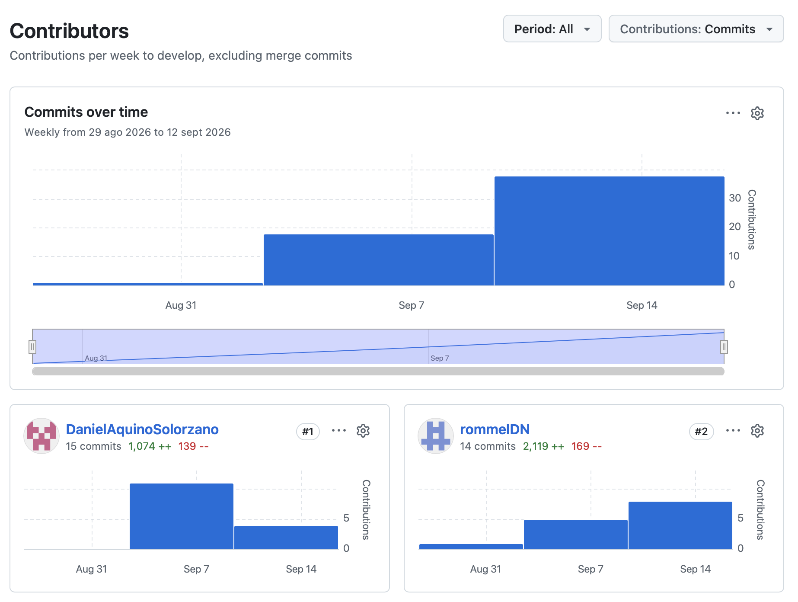

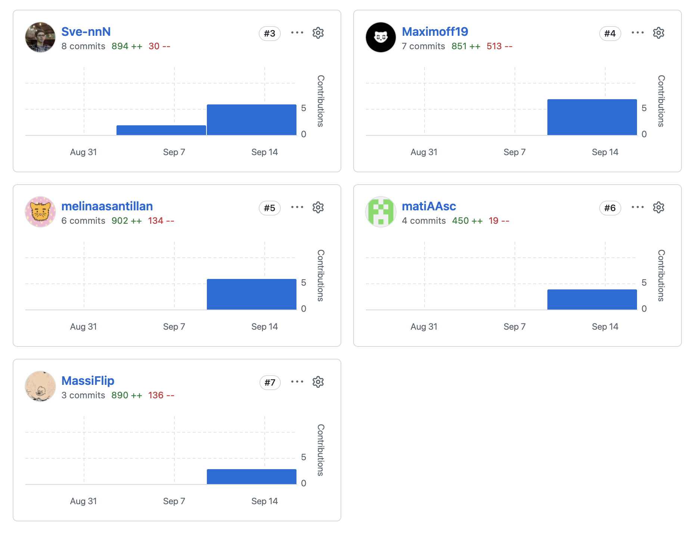

**Figura 2.** Historial de commits por integrante durante AV1.

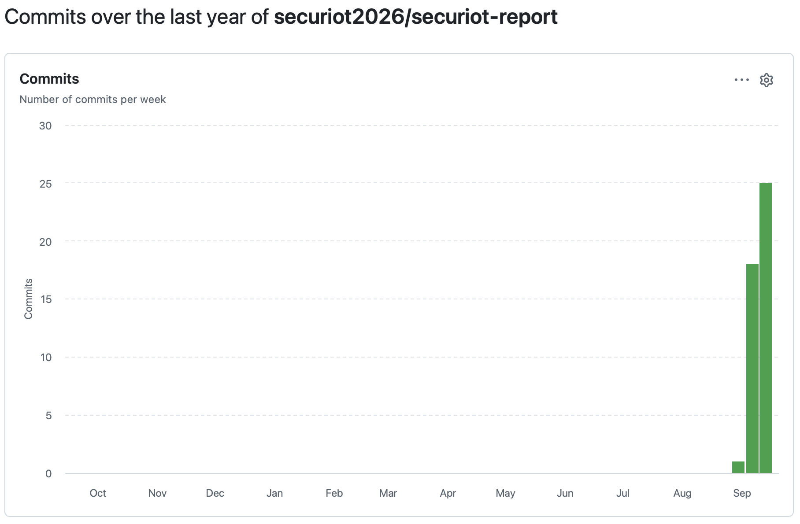

**Figura 3.** Actividad de ramas y pull requests (Insights → Network o Pull requests).

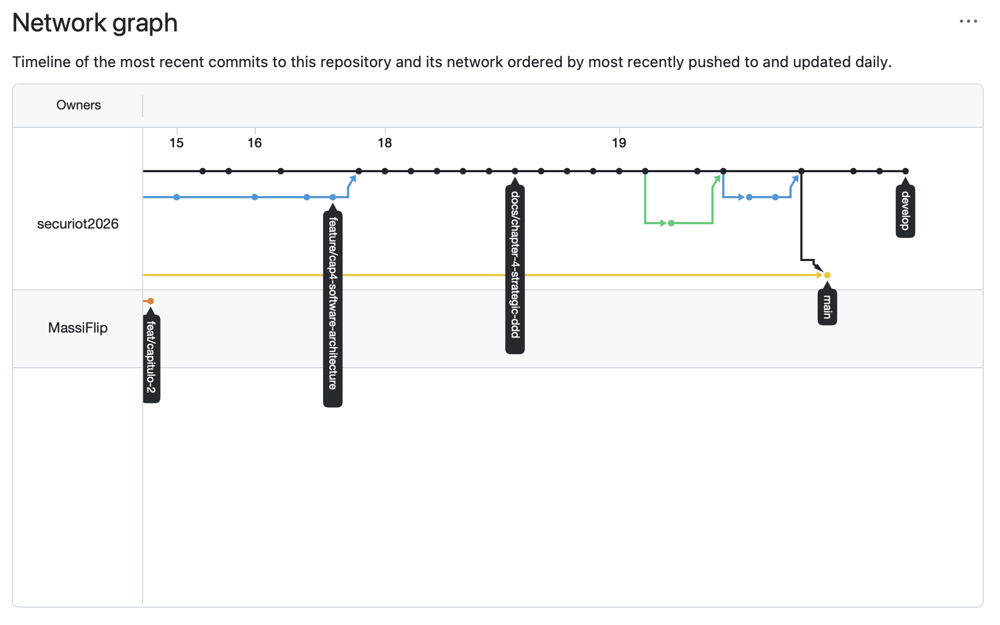

### Interpretación de los analíticos

Los analíticos muestran que las seis secciones principales del informe (Capítulos I a IV, más Conclusiones, Bibliografía y Anexos) se distribuyeron entre los integrantes, con un responsable claro por artefacto. La participación de cada integrante se refleja en el historial de commits y en el Registro de Versiones

También se identifica una oportunidad de mejora. Tres de las nueve versiones del informe (v1.7, v1.8 y v1.9) se registraron el 18 y el 19 de septiembre, es decir, en los dos últimos días antes de la entrega. Para TB1, el equipo se compromete a integrar los avances con mayor frecuencia, a repartir de forma más pareja los commits entre todos los integrantes y a revisar los pull requests antes del cierre de cada sprint.

# Contenido

- [Registro de Versiones del Informe](#registro-de-versiones-del-informe)
- [Project Report Collaboration Insights](#project-report-collaboration-insights)
- [Student Outcome](#student-outcome)
- [Capítulo I: Introducción](#capítulo-i-introducción)
  - [1.1. Startup Profile](#11-startup-profile)
    - [1.1.1. Descripción de la Startup](#111-descripción-de-la-startup)
    - [1.1.2. Perfiles de integrantes del equipo](#112-perfiles-de-integrantes-del-equipo)
  - [1.2. Solution Profile](#12-solution-profile)
    - [1.2.1. Antecedentes y problemática](#121-antecedentes-y-problemática)
    - [1.2.2. Lean UX Process](#122-lean-ux-process)
      - [1.2.2.1. Lean UX Problem Statements](#1221-lean-ux-problem-statements)
      - [1.2.2.2. Lean UX Assumptions](#1222-lean-ux-assumptions)
      - [1.2.2.3. Lean UX Hypothesis Statements](#1223-lean-ux-hypothesis-statements)
      - [1.2.2.4. Lean UX Canvas](#1224-lean-ux-canvas)
  - [1.3. Segmentos objetivo](#13-segmentos-objetivo)
- [Capítulo II: Requirements Elicitation & Analysis](#capítulo-ii-requirements-elicitation--analysis)
  - [2.1. Competidores](#21-competidores)
    - [2.1.1. Análisis competitivo](#211-análisis-competitivo)
    - [2.1.2. Estrategias y tácticas frente a competidores](#212-estrategias-y-tácticas-frente-a-competidores)
  - [2.2. Entrevistas](#22-entrevistas)
    - [2.2.1. Diseño de entrevistas](#221-diseño-de-entrevistas)
    - [2.2.2. Registro de entrevistas](#222-registro-de-entrevistas)
    - [2.2.3. Análisis de entrevistas](#223-análisis-de-entrevistas)
  - [2.3. Needfinding](#23-needfinding)
    - [2.3.1. User Personas](#231-user-personas)
    - [2.3.2. User Task Matrix](#232-user-task-matrix)
    - [2.3.3. User Journey Mapping](#233-user-journey-mapping)
    - [2.3.4. Empathy Mapping](#234-empathy-mapping)
  - [2.4. Big Picture EventStorming](#24-big-picture-eventstorming)
  - [2.5. Ubiquitous Language](#25-ubiquitous-language)
- [Capítulo III: Requirements Specification](#capítulo-iii-requirements-specification)
  - [3.1. User Stories](#31-user-stories)
  - [3.2. Impact Mapping](#32-impact-mapping)
  - [3.3. Product Backlog](#33-product-backlog)
- [Capítulo IV: Solution Software Design](#capítulo-iv-solution-software-design)
  - [4.1. Strategic-Level Domain-Driven Design](#41-strategic-level-domain-driven-design)
    - [4.1.1. Design-Level EventStorming](#411-design-level-eventstorming)
      - [4.1.1.1. Candidate Context Discovery](#4111-candidate-context-discovery)
      - [4.1.1.2. Domain Message Flows Modeling](#4112-domain-message-flows-modeling)
      - [4.1.1.3. Bounded Context Canvases](#4113-bounded-context-canvases)
    - [4.1.2. Context Mapping](#412-context-mapping)
    - [4.1.3. Software Architecture](#413-software-architecture)
      - [4.1.3.1. Software Architecture System Landscape Diagram](#4131-software-architecture-system-landscape-diagram)
      - [4.1.3.2. Software Architecture Context Level Diagrams](#4132-software-architecture-context-level-diagrams)
      - [4.1.3.3. Software Architecture Container Level Diagrams](#4133-software-architecture-container-level-diagrams)
      - [4.1.3.4. Software Architecture Deployment Diagrams](#4134-software-architecture-deployment-diagrams)
  - [4.2. Tactical-Level Domain-Driven Design](#42-tactical-level-domain-driven-design)
    - [4.2.1. Bounded Context: Monitoreo y Alertas](#421-bounded-context-monitoreo-y-alertas)
      - [4.2.1.1. Domain Layer](#4211-domain-layer)
      - [4.2.1.2. Interface Layer](#4212-interface-layer)
      - [4.2.1.3. Application Layer](#4213-application-layer)
      - [4.2.1.4. Infrastructure Layer](#4214-infrastructure-layer)
      - [4.2.1.5. Bounded Context Software Architecture Component Level Diagrams](#4215-bounded-context-software-architecture-component-level-diagrams)
      - [4.2.1.6. Bounded Context Software Architecture Code Level Diagrams](#4216-bounded-context-software-architecture-code-level-diagrams)
      - [4.2.1.6.1. Bounded Context Domain Layer Class Diagrams](#42161-bounded-context-domain-layer-class-diagrams)
      - [4.2.1.6.2. Bounded Context Database Design Diagram](#42162-bounded-context-database-design-diagram)
    - [4.2.2. Bounded Context: Identidad y Acceso](#422-bounded-context-identidad-y-acceso)
      - [4.2.2.1. Domain Layer](#4221-domain-layer)
      - [4.2.2.2. Interface Layer](#4222-interface-layer)
      - [4.2.2.3. Application Layer](#4223-application-layer)
      - [4.2.2.4. Infrastructure Layer](#4224-infrastructure-layer)
      - [4.2.2.5. Bounded Context Software Architecture Component Level Diagrams](#4225-bounded-context-software-architecture-component-level-diagrams)
      - [4.2.2.6. Bounded Context Software Architecture Code Level Diagrams](#4226-bounded-context-software-architecture-code-level-diagrams)
      - [4.2.2.6.1. Bounded Context Domain Layer Class Diagrams](#42261-bounded-context-domain-layer-class-diagrams)
      - [4.2.2.6.2. Bounded Context Database Design Diagram](#42262-bounded-context-database-design-diagram)
    - [4.2.3. Bounded Context: Gestion de Zonas y Dispositivos](#423-bounded-context-gestion-de-zonas-y-dispositivos)
      - [4.2.3.1. Domain Layer](#4231-domain-layer)
      - [4.2.3.2. Interface Layer](#4232-interface-layer)
      - [4.2.3.3. Application Layer](#4233-application-layer)
      - [4.2.3.4. Infrastructure Layer](#4234-infrastructure-layer)
      - [4.2.3.5. Bounded Context Software Architecture Component Level Diagrams](#4235-bounded-context-software-architecture-component-level-diagrams)
      - [4.2.3.6. Bounded Context Software Architecture Code Level Diagrams](#4236-bounded-context-software-architecture-code-level-diagrams)
      - [4.2.3.6.1. Bounded Context Domain Layer Class Diagrams](#42361-bounded-context-domain-layer-class-diagrams)
      - [4.2.3.6.2. Bounded Context Database Design Diagram](#42362-bounded-context-database-design-diagram)
    - [4.2.4. Bounded Context: Deteccion y Relay de Borde](#424-bounded-context-deteccion-y-relay-de-borde)
      - [4.2.4.1. Domain Layer](#4241-domain-layer)
      - [4.2.4.2. Interface Layer](#4242-interface-layer)
      - [4.2.4.3. Application Layer](#4243-application-layer)
      - [4.2.4.4. Infrastructure Layer](#4244-infrastructure-layer)
      - [4.2.4.5. Bounded Context Software Architecture Component Level Diagrams](#4245-bounded-context-software-architecture-component-level-diagrams)
      - [4.2.4.6. Bounded Context Software Architecture Code Level Diagrams](#4246-bounded-context-software-architecture-code-level-diagrams)
      - [4.2.4.6.1. Bounded Context Domain Layer Class Diagrams](#42461-bounded-context-domain-layer-class-diagrams)
      - [4.2.4.6.2. Bounded Context Database Design Diagram](#42462-bounded-context-database-design-diagram)

# Student Outcome

El curso contribuye al cumplimiento del siguiente Student Outcome de ABET:

**ABET – EAC - Student Outcome 5**

**Criterio:** La capacidad de funcionar efectivamente en un equipo cuyos miembros juntos proporcionan liderazgo, crean un entorno de colaboración e inclusivo, establecen objetivos, planifican tareas y cumplen objetivos.

| Criterio específico | Acciones realizadas | Conclusiones |
|---|---|---|
| Trabaja en equipo para proporcionar liderazgo en forma conjunta | **Angulo Juan Carlos**<br>**AV1**<br>Lideré el diseño de la arquitectura de software del proyecto en el Capítulo IV, construyendo el Strategic-Level DDD desde el Event Storming de diseño hasta el descubrimiento de los bounded contexts candidatos y su mapeo, y extendiendo después ese trabajo al Tactical DDD de los bounded contexts restantes del sistema. También impulsé el arranque del proyecto al completar el Lean UX Process del Capítulo I (problem statements, assumptions, hypothesis statements y canvas), coordinando con mis compañeros para que esas decisiones de producto quedaran alineadas con la definición del segmento objetivo que el equipo cerró después.<br><br>**Aquino Solorzano Daniel Jonatan**<br>**AV1**<br>Asumí un rol de coliderazgo en la fase de investigación de usuarios al estructurar la estrategia de empatización para tres segmentos objetivo del proyecto, coordinando activamente con el equipo la formulación y validación de las guías de entrevista para asegurar un enfoque coherente. Asimismo, lideré operativamente la recolección de hallazgos al gestionar y ejecutar directamente las sesiones sincrónicas por Google Meet con los dos primeros segmentos (completando tres entrevistas del primero y dos del segundo), compartiendo periódicamente los avances y facilitando la toma de decisiones compartida dentro del equipo para ajustar el rumbo del análisis según los datos obtenidos.<br><br>**Hurtado Balcazar Rommel Daniel**<br>**AV1**<br>Fomenté el trabajo colaborativo y en la organización de la delegación de tareas para el AV1.Desarrolle la idea de la StartUp, planteando su definición, así como el analisís de los antecedentes y la problemática, por ultimo gracias a la recopilación de información de LeanUX pude determinar el segmento objetivo en el cual se enfocara este servicio.<br><br>**Nikaido Vargas Javier Masaru**<br>**AV1**<br>Pendiente de completar en AV1<br><br>**Osores Marchese Pietro**<br>**AV1**<br>Pendiente de completar en AV1<br><br>**Salcedo Champi Matias Rodolfo**<br>**AV1**<br>Participé en la definición de requisitos iniciales del producto a partir de los hallazgos del proceso de needfinding. Elaboré y organicé User Stories con criterios de aceptación en formato Gherkin, incluyendo historias asociadas a la Landing Page y Technical Stories necesarias para sostener la solución. También trabajé el Impact Mapping para relacionar el objetivo de negocio con actores, impactos esperados y funcionalidades, evitando que el backlog quedara como una lista aislada de tareas sin conexión con el valor del producto.<br><br>**Santillan Alvarado Melina Liz**<br>**AV1**<br>- Propuso sustentar las tres User Personas exclusivamente con las entrevistas y sus análisis.<br>- Revisó la correspondencia entre los hallazgos de las entrevistas y los atributos incluidos en cada arquetipo.<br>- Validó que la User Task Matrix contuviera tareas del dominio independientes de las funcionalidades de SECURIOT.<br>- Definió el alcance del Ubiquitous Language limitado a términos del negocio y sin conceptos técnicos de ingeniería de software. | Durante AV1, el equipo logró convertir información inicial del problema en artefactos accionables para el proyecto. La participación de cada integrante permitió sostener una visión compartida del producto y tomar decisiones con mayor criterio al momento de priorizar requisitos, organizar evidencias y conectar cada entrega con los objetivos de SECURIOT.<br><br>Angulo Abud Juan Carlos, AV1: liderar el Capítulo IV en paralelo con el Lean UX Process me permitió entregarle al equipo decisiones de arquitectura ya validadas sin frenar el avance de los demás capítulos, reforzando un liderazgo compartido apoyado en dependencias claras entre entregables. |
| Crea un entorno colaborativo e inclusivo, establece metas, planifica tareas y cumple objetivos | **Angulo Juan Carlos**<br>**AV1**<br>Planifiqué el Capítulo IV en dos entregas dentro del sprint, primero el diseño estratégico y después el táctico, para poder avanzar en paralelo sin bloquear las secciones de requerimientos y UX que dependían de decisiones de arquitectura ya cerradas. Mantuve cada bounded context documentado y versionado en el repositorio a medida que quedaba definido, y prioricé cerrar primero el Lean UX Process para destrabar la definición del segmento objetivo del equipo, cumpliendo con los plazos que nos fijamos para el AV1.<br><br>**Aquino Solorzano Daniel Jonatan**<br>**AV1**<br>Fomenté un espacio de trabajo integrador y abierto a la retroalimentación al definir, junto a mis compañeros, el cronograma y las metas para el levantamiento de información cualitativa de tres segmentos objetivo. Organicé las tareas correspondientes mediante una planificación clara de los tiempos de contacto, la logística de las sesiones remotas por Google Meet y el registro detallado de las respuestas, cumpliendo puntualmente con el objetivo trazado al ejecutar con éxito las cinco entrevistas asignadas (tres del segmento inicial y dos del segundo) y entregando al equipo un repositorio estructurado de evidencias clave para el diseño de la solución.<br><br>**Hurtado Balcazar Rommel Daniel**<br>**AV1**<br>Ordene la asignación de de tareas para un correcto desarrollo del primer avance del trabajo final, desarrollando asi un trabajo ordenado y en plazo, cumpliendo los requisitos solicitados. Así mismo, integre los hallazgos del equipo encargos de LeanUX para determinar el segmento objetivo. <br><br>**Nikaido Vargas Javier Masaru**<br>**AV1**<br>Pendiente de completar en AV1<br><br>**Osores Marchese Pietro**<br>**AV1**<br>Pendiente de completar en AV1<br><br>**Salcedo Champi Matias Rodolfo**<br>**AV1**<br>Ordené el Product Backlog con estimación por Story Points y priorización por nivel de importancia, considerando épicas de monitoreo, zonas y accesos, alertas, trazabilidad, experiencia web/mobile, gestión multi-sede, Landing Page y Technical Stories. Además, desarrollé los User Journey Maps As-Is y Empathy Maps para representar la experiencia actual de los arquetipos definidos, tomando como base las entrevistas y los patrones detectados en los segmentos objetivo. Estas actividades ayudaron a que el equipo tuviera una referencia común para planificar la entrega y sustentar las decisiones de producto.<br><br>**Santillan Alvarado Melina Liz**<br>**AV1**<br>- Integró los hallazgos de las entrevistas aportadas por el equipo en las User Personas y la User Task Matrix.<br>- Organizó las tareas de los tres arquetipos por frecuencia e importancia para completar la sección 2.3.2.<br>- Consolidó en la sección 2.5 los términos del dominio identificados en entrevistas, reglas de negocio y bounded contexts. | La planificación de tareas y la construcción de artefactos compartidos favorecieron una coordinación más clara durante AV1. Al trabajar con historias, backlog, mapas de experiencia y lenguaje común, el equipo redujo ambigüedades sobre las necesidades reales de los usuarios y avanzó con responsabilidades más visibles.<br><br>Angulo Abud Juan Carlos, AV1: secuenciar el diseño estratégico antes del táctico y priorizar el cierre del Lean UX Process me permitió cumplir los plazos del AV1 sin generar cuellos de botella para las secciones que dependían de esas definiciones. |

# Capítulo I: Introducción

## 1.1. Startup Profile

### 1.1.1. Descripción de la Startup

Centinela Labs es una startup peruana de base tecnológica especializada en soluciones de seguridad patrimonial inteligente para el sector empresarial e industrial, mediante la integración de Internet de las Cosas (IoT), Edge Computing, Cloud Computing e Inteligencia Artificial. Nace de identificar una brecha crítica en la protección de activos productivos: las fábricas, almacenes, plantas industriales y oficinas corporativas dependen mayoritariamente de personal de vigilancia y videovigilancia pasiva, esquemas que reaccionan tarde frente a un intento de intrusión y que resultan costosos de escalar a medida que la empresa crece o abre nuevas sedes.

Su producto insignia, SECURIOT, es una plataforma de monitoreo de seguridad patrimonial dirigida a empresas, que utiliza visión por computadora e IA para identificar personas dentro de instalaciones productivas y administrativas, validar en tiempo real si su ingreso está autorizado, y activar de forma automática protocolos de respuesta ante una intrusión detectada: alarmas locales, notificación inmediata al personal de seguridad y a los responsables designados por la empresa, registro trazable del evento con fines de investigación y reporte a autoridades, y activación de controles de acceso en zonas restringidas (almacenes, líneas de producción, áreas de carga y descarga), siempre en cumplimiento de la normativa de seguridad y evacuación vigente.

La misión de Centinela Labs es reducir el tiempo entre la detección de una amenaza y la respuesta efectiva dentro de instalaciones empresariales, combinando dispositivos embebidos de bajo costo instalados en puntos críticos (accesos, perímetros, zonas de almacenamiento), procesamiento en el borde (edge) para decisiones de baja latencia, y una nube centralizada que permite gestión remota multi-sede, útil para empresas con más de una planta o almacén. Su visión es convertirse en la alternativa peruana de seguridad patrimonial inteligente para pequeñas y medianas empresas industriales y logísticas, un segmento históricamente desatendido por las soluciones de seguridad de gama alta orientadas solo a grandes corporaciones.

Como startup, Centinela Labs opera bajo un modelo de negocio escalable basado en suscripción (SaaS) por sede o perímetro monitoreado, complementado con la venta del hardware IoT (el dispositivo prototipo de la solución), apoyándose en tecnologías open-source y una arquitectura distribuida que facilita la incorporación de nuevos clientes empresariales sin rediseñar la solución.

### 1.1.2. Perfiles de integrantes del equipo

| Miembro | Descripción |
|---|---|
|  | **Hurtado Balcazar Rommel Daniel - U202517474** <br><br> Soy Rommel Hurtado Balcázar, tengo 23 años y estudio Ingeniería de Software en el 7to ciclo. Me considero un líder técnico orientado a la resolución de problemas, con capacidad para tomar decisiones y guiar al equipo hacia los objetivos del proyecto.<br><br>Cuento con experiencia en desarrollo fullstack, manejando tanto frontend como backend. En el lado del servidor trabajo principalmente con Java, y en el frontend utilizo React. Además, tengo conocimientos en bases de datos relacionales con SQL y no relacionales con MongoDB, así como experiencia con Node.js, Python y HTML/CSS.<br><br>He desarrollado proyectos propios fuera del ámbito universitario, lo que me ha dado una visión completa del ciclo de desarrollo de software. También me desenvuelvo en inglés a nivel intermedio-avanzado, lo que me permite acceder a documentación técnica y comunicarme en entornos internacionales. |
|  | **Nikaido Vargas Javier Masaru - U20221G099** <br><br> Soy Javier Masaru Nikaido Vargas, estudiante de Ingeniería de Software del 8to ciclo de la Universidad Peruana de Ciencias Aplicadas. Me caracterizo por trabajar de manera organizada y planificada, procurando realizar mis actividades con anticipación y mantener un ritmo de trabajo constante y ordenado.<br><br>Prefiero desarrollar mis responsabilidades con tranquilidad, distribuyendo adecuadamente el tiempo disponible para evitar retrasos y cumplir con los objetivos establecidos. Considero que la organización, la responsabilidad y el cumplimiento oportuno de las tareas son aspectos importantes para contribuir de manera efectiva al trabajo en equipo. |
|  | **Osores Marchese Pietro - U202310971** <br><br> Soy Pietro Osores Marchese, estudiante de Ingeniería de Software con interés en el desarrollo de software y la innovación tecnológica. Mi perfil combina habilidades en programación frontend, diseño de interfaces y gestión de proyectos ágiles, con un enfoque en la creación de soluciones digitales funcionales y escalables.<br><br>Me caracterizo por el trabajo en equipo, la adaptabilidad y la búsqueda constante de nuevas herramientas para optimizar procesos y experiencias de usuario. |
| 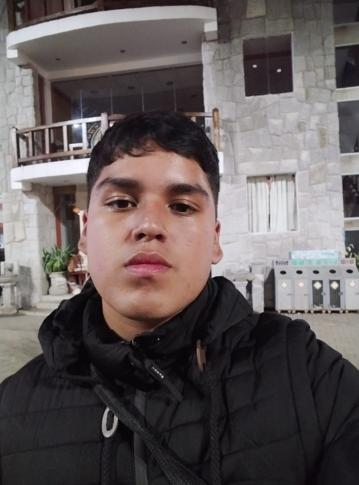 | **Salcedo Champi Matias Rodolfo - U202319698** <br><br> Soy Matias Salcedo Champi, tengo 21 años y estudio Ingeniería de Software en el 7mo ciclo. Soy un estudiante con experiencia en el desarrollo de aplicaciones móviles y web, y me gusta involucrarme en todas las etapas del ciclo de desarrollo, desde el levantamiento de requisitos hasta la implementación.<br><br>En el desarrollo móvil trabajo con Flutter y Dart, y en el backend utilizo Node.js y Express.js. Manejo bases de datos tanto relacionales, con PostgreSQL, como no relacionales, con MongoDB. Además, uso Git y GitHub para el control de versiones y el trabajo colaborativo en equipo, siguiendo el flujo GitFlow del proyecto.<br><br>He participado en proyectos de investigación y desarrollo, lo que me ha permitido fortalecer mi capacidad de análisis y mi visión integral del proceso de construcción de software. Aporto al equipo en la especificación de requisitos y en la definición del producto, contribuyendo a que la solución responda a las necesidades reales de los usuarios. |
| | **Aquino Solorzano Daniel Jonatan -U202217678** <br><br> Tengo 22 años y estoy en la carrera de Ingeniería de Software cursando el 7mo ciclo. Considero que mis fuertes son la responsabilidad y puntualidad con la entrega de trabajos. <br><br> Tengo experiencia en el desarrollo Fullstack de aplicaciones Web con DDD y uso de diferentes Frameworks de desarrollo como Spring Boot o Angular. Así como tambien experiencia con diferentes lenguajes de programación como TypeScript, Java, Python, Dart, etc. También poseo experiencia en el desarrollo de aplicaciones móviles en Android o IOS, aunque me centro más en el desarrollo de Plataformas Backend. Poseo además experiencia en Bases de Datos Relaciones y No Relacionales como MySQL o MongoDB respectivamente. He llegado a utilizar plataformas de despliegue como Azure y Render; además de tecnologías que ayudan en la contenerización como Docker. Como punto adicional tengo un nivel intermedio-avanzado en inglés, lo que me ayuda a ampliar mis capacidades en diferentes ámbitos. |
|  |**Angulo Juan Carlos - U202317692** <br><br> Tengo 24 años y curso Ingeniería de Software en el sétimo ciclo. Me considero una persona orientada a objetivos, me gusta tomar la iniciativa dentro del equipo y meterme de lleno a resolver el problema en vez de quedarme solo en la parte de planificación. <br><br> Soy desarrollador web con varios años de experiencia, y he trabajado con un buen número de clientes tanto nacionales como internacionales, desde proyectos pequeños hasta integraciones más complejas. Además del desarrollo, el posicionamiento web (SEO) es algo que me apasiona particularmente, y suelo combinar ambas disciplinas en los proyectos que tomo. Parte de mi trabajo se puede ver en mi portafolio personal, [juan-tech.com](https://juan-tech.com). |
|  | **Santillan Alvarado Melina Liz - U202216058** <br><br> Soy Melina Liz Santillan Alvarado, tengo 22 años y soy estudiante de Ingeniería de Software. Me considero una persona responsable, organizada y atenta a los detalles, con capacidad de adaptación y disposición para el aprendizaje continuo. <br><br> En desarrollo web, tengo mayor experiencia en frontend y utilizo tecnologías como HTML, CSS, JavaScript, TypeScript, Vue.js y Angular. En desarrollo móvil, cuento con conocimientos en Kotlin y Flutter. También tengo conocimientos en desarrollo backend con .NET y Spring Boot, construcción de APIs REST, bases de datos relacionales y control de versiones con Git y GitHub. <br><br> Puedo aportar al equipo en el diseño e implementación de interfaces, el desarrollo frontend, la integración con servicios backend, la organización del trabajo y la aplicación de buenas prácticas de desarrollo. |

## 1.2. Solution Profile

### 1.2.1. Antecedentes y problemática

#### Antecedentes

La seguridad patrimonial se ha convertido en una preocupación creciente para el sector empresarial peruano, particularmente para la industria y la logística. Según la Encuesta de Opinión Industrial de la Sociedad Nacional de Industrias (SNI), una de cada cinco industrias fue víctima de la delincuencia, considerando robos, intentos de robo, extorsión, amenazas y otros delitos, durante el tercer trimestre de 2024. A nivel nacional, el 27.7% de los peruanos en zonas urbanas fue víctima de algún delito en los últimos seis meses, y de forma específica, los delitos contra el patrimonio representan la categoría de mayor incidencia delictiva en el país.

A pesar de este panorama, la mayoría de empresas peruanas continúa desprotegida financieramente frente al riesgo: solo el 5% de las pymes en Perú cuenta con un seguro patrimonial que las proteja frente a incendios, terremotos y robos, lo que agrava el impacto económico de cualquier incidente de seguridad no prevenido. En respuesta a esta exposición, las fábricas y plantas industriales han incrementado su inversión en seguridad para proteger instalaciones y maquinaria, y dicha inversión ya no se limita a personal de vigilancia, sino que abarca también tecnología avanzada como sistemas de control de acceso y software de gestión. Sin embargo, este tipo de tecnología suele estar disponible principalmente para grandes corporaciones con presupuestos de seguridad elevados, dejando a las pequeñas y medianas empresas industriales dependiendo de medidas más básicas como cercos eléctricos, candados de alta seguridad o vigilancia humana tradicional.

El resultado es una brecha entre la magnitud del riesgo patrimonial que enfrentan las empresas —especialmente las industriales, con instalaciones extensas, múltiples puntos de acceso y activos de alto valor como maquinaria e inventario— y la capacidad real de estas empresas, sobre todo las de menor tamaño, para acceder a sistemas de seguridad proactivos, escalables y económicamente viables.

#### Aplicación de la técnica 5W + 2H

| Pregunta| Respuesta |
|--|--|
| **Who** <br> (¿Quién?)| Empresas industriales, logísticas y comerciales de mediana escala en el Perú (fábricas, plantas de producción, almacenes, centros de distribución, oficinas corporativas), con foco inicial en Lima Metropolitana. |
| **What** <br> (¿Qué?) | Ausencia de un sistema de seguridad patrimonial accesible que identifique amenazas en tiempo real dentro de instalaciones empresariales y active una respuesta automática, en lugar de depender exclusivamente de vigilancia humana o revisión posterior de grabaciones. |
| **Where** <br> (¿Dónde?) | Parques industriales, zonas logísticas y corredores comerciales/empresariales de Lima Metropolitana, con potencial de escalar a otras ciudades del país. |
| **When** <br> (¿Cuándo?) | El problema se ha agravado de forma sostenida en los últimos años, con un incremento en la inversión en seguridad por parte de las industrias reportado durante 2024-2026. |
| **Why** <br> (¿Por qué?) | Porque los esquemas de seguridad tradicionales (vigilancia humana, CCTV pasivo) no logran anticipar ni contener una intrusión en el momento en que ocurre, y las soluciones tecnológicas avanzadas existentes suelen ser costosas y orientadas a grandes corporaciones, dejando desprotegidas a las pymes industriales. |
| **How** <br> (¿Cómo?) | A través de una plataforma IoT que combina dispositivos embebidos instalados en accesos y perímetros, procesamiento en el borde (edge computing) para decisiones de baja latencia, inteligencia artificial para identificación y validación de accesos, y una nube centralizada para gestión remota multi-sede, alertas y analítica histórica de incidentes. |
| **How Much** <br> (¿Cuánto?) | El costo de no resolver el problema incluye pérdidas directas de inventario y maquinaria, interrupción de operaciones productivas, y una exposición financiera agravada por el bajo nivel de aseguramiento patrimonial en el sector (solo 5% de pymes aseguradas), afectando la continuidad del negocio. |

#### Problematica

Las empresas industriales, logísticas y comerciales de mediana escala en el Perú enfrentan un nivel significativo de exposición a robos e intrusiones dentro de sus instalaciones, mientras que los sistemas de seguridad tecnológicamente avanzados disponibles en el mercado están mayormente orientados a grandes corporaciones con altos presupuestos, dejando a las pymes industriales dependiendo de esquemas de seguridad reactivos y de bajo nivel de automatización, lo que se traduce en pérdidas patrimoniales, interrupción de operaciones y una persistente vulnerabilidad frente a la delincuencia.

#### Puntos más importantes a resolver

> Identificación de personas en tiempo real dentro de instalaciones empresariales, distinguiendo entre personal autorizado, proveedores/visitantes y personas no identificadas.

> Validación automática de accesos a zonas restringidas (almacenes, líneas de producción, áreas de carga y descarga), reduciendo la dependencia exclusiva de personal de vigilancia.

> Activación inmediata de protocolos de respuesta ante una intrusión detectada (alarmas, notificación al personal de seguridad y a los responsables de la empresa), sin comprometer las rutas de evacuación del personal.

> Registro y trazabilidad de los eventos de seguridad, generando evidencia auditable para investigación interna y reporte a autoridades.

> Visualización de información cuantitativa (incidentes por sede, tiempos de respuesta, patrones de acceso) para la toma de decisiones de los administradores de seguridad de la empresa.

> Gestión remota multi-sede, para empresas con más de una planta, almacén u oficina.

> Un modelo de costo accesible para pequeñas y medianas empresas industriales, no solo para grandes corporaciones.

#### Objetivos

- Reducir el tiempo de detección y respuesta ante un intento de intrusión no autorizada dentro de instalaciones empresariales, respecto a los sistemas de vigilancia tradicionales.
- Brindar a los administradores de seguridad de la empresa una herramienta centralizada de monitoreo y control de accesos, accesible desde Web y dispositivos móviles.
- Proveer evidencia confiable y trazable de los incidentes de seguridad patrimonial para su reporte a autoridades y aseguradoras.
- Ofrecer un modelo de suscripción escalable y accesible económicamente para pymes industriales y logísticas.

#### Restricciones

- La solución se enfoca en el segmento empresarial e industrial (fábricas, almacenes, plantas de producción, oficinas corporativas), quedando fuera de alcance el segmento residencial.
- El mercado inicial de validación es Lima Metropolitana, considerando su alta concentración de parques industriales y zonas logísticas.
- El prototipo físico del dispositivo IoT cubrirá un subconjunto relevante de funcionalidades (captura de imagen/video, procesamiento básico en el borde, comunicación con el Edge API), no la totalidad de un sistema de seguridad industrial completo.
- Cualquier protocolo de control de accesos debe respetar la normativa vigente de seguridad y evacuación del personal, priorizando siempre su integridad física.
- El tratamiento de datos biométricos e imágenes de personas debe cumplir con la normativa peruana de protección de datos personales (Ley N° 29733) y principios de privacidad por diseño.
- El desarrollo debe realizarse utilizando exclusivamente las tecnologías, lenguajes y herramientas open-source indicadas en el curso.

### 1.2.2. Lean UX Process

El Lean UX Process de Jeff Gothelf y Josh Seiden convierte la problemática de la sección anterior en creencias explícitas (assumptions) sobre el negocio y los usuarios, y esas creencias en hypothesis statements que se pueden verificar con experimentos concretos. El análisis cubre todo el dominio del problema (seguridad patrimonial industrial y logística) y no un segmento por separado, porque el curso pide la versión del template para una iniciativa nueva (brand new initiative), pensada justamente para esa mirada agregada.

#### 1.2.2.1. Lean UX Problem Statements

El proyecto tiene un único Problem Statement, que agrupa a todos los segmentos identificados (fábricas, plantas de producción, almacenes, centros de distribución y oficinas corporativas de empresas industriales, logísticas y comerciales de mediana escala). El template exigido por el curso para una iniciativa nueva se completa en inglés, tal como aparece en el enunciado del proyecto:

> The current state of **industrial and logistics asset security in Peru** has focused mainly on **medium-sized industrial, logistics and commercial companies that protect their facilities through human surveillance and passive CCTV, reviewing footage only after an incident has already occurred**.
>
> What existing products/services fail to address is **the gap between the magnitude of the patrimonial risk these companies face (extensive facilities, multiple access points, high-value machinery and inventory) and their real capacity to access proactive, scalable and economically viable security systems, which today are priced and designed mainly for large corporations**.
>
> Our product/service will address this gap by **combining low-cost IoT devices installed at critical points (access points, perimeters, storage zones), edge computing for low-latency local decisions, and a centralized cloud platform that enables real-time threat identification, automatic access validation to restricted zones, and immediate activation of response protocols**.
>
> Our initial focus will be **medium-sized industrial and logistics companies located in Lima Metropolitana, with physical facilities that include restricted-access zones such as warehouses, production lines, and loading/unloading areas**.
>
> We'll know we are successful when we see **these companies subscribing to and renewing the platform, a measurable reduction in the time between an intrusion attempt and the activation of a response protocol, and an increase in the number of security events that are correctly logged, notified and resolved compared to their previous manual process**.

En español, el mismo Problem Statement dice lo siguiente. Hoy la seguridad patrimonial industrial y logística en el Perú descansa casi por completo en vigilancia humana y CCTV pasivo, que reacciona revisando grabaciones después de ocurrido el incidente, nunca antes. Lo que el mercado no resuelve es la brecha entre el tamaño real del riesgo que enfrentan estas empresas (instalaciones extensas, múltiples accesos, maquinaria e inventario de alto valor) y su capacidad real de pagar por sistemas de seguridad proactivos y escalables, que hoy están diseñados y con precios pensados solo para grandes corporaciones. SecurIoT cierra esa brecha combinando dispositivos IoT de bajo costo en los puntos críticos, edge computing para decisiones locales de baja latencia, y una nube centralizada que identifica amenazas en tiempo real, valida accesos a zonas restringidas y activa protocolos de respuesta de forma automática. El foco inicial son empresas industriales y logísticas medianas de Lima Metropolitana, con zonas de acceso restringido como almacenes, líneas de producción y áreas de carga y descarga. El éxito se mide en suscripciones que se renuevan, en menos tiempo entre una intrusión y la activación del protocolo de respuesta, y en más eventos de seguridad correctamente registrados, notificados y resueltos frente al proceso manual anterior.

#### 1.2.2.2. Lean UX Assumptions

El curso pide organizar los assumptions en 5 tipos. Cada uno se redacta como una creencia afirmativa, no como la pregunta que la originó.

**Business Assumptions**

- Centinela Labs puede posicionarse como la alternativa peruana de seguridad patrimonial inteligente para pymes industriales, un segmento que las soluciones de gama alta no atienden hoy.
- El modelo de suscripción por sede o perímetro monitoreado, sumado a la venta del dispositivo IoT, alcanza para sostener el crecimiento del negocio sin necesidad de una ronda de inversión inicial grande.
- El equipo tiene las capacidades técnicas (IoT, edge computing, inteligencia artificial, desarrollo fullstack web y mobile) para construir y operar la plataforma sin depender de un proveedor externo crítico.
- Se puede cobrar bastante menos que los sistemas de seguridad avanzados orientados a grandes corporaciones y aun así mantener un margen operativo sano.
- Apoyarse en tecnologías open-source y una arquitectura distribuida deja incorporar nuevas empresas cliente sin rediseñar la solución, así que el costo de sumar una sede o un cliente nuevo no crece al mismo ritmo.

**Business Outcome Assumptions**

- El número de empresas industriales y logísticas suscritas crece mes a mes durante los primeros meses de operación comercial.
- La tasa de cancelación (churn) de los clientes suscritos queda por debajo del nivel de rotación típico de los contratos de seguridad tradicionales en pymes.
- El costo de adquisición de cliente (CAC) baja conforme la plataforma se hace conocida en el sector industrial y logístico de Lima Metropolitana.
- Los clientes existentes suman más sedes a la misma cuenta con el tiempo, en vez de contratar un proveedor distinto por cada planta.
- La tasa de renovación al terminar el primer periodo contratado es alta.

**User Assumptions**

- Los administradores de seguridad patrimonial son el usuario principal: configuran zonas y dispositivos, y revisan las alertas.
- El personal de vigilancia in situ es el usuario operativo, el que recibe y atiende en campo lo que el sistema le notifica.
- Los gerentes o dueños de la pyme industrial son un usuario secundario, más interesados en el reporte agregado y en si la suscripción vale lo que cuesta que en la operación día a día.
- La mayoría del uso ocurre desde el celular durante las rondas de vigilancia en planta, y desde el dashboard web cuando el administrador está en oficina o supervisando de forma remota.
- Proveedores y visitantes son actores que el sistema identifica, pero no usan la plataforma directamente.

**User Outcome and Benefit Assumptions**

- El administrador de seguridad deja de revisar grabaciones por rutina, porque el sistema solo le avisa cuando pasa algo relevante.
- El personal de vigilancia llega más rápido a una intrusión real porque la alerta es inmediata, no producto de una ronda que puede tardar.
- El gerente de la pyme industrial cuenta con evidencia trazable y auditable de cada incidente, lo que reduce su exposición legal y agiliza el reporte a aseguradoras y autoridades.
- Un mismo administrador supervisa varias sedes desde un solo panel, sin tener que contratar seguridad adicional en cada una.
- El usuario percibe la plataforma como accesible frente a lo que cuesta una solución de seguridad de gama alta.

**Feature Assumptions**

- Monitorear el estado de zonas y dispositivos casi en tiempo real deja ver de un vistazo qué punto de acceso está comprometido dentro de las instalaciones.
- Registrar y validar zonas y dispositivos restringidos quita la dependencia exclusiva del personal de vigilancia para controlar quién entra a un área crítica.
- Un motor de alertas basado en reglas sobre las lecturas de los sensores activa la notificación apenas se detecta una intrusión, sin esperar a que alguien revise nada.
- Un registro histórico y trazable de eventos y lecturas de telemetría es la base para auditar un incidente o armar el reporte a autoridades y aseguradoras.
- Un dashboard Web, y más adelante una aplicación Mobile, centraliza el estado de zonas, dispositivos y alertas en un solo lugar.
- Gestionar varias sedes de forma remota desde la misma Cloud API permite que un administrador supervise más de una planta o almacén sin cambiar de herramienta.

#### 1.2.2.3. Lean UX Hypothesis Statements

Cada Feature Assumption tiene su hypothesis statement correspondiente, siguiendo el template del curso (también en inglés):

> **HS-01: Identificación de accesos y monitoreo de dispositivos**
> We believe we will achieve **an increase in the number of industrial and logistics companies subscribed to the platform**
> If **security administrators and on-site guards**
> Attain **real-time visibility of the status of critical access points and devices within their facilities**
> With **a device and access-point status monitoring module integrated with the Cloud API**.
>
> *Creemos que lograremos más empresas industriales y logísticas suscritas si los administradores de seguridad y el personal de vigilancia obtienen visibilidad en tiempo real del estado de los puntos de acceso y dispositivos críticos, con un módulo de monitoreo de estado integrado a la Cloud API.*

> **HS-02: Validación de zonas y dispositivos**
> We believe we will achieve **a reduction in customer churn among subscribed companies**
> If **security administrators**
> Attain **a decrease in unauthorized access incidents to restricted zones without relying exclusively on human guards**
> With **a zone and device registration module for restricted areas and access points**.
>
> *Creemos que lograremos menor cancelación de clientes suscritos si los administradores de seguridad reducen los accesos no autorizados a zonas restringidas sin depender solo de personal de vigilancia, con un módulo de registro de zonas y dispositivos.*

> **HS-03: Alertas basadas en reglas**
> We believe we will achieve **an increase in subscription renewal rate at the end of the first contracted period**
> If **on-site security personnel and designated company officers**
> Attain **a faster response time to a detected intrusion compared to traditional passive surveillance**
> With **a rule-based alert engine that automatically notifies stakeholders when a security event is detected**.
>
> *Creemos que lograremos más renovaciones al cierre del primer periodo contratado si el personal de vigilancia y los responsables designados responden más rápido a una intrusión que con vigilancia pasiva tradicional, con un motor de alertas basado en reglas que notifica automáticamente al detectar el evento.*

> **HS-04: Registro histórico y trazable**
> We believe we will achieve **a decrease in the legal and financial exposure of subscribed companies**
> If **company managers and security administrators**
> Attain **trustworthy, auditable evidence of security incidents for internal investigation and reporting to authorities and insurers**
> With **a traceable historical event and telemetry log persisted per device and zone**.
>
> *Creemos que lograremos menor exposición legal y financiera para las empresas suscritas si gerentes y administradores de seguridad cuentan con evidencia confiable y auditable de cada incidente, con un registro histórico trazable de eventos y telemetría por dispositivo y zona.*

> **HS-05: Dashboard de monitoreo**
> We believe we will achieve **an increase in the number of sites managed per client account**
> If **security administrators**
> Attain **centralized visibility of the status of zones, devices, and alerts without needing dedicated on-site staff at every location**
> With **a Web monitoring dashboard integrated with the Cloud API, extended later with a Mobile application**.
>
> *Creemos que lograremos más sedes gestionadas por cada cuenta cliente si los administradores de seguridad obtienen visibilidad centralizada del estado de zonas, dispositivos y alertas sin necesitar personal dedicado en cada sede, con un dashboard Web integrado a la Cloud API, extendido después con una aplicación Mobile.*

> **HS-06: Gestión remota multi-sede**
> We believe we will achieve **an increase in monthly recurring revenue per client through account expansion**
> If **company managers overseeing more than one facility**
> Attain **the ability to supervise multiple plants or warehouses from a single account**
> With **a multi-site remote management architecture built on the Cloud API**.
>
> *Creemos que lograremos más ingreso recurrente mensual por cliente vía expansión de cuenta si los gerentes que supervisan más de una instalación pueden monitorear varias plantas o almacenes desde una sola cuenta, con una arquitectura de gestión remota multi-sede construida sobre la Cloud API.*

#### 1.2.2.4. Lean UX Canvas

| Elemento | Contenido |
|---|---|
| **1. Business Problem** <br> (Problema de negocio) | Las pymes industriales y logísticas de Lima Metropolitana están expuestas a un nivel significativo de robos e intrusiones patrimoniales, pero dependen de esquemas de seguridad reactivos (vigilancia humana, CCTV pasivo) porque los sistemas tecnológicos avanzados del mercado están orientados y priceados para grandes corporaciones. |
| **2. Business Outcomes** <br> (Resultados de negocio) | Incremento en el número de empresas suscritas y en sedes gestionadas por cuenta; reducción de la tasa de cancelación (churn); disminución del costo de adquisición de cliente (CAC); aumento en la tasa de renovación de suscripción. |
| **3. Users** <br> (Usuarios) | Administradores de seguridad patrimonial (usuario principal), personal de vigilancia in situ (usuario operativo), gerentes/dueños de la pyme industrial (usuario secundario). |
| **4. User Outcomes & Benefits** <br> (Resultados y beneficios para el usuario) | Menor tiempo dedicado a revisión pasiva de grabaciones; respuesta más rápida ante intrusiones reales; evidencia trazable y auditable de incidentes; supervisión centralizada de múltiples sedes sin personal adicional. |
| **5. Solutions** <br> (Soluciones / Features) | Monitoreo de estado de zonas y dispositivos; registro/validación de zonas y dispositivos restringidos; motor de alertas basado en reglas; registro histórico trazable de eventos; dashboard Web (y luego Mobile); gestión remota multi-sede. |
| **6. Hypotheses** <br> (Hipótesis) | HS-01 a HS-06 (ver sección 1.2.2.3), una por cada Feature Assumption identificada. |
| **7. What's the most important thing we need to learn first?** <br> (Lo más importante que aprender primero) | Si un administrador de seguridad de una pyme industrial confía lo suficiente en una alerta generada automáticamente por sensores IoT como para activar un protocolo de respuesta sin verificación humana previa, y si el precio de suscripción propuesto es percibido como accesible frente a la vigilancia tradicional. |
| **8. What's the least amount of work we can do to learn the next most important thing?** <br> (El experimento mínimo viable) | Un prototipo de la cadena dispositivo → Edge API → Cloud API → dashboard Web, con un solo tipo de sensor y una sola zona simulada, presentado a administradores de seguridad de 2 o 3 pymes industriales para validar percepción de confianza y de precio, sin necesidad de desplegar el hardware final ni la aplicación móvil. |

## 1.3. Segmentos objetivo

Los segmentos objetivo de SECURIOT se derivan directamente de los User Assumptions definidos en el Lean UX Canvas (ver sección 1.2.2.2): dentro de cada empresa industrial, logística o comercial mediana que contrata la plataforma existen tres roles distintos que interactúan con la solución, y a los que se dirigirá el proceso de Needfinding y la construcción posterior de los User Persona (Capítulo II). Cada segmento se describe a continuación considerando sus características demográficas y la información estadística que sustenta su relevancia dentro del dominio del problema.

#### Segmento 1: Administrador de Seguridad Patrimonial (segmento principal)

**Descripción.** Es el responsable de la seguridad física de una o más sedes de la empresa cliente (fábrica, almacén, planta de producción u oficina corporativa). Configura zonas y dispositivos dentro de la plataforma, revisa las alertas generadas y es quien evalúa y recomienda la renovación de la suscripción junto con la gerencia.

**Características demográficas.** Adultos entre 28 y 55 años, con formación técnica o universitaria en seguridad industrial, administración, ingeniería industrial o carreras afines; ocupación mayoritariamente masculina, aunque con una participación femenina creciente en el sector de seguridad privada del Perú. Se ubican en Lima Metropolitana, principalmente en distritos con alta concentración de parques industriales y zonas logísticas, como Ate, Los Olivos, Villa El Salvador, Lurín, Callao y Santa Anita.

**Información estadística de sustento.** Según el INEI, Lima Metropolitana concentra 86,636 unidades manufactureras, equivalentes al 10.28% del total de empresas de la ciudad y al 55.18% de las empresas manufactureras del país (INEI, s.f.), lo que da una idea de la magnitud del universo de empresas industriales que requerirían de este rol. De acuerdo con la Encuesta de Opinión Industrial del III trimestre de 2024 de la Sociedad Nacional de Industrias (SNI), el 21% de las empresas del sector industrial fue víctima de algún hecho delictivo entre julio y setiembre de dicho año, y el 45% de los empresarios industriales incrementó su gasto en seguridad (videovigilancia, personal, alarmas, ciberseguridad) como respuesta (SNI, 2024). Asimismo, solo el 5% de las pymes en el Perú cuenta con un seguro patrimonial que las proteja frente a robos, incendios o terremotos, sobre un universo estimado de 3 millones de negocios (Infobae, 2025), lo que evidencia el nivel de exposición financiera que enfrenta este segmento y el vacío que SECURIOT busca cubrir.

#### Segmento 2: Personal de Vigilancia In Situ (segmento operativo)

**Descripción.** Es quien atiende en campo las alertas generadas por la plataforma: verifica el estado de zonas y dispositivos, se traslada al punto de acceso comprometido y ejecuta el protocolo de respuesta ante una intrusión detectada. Es el usuario que interactúa con mayor frecuencia con la aplicación móvil de SECURIOT durante sus rondas de vigilancia.

**Características demográficas.** Adultos entre 20 y 45 años (rango de edad típico exigido por las empresas de seguridad privada para el puesto), con secundaria completa como mínimo educativo y, en algunos casos, formación técnica en seguridad; ocupación mayoritariamente masculina. Trabajan en turnos rotativos dentro o alrededor de las instalaciones de la empresa cliente, por lo que su interacción con la plataforma ocurre principalmente desde dispositivos móviles de gama media durante sus rondas.

**Información estadística de sustento.** Según SUCAMEC, entidad encargada de regular y supervisar los servicios de seguridad privada en el país, más de 125,546 personas se encuentran acreditadas como agentes de seguridad a nivel nacional, respaldadas por más de 4,319 empresas de seguridad acreditadas (El Peruano, s.f.), lo que confirma que este segmento representa un volumen considerable de usuarios operativos potenciales dentro de las empresas cliente de SECURIOT.

#### Segmento 3: Gerente o Dueño de Pyme Industrial (segmento secundario)

**Descripción.** Es el responsable final de la decisión de negocio: aprueba la contratación y renovación de la suscripción, y utiliza principalmente el reporte agregado de incidentes y el dashboard de indicadores para evaluar si el servicio justifica su costo, más que la operación diaria de la plataforma.

**Características demográficas.** Adultos entre 35 y 60 años, en su mayoría con estudios superiores en administración, ingeniería o carreras afines a la actividad de la empresa que dirigen; su interacción directa con la plataforma es esporádica y está orientada a la revisión de métricas desde Web o, eventualmente, desde dispositivos móviles cuando supervisan más de una sede.

**Información estadística de sustento.** Según el INEI, al 31 de marzo de 2024 el Perú registraba 3'375,115 empresas activas, con una tasa de natalidad empresarial de 2.11% y una tasa de mortalidad de 0.31% para el primer trimestre del año (INEI, 2024), lo que refleja un universo amplio y dinámico de gerentes y dueños de pyme que constituyen el mercado potencial de decisores para el modelo de suscripción de SECURIOT.

Estos tres segmentos son la base sobre la que se construirán, en el Capítulo II, los User Persona, el User Task Matrix, los User Journey Map y los Empathy Map correspondientes.


# Capítulo II: Requirements Elicitation & Analysis

## 2.1. Competidores

El mercado de seguridad patrimonial en el Perú no es un espacio vacío. Conviven empresas de vigilancia física con décadas de trayectoria, servicios de alarma inteligente orientados al hogar y al comercio pequeño, y plataformas globales de cámaras con inteligencia artificial que recién empiezan a mirar la región. Se seleccionaron tres competidores que representan estos tres frentes, uno directo (comparte el enfoque de detección tecnológica sobre vigilancia pasiva) y dos indirectos (resuelven una parte del problema, pero desde un modelo de negocio distinto al de SecurIoT).

### 2.1.1. Análisis competitivo

**Prosegur Perú.** Empresa global de seguridad física con fuerte presencia en el país: vigilancia presencial, patrullaje móvil y un centro de operaciones remoto (iSOC) que suma cámaras y reconocimiento inteligente como capa adicional sobre el modelo de guardias (Prosegur, s.f.).

**Verisure Perú.** Empresa de alarmas monitoreadas del grupo Verisure/Securitas Direct, con más de 35 años en el país, instalación inalámbrica y una línea específica para negocios (Verisure, s.f.).

**Verkada.** Plataforma estadounidense de seguridad física gestionada en la nube (cámaras, sensores, control de accesos con IA), en expansión agresiva en Latinoamérica: la propia empresa reportó un crecimiento de reservas de 300% interanual en la región y nombró en 2026 un nuevo líder comercial para Latinoamérica con sede en Ciudad de México (Infobae, 2026).

#### Competitive Analysis Landscape

| | SecurIoT | Prosegur Perú | Verisure Perú | Verkada |
|---|---|---|---|---|
| **Overview** | Plataforma peruana de seguridad patrimonial para pymes industriales, logísticas y comerciales medianas, con dispositivos IoT en accesos y perímetros, procesamiento en el borde y gestión centralizada en la nube. | Seguridad física tradicional con capa tecnológica adicional (iSOC): vigilancia presencial, patrullaje móvil, CCTV y reconocimiento inteligente. | Alarmas monitoreadas para hogar y comercio pequeño, instalación inalámbrica, grabación continua y despacho ante emergencias. | Cámaras, sensores y control de accesos gestionados en la nube con IA embebida, para clientes enterprise. |
| **Ventaja competitiva** | Detección y decisión ocurren en el dispositivo mismo, sin depender de un operador humano viendo cámaras ni de un kit aislado por local; un solo panel para varias sedes, a un costo pensado para pyme y no para gran corporación. | Décadas de trayectoria, cobertura física real (guardias, respuesta en sitio) y cartera ya establecida de clientes industriales y corporativos. | Marca reconocida en seguridad residencial/comercial, instalación rápida, despacho ante emergencias ya integrado al servicio. | Plataforma madura y probada en clientes enterprise, video + accesos + sensores en un solo producto, crecimiento regional fuerte. |
| **Mercado objetivo** | Empresas industriales, logísticas y comerciales medianas de Lima Metropolitana, con instalaciones que tienen zonas de acceso restringido. | Desde pymes hasta grandes corporaciones, en sectores industrial, financiero y retail. | Principalmente hogares, con una línea "negocio" para locales comerciales u oficinas individuales. | Grandes empresas y campus corporativos; clientes de la región reportados en México (C5, Softek, Finsa, American School Foundation). |
| **Estrategias de marketing** | Validación directa con administradores de seguridad de pymes industriales, landing propia, venta consultiva antes que masiva. | Venta consultiva por cotización, presencia institucional de décadas, casos de sectores publicados en su propio sitio. | Marketing directo al consumidor, descuentos de entrada (hasta 50% en el primer periodo), venta por estudio personalizado del local. | Venta enterprise B2B, liderazgo regional dedicado desde 2026, casos de éxito de cuentas grandes. |
| **Productos & Servicios** | Dispositivo IoT (ESP32-CAM + sensores PIR, reed switch y ultrasónico), Edge API local, Cloud API multi-sede, Web App para administradores, Mobile App para guardias de campo. | Vigilancia presencial, patrullaje móvil, iSOC (CCTV + monitoreo remoto + reconocimiento inteligente), transporte de valores. | Kit de alarma inalámbrica, grabación continua, verificación y despacho ante alerta, app de monitoreo. | Cámaras con IA, sensores ambientales, control de accesos, plataforma unificada de gestión en la nube. |
| **Precios & Costos** | Suscripción por sede o perímetro monitoreado más venta del dispositivo IoT; precio aún no público al estar en etapa de validación. | No publicados. Una nota de El Comercio de 2013 ubicaba un guardia no armado 24h en cerca de S/6,500 mensuales, cifra desactualizada pero indicativa de que el costo escala con cada turno adicional (El Comercio, 2013). | Desde S/189 mensuales en promoción vigente; otra fuente ubica el costo real cerca de S/170 mensuales bajo contrato de 3 años (Verisure, s.f.). | Cámaras entre US$500 y US$3,000+ por unidad; sensores entre US$200 y US$500 más licencia anual de US$50-150; controladores de puerta entre US$400 y US$800 más licencia anual de US$100-300 por puerta (Spot AI, 2026). |
| **Canales de distribución** | Web (landing y panel), Mobile (guardias de campo), venta directa/consultiva a pymes industriales. | Web institucional con formulario de cotización, fuerza de ventas directa, sin autoservicio en línea. | Web con cotizador en línea, venta telefónica, instalación a domicilio. | Venta directa enterprise, sin autoservicio ni distribuidor confirmado en Perú. |
| **Fortalezas** | Edge computing propio, arquitectura multi-sede desde el diseño, foco vertical industrial/perimetral, presencia y soporte local. | Marca establecida, cobertura física real, cartera de clientes industriales existente. | Precio de entrada bajo, marca reconocida, instalación rápida. | Plataforma tecnológica madura, capital y respaldo para expansión regional, marca reconocida en seguridad corporativa. |
| **Debilidades** | Startup sin trayectoria ni clientes de referencia todavía, sin cobertura física propia (guardias, enlace a Serenazgo o PNP), escala de soporte de hardware aún no probada. | Costo atado a mano de obra, la alerta depende de un operador humano viendo cámaras en iSOC, sin producto de autoservicio para pyme. | Diseño de un kit por local, sin panel que centralice varias sedes, contrato de permanencia de 3 años, sin enfoque industrial o perimetral. | Costo por dispositivo fuera del alcance de una pyme, sin presencia local confirmada en Perú, producto genérico no ajustado al riesgo industrial/perimetral. |
| **Oportunidades** | Vacío real entre la vigilancia humana cara y las plataformas de IA fuera del alcance de una pyme; ningún competidor cubre bien a la pyme industrial multi-sede. | Puede sumar IA y edge computing sobre su base de clientes existente más rápido que un jugador nuevo, si decide invertir en ello. | Podría extender su línea "negocio" hacia pymes con más de un local, si decide invertir en un panel multi-sede. | El momentum regional en Latinoamérica podría traducirse en entrada directa al Perú con recursos que un jugador local no tiene. |
| **Amenazas** | Entrada directa de un jugador global como Verkada al Perú; que un incumbente como Prosegur sume su propia capa de IA sobre su cartera existente; percepción de marca nueva en un rubro donde la confianza pesa en la decisión de compra. | Jugadores con costo de operación más bajo (como SecurIoT) le quitan el segmento pyme, que hoy atiende con la misma estructura cara que usa para grandes corporaciones. | Un competidor con panel multi-sede nativo le quita el segmento de pyme con más de una sede, que hoy tendría que atender vendiendo un kit por cada local. | Un competidor local con precio y soporte pensado para pyme le cierra el paso a un segmento que todavía no atiende mientras decide si entra al Perú. |

Todas las cifras de precio de la competencia provienen de fuentes públicas (sitios oficiales, prensa) y deben leerse como señales de precio, no como listas de precio auditadas; donde la fuente lo permite se indica la fecha o el contexto de la cifra.

### 2.1.2. Estrategias y tácticas frente a competidores

Frente a **Prosegur**, la fortaleza a enfrentar es su cobertura física real y su cartera de clientes ya establecida; la debilidad a aprovechar es que su modelo de alerta sigue dependiendo de un operador humano mirando cámaras y que su costo crece con cada guardia y turno adicional. SecurIoT no compite por reemplazar al guardia, compite por reducir el tiempo entre que algo pasa y que alguien se entera, con detección que corre en el dispositivo y no en un centro de monitoreo. El mensaje más útil aquí es de complemento, no de sustitución: SecurIoT puede integrarse con la central de alarmas o el enlace a serenazgo que el cliente ya tenga, en vez de pedirle que abandone a su proveedor actual.

Frente a **Verisure**, la fortaleza a enfrentar es su marca reconocida y su instalación rápida; la debilidad a aprovechar es que vende un kit aislado por local, sin ningún concepto de gestión centralizada ni de zona restringida, y que ata al cliente a un contrato de tres años. Un administrador que supervisa una planta, un almacén y una oficina necesita un solo panel para las tres, no kits sueltos sin relación entre sí. SecurIoT también puede jugar la carta de flexibilidad contractual frente al candado de permanencia que exige Verisure, algo que pesa para una pyme que recién está probando si el gasto en seguridad tecnológica le conviene.

Frente a **Verkada**, la fortaleza a enfrentar es su plataforma madura y su respaldo de capital para expandirse en la región; la debilidad a aprovechar es que su estructura de costo por dispositivo es imposible de pagar para una pyme peruana y que, a la fecha de esta investigación, no se encontró oficina ni distribuidor propio en el país. La táctica es ofrecer el mismo tipo de propuesta (cámaras con IA, decisión en el borde, panel centralizado) a un precio pensado desde el inicio para el presupuesto de una pyme, con soporte en español y en el mismo huso horario. Esa ventana no es eterna: si Verkada entra directamente al Perú con el mismo impulso que ya muestra en el resto de la región, la brecha se cierra rápido, lo que hace que el momento de consolidar clientes en el segmento pyme sea ahora.

## 2.2. Entrevistas

El presente apartado expone el proceso de investigación cualitativa dirigido a los tres segmentos objetivo de SECURIOT, con el propósito de comprender sus necesidades, comportamientos, objetivos, frustraciones y experiencias relacionadas con la seguridad patrimonial.

La investigación mediante entrevistas permitirá obtener información directamente de representantes de cada segmento, evitando basar las decisiones del proyecto únicamente en los supuestos iniciales del equipo. Los resultados obtenidos servirán posteriormente como base para la elaboración de los User Persona, User Task Matrix, User Journey Maps, Empathy Maps y demás artefactos del proceso de Needfinding.

El proceso de entrevistas se organiza en tres etapas:

- **Diseño de entrevistas:** definición de las preguntas principales y complementarias dirigidas a cada segmento objetivo.
- **Registro de entrevistas:** documentación de las entrevistas realizadas, incluyendo información del participante, evidencia audiovisual y resumen descriptivo de sus respuestas.
- **Análisis de entrevistas:** identificación de patrones y características comunes dentro de cada segmento a partir de los datos reales obtenidos durante las entrevistas.

### 2.2.1. Diseño de entrevistas

Con el propósito de comprender las necesidades, comportamientos, objetivos y puntos de dolor de los segmentos objetivo de SECURIOT, se diseñaron entrevistas semiestructuradas dirigidas a representantes de los siguientes segmentos:

- Administrador de Seguridad Patrimonial.
- Personal de Vigilancia In Situ.
- Gerente o Dueño de Pyme Industrial.

Las entrevistas están conformadas por preguntas principales, que serán formuladas a todos los participantes pertenecientes a un mismo segmento, y preguntas complementarias, que permitirán profundizar en determinadas respuestas cuando sea necesario.

La entrevista se orientará inicialmente a comprender la situación actual del participante, sus actividades, herramientas, problemas y experiencias. La propuesta de SECURIOT será presentada únicamente después de explorar el contexto actual del entrevistado, con la finalidad de evitar condicionar sus respuestas.

Asimismo, se recopilará información objetiva y subjetiva que permita posteriormente construir los arquetipos correspondientes a cada segmento.

#### Información general del entrevistado

Antes de iniciar las preguntas específicas de cada segmento, se recopilarán los siguientes datos:

- Nombres y apellidos.
- Edad.
- Género.
- Distrito de residencia.
- Estado civil y composición familiar, de manera opcional.
- Ocupación.
- Cargo actual.
- Sector de la empresa en la que trabaja.
- Años de experiencia en su actividad.
- Breve descripción de su trayectoria profesional.
- Dispositivos que utiliza con mayor frecuencia.
- Aplicaciones, plataformas y canales digitales utilizados habitualmente.
- Herramientas o marcas tecnológicas que utiliza o reconoce dentro de su actividad laboral.

Durante la entrevista también se buscará identificar características relacionadas con sus habilidades, comportamiento frente a la tecnología, objetivos, frustraciones y forma de tomar decisiones.

#### Segmento 1: Administrador de Seguridad Patrimonial

**Objetivo de la entrevista:** Comprender cómo se gestiona actualmente la seguridad de las instalaciones, cuáles son las principales dificultades relacionadas con el monitoreo, control de accesos y respuesta ante incidentes, y qué información requiere el administrador para supervisar y tomar decisiones.

**Preguntas principales y complementarias**

1. **¿Podría contarnos cuál es su cargo y qué responsabilidades tiene relacionadas con la seguridad de la organización?**
   - ¿Cuántas instalaciones o áreas se encuentran bajo su responsabilidad?
   - ¿Participa directamente en la elección o evaluación de sistemas de seguridad?
   - ¿Con cuánto personal de seguridad suele coordinar?

2. **¿Cómo está organizado actualmente el sistema de seguridad y control de accesos de la empresa?**
   - ¿Utilizan vigilancia humana?
   - ¿Utilizan cámaras de seguridad?
   - ¿Cuentan con alarmas?
   - ¿Utilizan controles biométricos o tarjetas?
   - ¿Utilizan algún software de monitoreo?

3. **¿Cómo controlan actualmente quién puede ingresar a zonas restringidas como almacenes, áreas de producción o zonas de carga?**
   - ¿Existen diferentes niveles de autorización?
   - ¿Cómo manejan trabajadores temporales, contratistas o visitantes?
   - ¿Cómo se actualizan o eliminan los permisos?

4. **¿Cuáles son las principales dificultades que tienen para determinar si una persona que se encuentra en una zona restringida está realmente autorizada?**
   - ¿Existen puntos ciegos?
   - ¿Depende de que una persona reconozca al trabajador?
   - ¿Han ocurrido errores de identificación?

5. **Cuénteme sobre alguna situación reciente en la que hayan detectado un acceso no autorizado o una actividad sospechosa. ¿Cómo se enteraron y qué ocurrió después?**
   - ¿Cuánto tiempo tardaron en detectarlo?
   - ¿Quién recibió la primera alerta?
   - ¿Cómo se comunicó al personal de seguridad?
   - ¿Qué procedimiento siguieron?

6. **¿Con qué frecuencia reciben falsas alarmas o alertas que finalmente no representan una amenaza?**
   - ¿Qué suele provocarlas?
   - ¿Cuánto tiempo toma verificar cada una?
   - ¿Considera que afectan la atención que se presta a futuras alertas?

7. **Cuando ocurre un incidente, ¿cómo recopilan posteriormente la evidencia necesaria para investigarlo?**
   - ¿Revisan grabaciones?
   - ¿Revisan registros de acceso?
   - ¿Utilizan reportes elaborados por el personal?
   - ¿Cuánto tiempo suele tomar encontrar toda la información?

8. **¿Cómo coordinan actualmente una emergencia con el personal de vigilancia?**
   - ¿Utilizan radio?
   - ¿Teléfono?
   - ¿WhatsApp?
   - ¿Alguna aplicación?
   - ¿Qué problemas de comunicación suelen aparecer?

9. **¿Qué información o indicadores utiliza para evaluar el nivel de seguridad de una sede?**
   - Número de incidentes.
   - Tiempo de respuesta.
   - Accesos fuera de horario.
   - Zonas con mayor cantidad de eventos.

10. **Si administra más de una sede, ¿cómo realiza actualmente la supervisión de todas ellas?**
    - ¿Debe ingresar a diferentes sistemas?
    - ¿Puede revisar información remotamente?
    - ¿Qué dificultades presenta supervisar varias instalaciones?

11. **¿Qué dispositivos y herramientas digitales utiliza con mayor frecuencia para realizar su trabajo?**
    - ¿Computadora?
    - ¿Smartphone?
    - ¿Tablet?
    - ¿Qué navegador utiliza habitualmente?
    - ¿Qué medio prefiere para recibir información urgente?

12. **¿Qué parte del proceso actual de seguridad le gustaría mejorar primero y por qué?**

**Exploración de la propuesta**

13. **¿Qué opinión tendría sobre una solución capaz de detectar posibles accesos no autorizados y notificar automáticamente al personal responsable?**
    - ¿En qué situaciones le resultaría útil?
    - ¿En qué situaciones no confiaría en ella?
    - ¿Qué tipo de verificación consideraría necesaria?

14. **¿Cuál sería su principal preocupación al implementar una solución basada en sensores, cámaras o inteligencia artificial?**
    - Confiabilidad.
    - Privacidad.
    - Falsas alarmas.
    - Costos.
    - Integración con sistemas existentes.

15. **¿Qué tendría que ofrecer una solución como esta para que usted realmente considerara utilizarla dentro de su organización?**

---

#### Segmento 2: Personal de Vigilancia In Situ

**Objetivo de la entrevista:** Comprender cómo se realizan las tareas de vigilancia y control de accesos durante una jornada de trabajo, cuáles son las principales dificultades para identificar incidentes y qué información permitiría responder con mayor rapidez y seguridad.

**Preguntas principales y complementarias**

1. **¿Podría contarnos cómo es normalmente una jornada de trabajo para usted?**
   - ¿Qué zonas supervisa?
   - ¿Realiza rondas?
   - ¿Supervisa cámaras?
   - ¿Controla ingresos?

2. **¿Cómo realiza sus recorridos habituales y cómo registra que pasó por los diferentes puntos de control?**
   - ¿Utiliza registros manuales?
   - ¿Utiliza algún dispositivo?
   - ¿Utiliza alguna aplicación?

3. **Cuando ocurre una anomalía o alguien ingresa donde no debería, ¿cómo recibe actualmente el aviso?**
   - Radio.
   - Llamada.
   - Sirena.
   - Mensaje.
   - Comunicación presencial.

4. **Cuando recibe una alerta, ¿qué información conoce antes de llegar al lugar?**
   - ¿Ubicación exacta?
   - ¿Cantidad de personas?
   - ¿Imagen de la persona?
   - ¿Tipo de evento?

5. **Desde que recibe el aviso hasta que llega al lugar del incidente, ¿cuánto tiempo suele pasar?**
   - ¿Qué factores pueden retrasarlo?
   - ¿La distancia?
   - ¿Problemas de comunicación?
   - ¿Falta de información?
   - ¿Dificultades para acceder a determinadas zonas?

6. **Cuando encuentra a una persona en una zona restringida, ¿cómo determina si realmente tiene autorización para estar allí?**
   - ¿Debe consultar a un supervisor?
   - ¿Revisa algún registro?
   - ¿Solicita identificación?
   - ¿Existen situaciones donde resulte difícil verificarlo?

7. **Si confirma una posible intrusión, ¿qué procedimiento debe seguir?**
   - ¿A quién informa primero?
   - ¿Debe esperar alguna autorización?
   - ¿Qué acciones puede realizar directamente?

8. **¿Con qué frecuencia atiende alertas que finalmente resultan no ser una amenaza real?**
   - ¿Qué suele provocarlas?
   - ¿Animales?
   - ¿Errores de sensores?
   - ¿Personal fuera de horario?
   - ¿Cómo afecta esto su trabajo?

9. **¿Qué dificultades encuentra cuando debe supervisar varias zonas, accesos o cámaras al mismo tiempo?**

10. **Después de atender un incidente, ¿cómo registra lo sucedido?**
    - ¿Redacta un informe?
    - ¿El registro es manual o digital?
    - ¿Cuánto tiempo le toma?
    - ¿Debe adjuntar alguna evidencia?

11. **¿Utiliza un teléfono móvil durante sus actividades de trabajo?**
    - ¿Es personal o corporativo?
    - ¿Tiene problemas de batería?
    - ¿Presenta problemas de señal?
    - ¿El tamaño de pantalla representa alguna dificultad?
    - ¿Es difícil utilizarlo durante una ronda?

12. **¿Qué aplicaciones o medios digitales utiliza habitualmente para comunicarse durante su turno?**

13. **¿Cómo se siente al utilizar una herramienta tecnológica nueva dentro del trabajo?**
    - ¿Suele adaptarse rápidamente?
    - ¿Qué hace que una aplicación sea fácil o difícil de utilizar?
    - ¿Prefiere instrucciones visuales, texto, sonidos u otro tipo de interacción?

14. **Si pudiera mejorar una sola parte de su trabajo diario relacionada con la seguridad, ¿cuál sería?**

**Exploración de la propuesta**

15. **¿Qué opinión tendría sobre una aplicación que le avisara inmediatamente cuando se detecta un posible acceso no autorizado y le indicara dónde está ocurriendo?**
    - ¿Qué información debería mostrar?
    - ¿Necesitaría una fotografía?
    - ¿Nivel de riesgo?
    - ¿Hora?
    - ¿Zona exacta?

16. **¿Qué tendría que tener una alerta para que realmente le resulte útil y no termine siendo una distracción durante su trabajo?**

17. **¿Qué situaciones cree que un sistema automático podría interpretar incorrectamente y deberían ser revisadas por una persona?**

---

#### Segmento 3: Gerente o Dueño de Pyme Industrial

**Objetivo de la entrevista:** Comprender cómo la gerencia evalúa económicamente la seguridad patrimonial, qué impacto tienen los incidentes sobre el negocio y qué factores influyen en la decisión de contratar y mantener una solución tecnológica mediante un modelo de suscripción.

**Preguntas principales y complementarias**

1. **¿Podría contarnos brevemente sobre la empresa que dirige y su responsabilidad dentro de ella?**
   - ¿A qué sector pertenece?
   - ¿Cuántas sedes tiene?
   - ¿Cuántos trabajadores aproximadamente?
   - ¿Cuenta con almacenes, plantas o instalaciones con zonas restringidas?

2. **Actualmente, ¿cuáles son sus principales preocupaciones respecto a la seguridad de las instalaciones y activos de la empresa?**

3. **¿Qué medidas de seguridad utiliza actualmente la organización?**
   - Vigilancia.
   - Cámaras.
   - Alarmas.
   - Seguros.
   - Controles de acceso.

4. **¿Cómo evalúa actualmente si la inversión que realiza en seguridad está dando buenos resultados?**
   - ¿Utiliza indicadores?
   - ¿Se revisan incidentes?
   - ¿Se compara el gasto con las pérdidas evitadas?

5. **¿Algún incidente de seguridad podría afectar significativamente las operaciones de la empresa? ¿De qué manera?**
   - Pérdidas de inventario.
   - Daño de maquinaria.
   - Paralización de operaciones.
   - Problemas legales.
   - Afectación a clientes.

6. **¿Qué información relacionada con seguridad recibe actualmente de los responsables de las instalaciones?**
   - ¿Con qué frecuencia?
   - ¿Recibe reportes?
   - ¿Recibe indicadores?
   - ¿Solo se le informa cuando ocurre un incidente?

7. **Cuando se encuentra fuera de la empresa, ¿cómo supervisa que los protocolos de seguridad se estén cumpliendo?**

8. **¿La empresa cuenta actualmente con algún tipo de seguro patrimonial?**

   En caso afirmativo:
   - ¿Qué factores influyeron en la decisión de contratarlo?
   - ¿Qué dificultades encontró?

   En caso negativo:
   - ¿Qué factores han influido para no contratarlo?

9. **¿Qué factores considera más importantes cuando evalúa contratar un nuevo proveedor de seguridad o tecnología?**
   - Costo.
   - Confiabilidad.
   - Soporte.
   - Facilidad de implementación.
   - Integración.
   - Privacidad.

10. **¿Qué tendría que demostrar una solución tecnológica para justificar un pago mensual por suscripción?**

11. **¿Qué información le gustaría recibir periódicamente para evaluar si una solución de seguridad está generando valor?**
    - Incidentes detectados.
    - Tiempo de respuesta.
    - Accesos fuera de horario.
    - Comparaciones entre sedes.
    - Tendencias mensuales.

12. **Cuando toma decisiones sobre tecnología para la empresa, ¿qué dispositivos, plataformas o fuentes de información utiliza habitualmente?**

13. **¿Qué suele generar mayor desconfianza cuando evalúa contratar una nueva solución tecnológica para la empresa?**

14. **Si pudiera mejorar un único aspecto de la seguridad patrimonial de su empresa, ¿qué elegiría y por qué?**

**Exploración de la propuesta**

15. **¿Qué opinión tendría sobre complementar la vigilancia existente con un sistema que detecte automáticamente posibles accesos no autorizados y registre los incidentes?**

16. **¿Qué resultados tendría que observar después de utilizar una solución como esta para considerar que vale la pena mantenerla?**

17. **Si una solución permitiera supervisar varias instalaciones desde un único sistema, ¿qué información necesitaría visualizar para confiar en ella?**

---

#### Preguntas de cierre

Al finalizar cada entrevista se realizarán las siguientes preguntas abiertas:

1. **¿Existe algún problema relacionado con la seguridad de su organización o trabajo que considere importante y que no hayamos mencionado?**

2. **¿Hay alguna experiencia, necesidad o recomendación adicional que considere importante para nuestra investigación?**

Estas preguntas permitirán identificar aspectos que no hayan sido contemplados inicialmente por el equipo y reducir el riesgo de limitar los hallazgos únicamente a los supuestos establecidos previamente.

#### Criterios para la ejecución de las entrevistas

Durante las entrevistas se considerarán las siguientes buenas prácticas:

- Priorizar preguntas abiertas.
- Evitar sugerir respuestas al participante.
- Solicitar ejemplos o experiencias reales cuando sea posible.
- No presentar detalladamente SECURIOT antes de explorar la problemática actual.
- Utilizar las preguntas complementarias cuando sea necesario profundizar en una respuesta.
- No asumir que todos los participantes experimentan los mismos problemas.
- Permitir que el participante amplíe aspectos que considere relevantes.
- Solicitar autorización antes de registrar la entrevista en video.

La entrevista seguirá el siguiente orden:

**Caracterización → Contexto actual → Tareas → Problemas → Experiencias reales → Objetivos y necesidades → Tecnología y canales → Exploración de la propuesta → Cierre.**

### 2.2.2. Registro de entrevistas

En esta sección se presenta el registro de las entrevistas realizadas a representantes de los tres segmentos objetivo de SECURIOT. Para cada participante se incluyen sus datos generales, la evidencia visual de la sesión, el enlace correspondiente a la grabación y un resumen descriptivo de los principales hallazgos obtenidos.

Todas las entrevistas fueron realizadas de manera virtual mediante **Google Meet**. Las grabaciones correspondientes se almacenan en **Google Drive**.

#### Segmento 1: Administrador de Seguridad Patrimonial

##### Entrevista 1: Bianca Beltrán

| Dato | Información |
|---|---|
| **Nombres y apellidos** | Bianca Beltrán |
| **Edad** | 42 años |
| **Distrito de residencia** | Ate |
| **Segmento** | Administrador de Seguridad Patrimonial |
| **Medio de entrevista** | Google Meet |
| **Inicio** | 00:00 |
| **Duración** | 4:23 |
| **Video de la entrevista** | [Ver entrevista en Google Drive](https://drive.google.com/drive/folders/1jC7MRUZ4k6w8-7biKTMAuQqbS1o10VYm?usp=sharing) |

**Evidencia de entrevista**

<p align="center">
  
</p>

**Resumen de la entrevista**

A partir de la entrevista realizada a Bianca Beltrán, de 42 años y residente de Ate, se identificó que la entrevistada se desempeña como Jefe de Seguridad Patrimonial en una planta industrial de manufactura y producción ubicada en su mismo distrito. Describe que supervisa múltiples sedes bajo un esquema mixto y fragmentado, contando con un centro de control con 40 cámaras análogas e IP y molinetes biométricos para el personal fijo, pero señala que los ingresos vehiculares y áreas de carga se gestionan mediante cuadernos físicos y grabadores locales independientes con enlaces VPN inestables.

Manifiesta frustración por los puntos ciegos provocados por el alto flujo de terceros (contratistas, choferes y estibadores), quienes usan chalecos reflectivos idénticos y se confunden fácilmente entre las áreas de almacén y despacho sin que el operador de cámaras lo note en tiempo real. Relata como antecedente crítico el ingreso no detectado de un exempleado de un contratista que permaneció 40 minutos en el almacén de repuestos mecánicos antes de ser descubierto de forma fortuita. Asimismo, reporta que los sensores perimetrales generan entre 4 y 8 falsas alarmas nocturnas por factores ambientales, demandando hasta 15 minutos de descarte por evento y saturando al personal. Expone que la contención recae por completo en la respuesta física de los guardias al carecer de bloqueos remotos, que las fallas de comunicación por zonas muertas de radio y retrasos en WhatsApp entorpecen la coordinación, y que la consolidación de evidencias ante hurtos y la elaboración de KPIs para gerencia le demandan hasta 3 días hábiles debido a interfaces lentas de NVR y datos basados en bitácoras manuales.

Finaliza expresando interés en incorporar una solución con visión computarizada e IA para automatizar la trazabilidad y las alertas, indicando como inquietud clave que el software sea compatible con sus cámaras actuales vía protocolos estándar para evitar reemplazos costosos, además de exigir una baja tasa de falsos positivos y el cumplimiento irrestricto de las normas de evacuación de INDECI en los mecanismos de bloqueo.

---

##### Entrevista 2: Nadia Cardenas

| Dato | Información |
|---|---|
| **Nombres y apellidos** | Nadia Cardenas |
| **Edad** | 52 años |
| **Distrito de residencia** | Lurin |
| **Segmento** | Administrador de Seguridad Patrimonial |
| **Medio de entrevista** | Google Meet |
| **Inicio** | 00:00 |
| **Duración** | 4:20 |
| **Video de la entrevista** | [Ver entrevista en Google Drive](https://drive.google.com/drive/folders/1jC7MRUZ4k6w8-7biKTMAuQqbS1o10VYm?usp=sharing) |

**Evidencia de entrevista**

<p align="center">
  
</p>

**Resumen de la entrevista**

A partir de la entrevista realizada a Nadia Cárdenas, de 52 años y residente de Lurín, se identificó que la entrevistada se desempeña como Jefa de Seguridad Patrimonial en un centro de distribución logístico y almacén de frío en su mismo distrito. Describe que su operación diaria abarca la supervisión de un predio de 12,000 m² mediante un sistema mixto de 64 cámaras IP y dos NVRs en un cuarto de monitoreo, pero señala que el control en las áreas más sensibles (cámaras de frío, almacén de valor y 18 bahías de carga) depende principalmente de candados mecánicos, supervisión visual y registros manuales en papel.

Manifiesta una constante preocupación y frustración por los puntos ciegos derivados de la alta rotación de personal externo (entre 30 y 50 estibadores nuevos por semana), quienes además visten indumentaria térmica pesada que dificulta su reconocimiento visual e impide validar con rapidez si cuentan con autorización para transitar por zonas críticas. Relata como experiencia crítica la reciente intrusión de un transportista en áreas restringidas que pasó inadvertida durante 25 minutos. A esto se suma el desgaste operativo provocado por entre 5 y 6 falsas alarmas nocturnas por causas ambientales que obligan a realizar descartes visuales manuales de hasta 12 minutos por evento, así como las fallas de comunicación en sus radios Motorola por la interferencia estructural de las naves. Expone que ante una alerta no posee mecanismos de contención remota y depende 100% de la intervención física de los guardias, mientras que la recopilación de evidencia ante hurtos le toma jornadas enteras debido al desfasaje horario entre grabadores. Asimismo, debe invertir cerca de 20 horas al mes consolidando datos dispersos para reportar a gerencia y cumplir con las auditorías de certificación BASC.

Finaliza mostrando una postura favorable hacia una solución automatizada con visión computarizada e IA que optimice las alertas tempranas y la trazabilidad, enfatizando que esta debe operar con baja latencia sin saturar el ancho de banda local y estar estrictamente alineada a las normas de evacuación de INDECI para no bloquear salidas de emergencia ante incidentes de riesgo.

---

##### Entrevista 3: Dante Zavala

| Dato | Información |
|---|---|
| **Nombres y apellidos** | Dante Zavala |
| **Edad** | 53 años |
| **Distrito de residencia** | El Callao |
| **Segmento** | Administrador de Seguridad Patrimonial |
| **Medio de entrevista** | Google Meet |
| **Inicio** | 00:00 |
| **Duración** | 4:19 |
| **Video de la entrevista** | [Ver entrevista en Google Drive](https://drive.google.com/drive/folders/1jC7MRUZ4k6w8-7biKTMAuQqbS1o10VYm?usp=sharing) |

**Evidencia de entrevista**

<p align="center">
  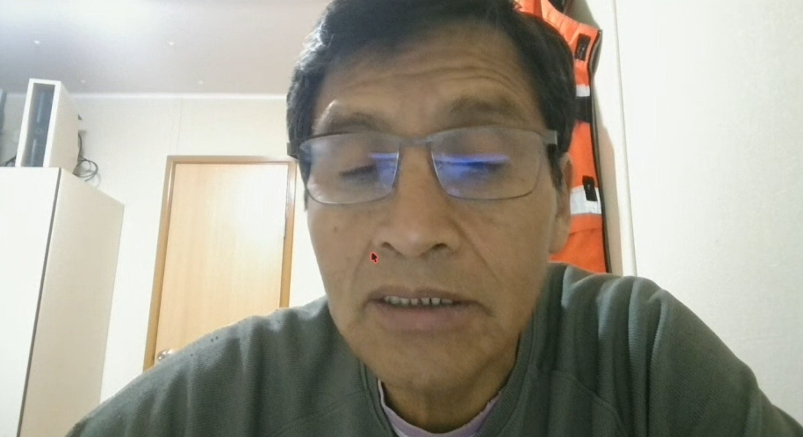
</p>

**Resumen de la entrevista**

A partir de la entrevista realizada a Dante Zavala, de 53 años y residente de El Callao, se identificó que el entrevistado se desempeña como Coordinador de Seguridad Integral en un complejo metalmecánico y patio de fundición en su mismo distrito. Describe que su rutina laboral implica custodiar un predio de casi 15,000 m² con insumos de alto valor (como cobre y bronce) mediante una caseta de monitoreo con 32 cámaras mayoritariamente análogas, pero señala que el resguardo de las zonas críticas depende de candados y llaves físicas, torniquetes peatonales para personal fijo y revisiones manuales con cuadernos en los accesos de carga.

Manifiesta una constante frustración ante la incapacidad de distinguir intrusos de trabajadores autorizados en las cámaras debido al uso obligatorio de EPP pesado (overoles oscuros, cascos y respiradores), lo que facilita el robo interno de metales en zonas como el almacén de lingotes. Relata que las condiciones ambientales extremas (polvo metálico, calor y vibraciones de hornos) y la fauna costera provocan de 4 a 7 falsas alarmas nocturnas en sensores infrarrojos, perdiendo hasta 15 minutos en cada inspección manual. Expone que las brechas de detección son graves, recordando un evento donde dos sujetos vulneraron el perímetro y pasaron inadvertidos durante casi una hora hasta ser descubiertos por casualidad. Añade que la contención recae 100% en el cierre manual de portones con cadenas por falta de controles automáticos, que el ruido industrial de más de 85 dB anula la efectividad de sus radios analógicas, y que auditar incidentes o armar reportes para gerencia le toma días enteros debido a videos borrosos por suciedad en lentes, interfaces lentas de DVR y bitácoras en papel con horas imprecisas.

Finaliza expresando interés en una plataforma con visión computarizada e IA para automatizar la trazabilidad y las alertas tempranas, remarcando que su principal inquietud técnica es la precisión del reconocimiento bajo condiciones de polvo, luz adversa y prendas de seguridad industrial, y estableciendo como requisito indispensable que el sistema se desenergice automáticamente ante siniestros para respetar las normativas de evacuación de INDECI.

---

#### Segmento 2: Personal de Vigilancia In Situ

##### Entrevista 1: Julieta Cordero

| Dato | Información |
|---|---|
| **Nombres y apellidos** | Julieta Cordero |
| **Edad** | 40 años |
| **Distrito de residencia** | Villa El Salvador |
| **Segmento** | Personal de Vigilancia In Situ |
| **Medio de entrevista** | Google Meet |
| **Inicio** | 00:00 |
| **Duración** | 3:29 |
| **Video de la entrevista** | [Ver entrevista en Google Drive](https://drive.google.com/drive/folders/1jC7MRUZ4k6w8-7biKTMAuQqbS1o10VYm?usp=sharing) |

**Evidencia de entrevista**

<p align="center">
  
</p>

**Resumen de la entrevista**

A partir de la entrevista realizada a Julieta Cordero, de 40 años y residente de Villa El Salvador, se identificó que la entrevistada labora como agente de seguridad en un centro logístico ubicado en su mismo distrito, cumpliendo turnos nocturnos rotativos de 12 horas a cargo del patrullaje perimetral y la atención primaria de alertas. Describe que realiza rondas a pie cada 45 minutos marcando puntos de control con un bastón electrónico, cuyo reporte se descarga de forma manual en garita al finalizar la jornada.

Manifiesta una constante sensación de inseguridad e incertidumbre operativa al ser despachada a verificar posibles intrusiones mediante avisos por radio o llamadas telefónicas sin información previa sobre la cantidad de personas, su indumentaria o su nivel de amenaza, llegando a los puntos prácticamente a ciegas. Señala que el traslado físico le toma entre 3 y 6 minutos, viéndose retrasada por la falta de iluminación en el patio de maniobras, obstáculos en pasillos y la apertura manual de portones con candados pesados. Asimismo, expresa frustración por el desgaste físico y mental que causan entre 3 y 5 falsas alarmas por noche generadas por animales, viento o choferes fuera de hora. Explica que la validación de personas en campo depende de solicitar documentos y dictarlos por radio a garita, que utiliza su propio celular de gama media enfrentando problemas de descarga de batería y pérdida de señal bajo techos metálicos, y que la redacción de partes le toma hasta media hora a mano en cuadernos de papel.

Finaliza mostrando una actitud receptiva hacia la implementación de una aplicación móvil que le brinde alertas en tiempo real, precisando que esta debe ser intuitiva, con botones grandes, emitir una señal sonora potente y mostrar de inmediato la fotografía del sujeto junto a su ubicación exacta sin menús complejos, consumiendo el mínimo de batería durante su turno.

---

##### Entrevista 2: Christopher Cabán

| Dato | Información |
|---|---|
| **Nombres y apellidos** | Christopher Cabán |
| **Edad** | 41 años |
| **Distrito de residencia** | Los Olivos |
| **Segmento** | Personal de Vigilancia In Situ |
| **Medio de entrevista** | Google Meet |
| **Inicio** | 00:00 |
| **Duración** | 4:11 |
| **Video de la entrevista** | [Ver entrevista en Google Drive](https://drive.google.com/drive/folders/1jC7MRUZ4k6w8-7biKTMAuQqbS1o10VYm?usp=sharing) |

**Evidencia de entrevista**

<p align="center">
  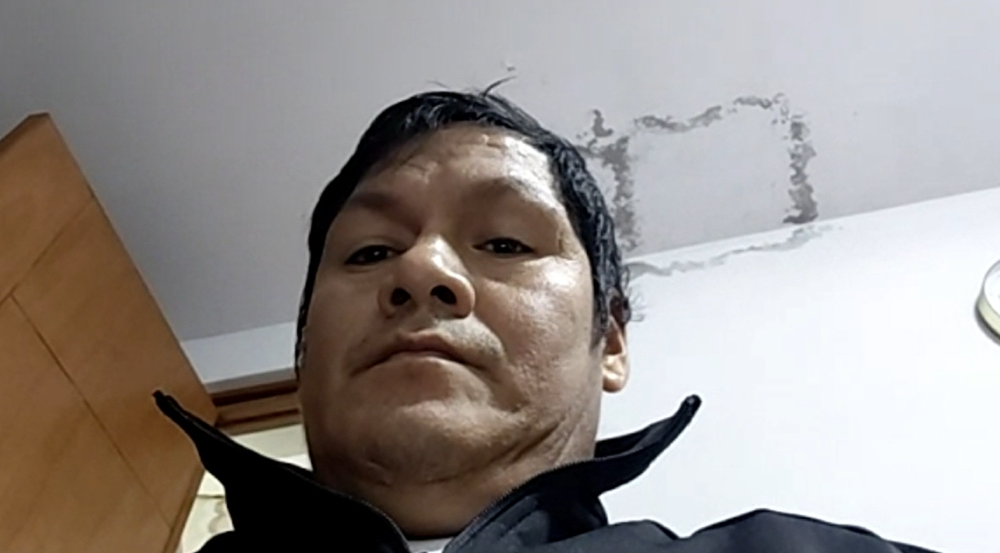
</p>

**Resumen de la entrevista**

A partir de la entrevista realizada a Christopher Cabán, de 41 años y residente de Los Olivos, se identificó que el entrevistado se desempeña como vigilante de seguridad privada en una planta metalmecánica y almacén de insumos en su mismo distrito, cubriendo turnos rotativos tanto diurnos como nocturnos. Describe que su labor involucra el control de accesos peatonales y vehiculares, así como la respuesta a incidencias en talleres y patios mediante rondas horarias registradas con un llavero RFID en tres puntos fijos, recurriendo a anotaciones manuales en una libreta de campo cuando la congestión de camiones retrasa su recorrido.  Manifiesta una constante incertidumbre y sensación de riesgo al atender alertas de posibles intrusos, ya que la caseta le avisa por radio o WhatsApp sin brindarle detalles previos sobre la cantidad de sujetos o su perfil, obligándolo a acudir a oscuras únicamente con su linterna. Señala que llegar al punto comprometido le toma entre 2 y 5 minutos, enfrentando obstáculos como materiales dispersos en el suelo, zonas poco iluminadas y rejas con cadenas o candados desgastados que se atascan. Asimismo, expone frustración por el desgaste operativo que conllevan entre 4 y 5 falsas alarmas por noche generadas por aves, roedores u operarios no avisados. Explica que validar la identidad del personal en planta es difícil debido al uso de overoles, cascos y mascarillas, dependiendo de dictar los datos por radio a garita. En cuanto al aspecto técnico, utiliza su propio celular Android enfrentando problemas de consumo rápido de batería y pérdida total de señal bajo las planchas de fierro de los galpones, mientras que el cierre de informes le toma hasta 40 minutos a mano en el cuaderno de novedades tras un siniestro.  Finaliza manifestando una recepción muy favorable hacia una solución móvil que notifique intrusiones en tiempo real, precisando que la aplicación debe ser de respuesta rápida, evitar solicitudes reiteradas de credenciales, emitir una alarma con volumen muy alto incluso en modo silencio, y proyectar la fotografía del intruso junto a su ubicación exacta mediante un solo toque en pantalla.

---

##### Entrevista 3: Samuel Alzamora

| Dato | Información |
|---|---|
| **Nombres y apellidos** | Samuel Alzamora |
| **Edad** | 20 años |
| **Distrito de residencia** | San Isidro |
| **Segmento** | Personal de Vigilancia In Situ |
| **Medio de entrevista** | Google Meet |
| **Inicio** | 00:00 |
| **Duración** | 4:46 |
| **Video de la entrevista** | [Ver entrevista en Google Drive](https://drive.google.com/drive/folders/1jC7MRUZ4k6w8-7biKTMAuQqbS1o10VYm?usp=sharing) |

**Evidencia de entrevista**

<p align="center">
  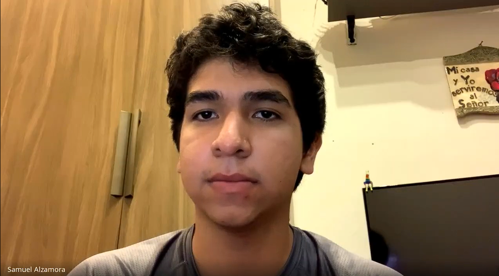
</p>

**Resumen de la entrevista**

A partir de la entrevista realizada a Samuel Alzamora, de 20 años y residente de San Isidro, se identificó que el entrevistado pertenece al segmento de Personal de Vigilancia In Situ y desarrolla actividades relacionadas con la supervisión de accesos, verificación del ingreso de personas y realización de rondas dentro de las instalaciones.

Durante una jornada habitual utiliza diferentes herramientas para realizar sus funciones, principalmente cámaras de seguridad, radio y teléfono celular. También se emplean registros para documentar ingresos y novedades ocurridas durante el turno. Respecto al control de accesos, indicó que cuando una persona intenta ingresar a una zona restringida es necesario verificar su identificación y, en situaciones donde existe alguna duda, consultar con un supervisor o responsable del área, proceso que puede generar demoras cuando la información necesaria no se encuentra disponible inmediatamente.

Ante una situación sospechosa, el personal puede enterarse mediante observación directa durante las rondas, a través de las cámaras de seguridad o mediante comunicación por radio. Después de identificar el evento, debe verificarse lo ocurrido y comunicarlo al supervisor correspondiente para continuar con el protocolo establecido. Una de las principales dificultades identificadas es la imposibilidad de supervisar simultáneamente todas las zonas y cámaras, ya que mientras realiza una ronda física resulta complicado mantener vigilancia constante sobre los demás puntos de la instalación.

Samuel considera que, frente a una posible intrusión, la información más importante es conocer la ubicación exacta del evento, el tipo de alerta y, cuando sea posible, disponer de una imagen de la persona detectada. En cuanto al uso de tecnología, utiliza principalmente celular y radio, aunque señala posibles limitaciones relacionadas con la cobertura de señal y con la dificultad de revisar una pantalla mientras realiza rondas o desplazamientos.

Respecto a SECURIOT, considera que las alertas deben ser rápidas, claras y contener únicamente información relevante. Asimismo, destacó la importancia de reducir las falsas alarmas, debido a que un exceso de notificaciones incorrectas podría disminuir la atención prestada a futuros eventos. Finalmente, señaló que una solución de seguridad debería ser sencilla de utilizar, especialmente durante situaciones de emergencia, donde el personal necesita conocer rápidamente qué ocurrió, dónde ocurrió y qué acción debe realizar.

---

#### Segmento 3: Gerente o Dueño de Pyme Industrial

##### Entrevista 1: Marco Salvador

| Dato | Información |
|---|---|
| **Nombres y apellidos** | Marco Salvador |
| **Edad** | 20 años |
| **Distrito de residencia** | Villa María del Triunfo |
| **Segmento** | Gerente o Dueño de Pyme Industrial |
| **Medio de entrevista** | Google Meet |
| **Inicio** | 00:00 |
| **Duración** | 13:09 |
| **Video de la entrevista** | [Ver entrevista en Google Drive](https://drive.google.com/drive/folders/1jC7MRUZ4k6w8-7biKTMAuQqbS1o10VYm?usp=sharing) |

**Evidencia de entrevista**

<p align="center">
  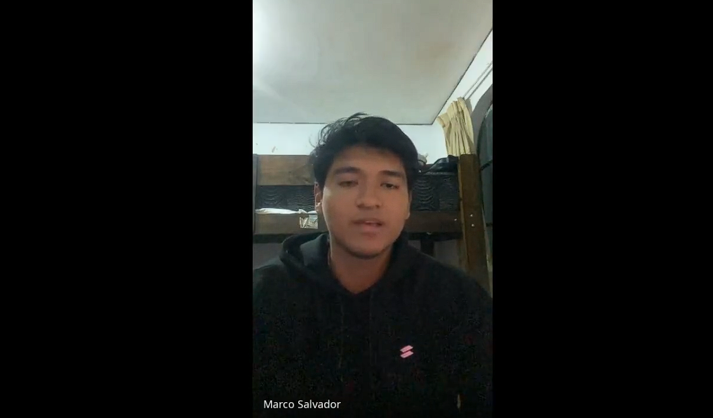
</p>

**Resumen de la entrevista**

A partir de la entrevista realizada a Marco Salvador, de 20 años y residente de Villa María del Triunfo, se identificó que participa en la administración de una pequeña empresa familiar del sector comercial, apoyando principalmente en actividades administrativas, supervisión de operaciones y toma de decisiones relacionadas con gastos y mejoras del negocio. Durante sus actividades utiliza principalmente un teléfono celular y una computadora, mientras que WhatsApp y el correo electrónico se encuentran entre sus principales medios de comunicación.

Respecto a la seguridad patrimonial, señaló que una de sus principales preocupaciones es el ingreso de personas no autorizadas y la posibilidad de pérdida de productos o equipos. La empresa utiliza cámaras de seguridad, cerraduras y mecanismos de control de ingreso. Asimismo, indicó que cuando se encuentra fuera de las instalaciones depende principalmente de llamadas, mensajes o de la revisión de cámaras para conocer el estado de la empresa, por lo que considera útil disponer de una herramienta que centralice la información y permita consultar remotamente el estado de la seguridad.

Al evaluar nuevas tecnologías, considera importantes factores como la confiabilidad, el costo, la facilidad de instalación y el soporte. En relación con SECURIOT, destacó principalmente la utilidad de recibir alertas en tiempo real indicando qué ocurrió y en qué zona se produjo el evento. También manifestó preocupación respecto a las falsas alarmas, debido a que una cantidad excesiva de notificaciones incorrectas podría provocar que los usuarios dejen de prestar atención a las alertas.

---

##### Entrevista 2: Aldair Salas

| Dato | Información |
|---|---|
| **Nombres y apellidos** | Aldair Salas |
| **Edad** | 21 años |
| **Distrito de residencia** | San Borja |
| **Segmento** | Gerente o Dueño de Pyme Industrial |
| **Medio de entrevista** | Google Meet |
| **Inicio** | 00:00 |
| **Duración** | 14:42 |
| **Video de la entrevista** | [Ver entrevista en Google Drive](https://drive.google.com/drive/folders/1jC7MRUZ4k6w8-7biKTMAuQqbS1o10VYm?usp=sharing) |

**Evidencia de entrevista**

<p align="center">
  
</p>

**Resumen de la entrevista**

A partir de la entrevista realizada a Aldair Salas, de 21 años y residente de San Borja, se identificó que participa en la administración de un negocio familiar dedicado a la distribución y comercialización de productos. Sus actividades se encuentran relacionadas principalmente con la organización de operaciones, compras, control de gastos y coordinación con el personal.

Su principal preocupación en materia de seguridad se relaciona con la protección de las zonas donde se almacena mercadería y con evitar que personas ingresen a espacios para los que no poseen autorización. Actualmente se utilizan diferentes mecanismos de seguridad, como cámaras, cerraduras, iluminación y control humano de accesos. Uno de los problemas identificados es que las herramientas utilizadas se encuentran separadas entre sí, obligando a consultar distintas fuentes de información.

Aldair considera beneficioso disponer de una plataforma que permita visualizar remotamente y desde un único lugar el estado de las diferentes instalaciones. En relación con SECURIOT, valoró especialmente la posibilidad de centralizar las alertas y mantener un registro automático de los incidentes. También considera importante que la plataforma sea sencilla de utilizar y que los usuarios reciban una adecuada capacitación para aprovechar sus funcionalidades.

---

##### Entrevista 3: Dania Cárdenas

| Dato | Información |
|---|---|
| **Nombres y apellidos** | Dania Cárdenas |
| **Edad** | 21 años |
| **Distrito de residencia** | Miraflores |
| **Segmento** | Gerente o Dueño de Pyme Industrial |
| **Medio de entrevista** | Google Meet |
| **Inicio** | 00:00 |
| **Duración** | 4:57 |
| **Video de la entrevista** | [Ver entrevista en Google Drive](https://drive.google.com/drive/folders/1jC7MRUZ4k6w8-7biKTMAuQqbS1o10VYm?usp=sharing) |

**Evidencia de entrevista**

<p align="center">
  
</p>

**Resumen de la entrevista**

A partir de la entrevista realizada a Dania Cárdenas, de 21 años y residente de Miraflores, se identificó que participa en la administración de una pequeña empresa familiar, apoyando principalmente en la coordinación de actividades, supervisión general de las operaciones y control de determinados gastos.

Entre sus principales preocupaciones se encuentra el ingreso de personas no autorizadas a determinadas áreas y la protección de productos y equipos que permanecen dentro de las instalaciones. La empresa utiliza cámaras de seguridad, cerraduras y controles manuales de ingreso. Para comunicar situaciones fuera de lo habitual se utilizan principalmente llamadas telefónicas y aplicaciones de mensajería.

Dania considera que uno de los principales problemas de los mecanismos tradicionales es que las cámaras permiten observar o revisar lo sucedido, pero siguen dependiendo de que una persona detecte que algo está ocurriendo. Respecto a SECURIOT, identificó las alertas inmediatas en dispositivos móviles como una de las funcionalidades de mayor valor. Considera que deberían comunicar de manera clara qué ocurrió y dónde ocurrió. Asimismo, considera importante disponer de un historial de incidentes que permita evaluar con el tiempo la efectividad de las medidas de seguridad.

---

### 2.2.3. Análisis de entrevistas

El análisis de las entrevistas se realizó de manera independiente para cada uno de los tres segmentos objetivo de SECURIOT. En total se consideraron **9 entrevistas**, distribuidas equitativamente en **3 participantes por segmento**.

Debido al tamaño de la muestra, los porcentajes presentados tienen un propósito descriptivo y representan únicamente los patrones encontrados entre los participantes entrevistados. Para cada segmento, una coincidencia entre los tres entrevistados representa el **100%**, entre dos representa el **66.7%** y en un entrevistado representa el **33.3%**.

---

#### Análisis del Segmento 1: Administrador de Seguridad Patrimonial

El segmento de Administradores de Seguridad Patrimonial estuvo compuesto por tres participantes con edades de **42, 52 y 53 años**, obteniéndose una edad promedio de aproximadamente **49 años**. Los entrevistados desarrollan actividades de supervisión de seguridad dentro de instalaciones industriales, logísticas o productivas y poseen responsabilidad sobre sistemas de vigilancia, accesos y respuesta ante incidentes.

A partir de las entrevistas se identificó una fuerte dependencia de infraestructuras de seguridad compuestas por múltiples herramientas que no necesariamente se encuentran integradas. Los tres entrevistados mencionaron el uso combinado de cámaras, controles físicos, registros manuales y personal de vigilancia.

| Característica identificada | Entrevistados | Porcentaje |
|---|---:|---:|
| Utilizan sistemas de seguridad compuestos por diferentes herramientas y mecanismos físicos | 3 de 3 | 100% |
| Presentan dificultades para identificar rápidamente personas autorizadas y no autorizadas | 3 de 3 | 100% |
| Reportan problemas relacionados con falsas alarmas | 3 de 3 | 100% |
| Presentan dificultades de comunicación durante la atención de incidentes | 3 de 3 | 100% |
| La respuesta ante incidentes depende principalmente de la intervención física del personal | 3 de 3 | 100% |
| La recopilación de evidencias y elaboración de reportes requiere procesos manuales o lentos | 3 de 3 | 100% |
| Mostraron interés en automatizar la detección, trazabilidad y generación de alertas | 3 de 3 | 100% |
| Mencionaron requisitos técnicos de confiabilidad, integración o adaptación al entorno existente | 3 de 3 | 100% |
| Consideran necesario respetar las condiciones y normas de evacuación de las instalaciones | 3 de 3 | 100% |

Uno de los hallazgos más relevantes es la dificultad para identificar personas dentro de zonas críticas. En los tres casos existen factores que complican el reconocimiento visual, como la presencia de contratistas, alta rotación de trabajadores, prendas similares o el uso de equipos de protección personal.

También se identificó un problema generalizado relacionado con las **falsas alarmas**. Los tres participantes mencionaron este fenómeno, producido por factores ambientales, animales u otras condiciones del entorno. Estas alertas requieren verificación humana y consumen tiempo del personal, aumentando el riesgo de que una alerta real no reciba la prioridad necesaria.

Asimismo, el **100% de los entrevistados depende de la intervención física del personal de vigilancia** para verificar o contener una situación. Esto demuestra que los sistemas actuales funcionan principalmente como herramientas de observación y no necesariamente como sistemas capaces de apoyar activamente la respuesta.

Otro problema común es la generación de evidencia y reportes. Los entrevistados señalaron dificultades para consultar grabaciones, integrar registros y elaborar indicadores posteriormente. En algunos casos estas actividades requieren varias horas o incluso días de trabajo.

En consecuencia, para este segmento SECURIOT debe priorizar:

- Alertas automáticas oportunas y verificables.
- Reducción de falsos positivos.
- Identificación y validación de accesos.
- Centralización de eventos y evidencias.
- Generación de información histórica e indicadores.
- Compatibilidad con infraestructura previamente instalada.
- Operación adecuada en condiciones industriales adversas.
- Cumplimiento de las normas de seguridad y evacuación.

---

#### Análisis del Segmento 2: Personal de Vigilancia In Situ

El segmento de Personal de Vigilancia In Situ estuvo compuesto por participantes de **20, 40 y 41 años**, obteniéndose una edad promedio aproximada de **33.7 años**.

Los tres participantes desarrollan actividades relacionadas con rondas, control de accesos, supervisión de instalaciones y respuesta directa ante posibles incidentes. Debido a la naturaleza de sus funciones, trabajan principalmente en movimiento y requieren recibir información mientras se desplazan dentro de las instalaciones.

| Característica identificada | Entrevistados | Porcentaje |
|---|---:|---:|
| Realizan rondas, control de accesos o verificación directa de incidentes | 3 de 3 | 100% |
| Utilizan celular y radio como herramientas de comunicación | 3 de 3 | 100% |
| Presentan dificultades relacionadas con señal, batería o uso del dispositivo durante las rondas | 3 de 3 | 100% |
| Consideran importante conocer la ubicación exacta de una alerta | 3 de 3 | 100% |
| Consideran útil disponer de una imagen o información contextual antes de llegar al incidente | 3 de 3 | 100% |
| Identifican las falsas alarmas como un problema que debe reducirse | 3 de 3 | 100% |
| Prefieren alertas simples, rápidas y fáciles de interpretar | 3 de 3 | 100% |
| Actualmente elaboran o utilizan registros manuales de incidencias | 2 de 3 | 66.7% |
| Manifestaron recibir información insuficiente antes de acudir físicamente a una alerta | 2 de 3 | 66.7% |

El hallazgo principal de este segmento es que el personal debe responder físicamente ante una alerta, pero no siempre dispone de suficiente información antes de desplazarse hacia el lugar.

Julieta Cordero y Christopher Cabán señalaron explícitamente que pueden ser enviados a verificar una posible intrusión sin conocer previamente la cantidad de personas involucradas o las características de la situación. Esta condición incrementa la incertidumbre y el riesgo durante la respuesta.

Los tres participantes coincidieron en que una alerta útil debería proporcionar información inmediata relacionada con:

- Ubicación exacta.
- Tipo de evento.
- Imagen o referencia visual.
- Información suficiente para determinar la prioridad de la situación.

Otro patrón importante corresponde a las limitaciones tecnológicas del entorno de trabajo. El **100% utiliza celular y radio**, pero también se identificaron dificultades relacionadas con pérdida de señal, consumo de batería y dificultad para utilizar una pantalla mientras se realizan desplazamientos.

Las falsas alarmas constituyen nuevamente un problema importante. Julieta y Christopher describieron múltiples falsas alarmas durante sus turnos, mientras que Samuel señaló que reducir este tipo de notificaciones es indispensable para evitar que el personal pierda confianza o atención frente a futuras alertas.

En términos de experiencia de usuario, los tres entrevistados mostraron preferencia por una solución que requiera pocas interacciones y presente solamente la información necesaria durante una emergencia.

Por lo tanto, para este segmento SECURIOT debe priorizar:

- Aplicación móvil orientada a acciones rápidas.
- Alertas con ubicación exacta.
- Evidencia visual inmediata del evento.
- Información clara sobre el tipo de incidente.
- Interfaz sencilla y con pocos pasos.
- Alertas perceptibles en ambientes industriales.
- Bajo consumo de batería.
- Funcionamiento adecuado ante conectividad limitada.
- Reducción significativa de falsas alarmas.

---

#### Análisis del Segmento 3: Gerente o Dueño de Pyme Industrial

El tercer segmento estuvo compuesto por tres participantes de **20, 21 y 21 años**, obteniéndose una edad promedio aproximada de **20.7 años**.

Los tres entrevistados participan en actividades administrativas, de supervisión o de toma de decisiones dentro de pequeñas empresas y mostraron preocupación principalmente por la protección de activos y el ingreso de personas no autorizadas.

| Característica identificada | Entrevistados | Porcentaje |
|---|---:|---:|
| Consideran el acceso no autorizado una preocupación de seguridad | 3 de 3 | 100% |
| Utilizan actualmente cámaras, cerraduras o controles tradicionales de acceso | 3 de 3 | 100% |
| Perciben valor en automatizar o centralizar información de seguridad | 3 de 3 | 100% |
| Consideran valiosas las alertas automáticas ante posibles incidentes | 3 de 3 | 100% |
| Valoran poder supervisar remotamente o centralizar información | 2 de 3 | 66.7% |
| Consideran importante disponer de un historial automático de incidentes | 2 de 3 | 66.7% |
| Manifestaron explícitamente preocupación por falsas alarmas | 1 de 3 | 33.3% |

En los tres casos se identificó que las empresas todavía utilizan mecanismos tradicionales como cámaras, cerraduras y controles de ingreso. Si bien estas herramientas permiten cierto nivel de protección, los entrevistados identificaron limitaciones relacionadas con la necesidad de supervisión humana y la dispersión de información.

Marco Salvador destacó la necesidad de poder conocer remotamente el estado de la empresa y recibir alertas en tiempo real. Aldair Salas hizo énfasis en centralizar herramientas que actualmente funcionan de manera separada y mantener un registro automático de los incidentes. Dania Cárdenas señaló que las cámaras permiten revisar lo ocurrido, pero siguen dependiendo de que una persona detecte previamente una situación.

Por lo tanto, los tres entrevistados mostraron interés en pasar de un modelo principalmente reactivo a uno donde la tecnología participe activamente en la detección y comunicación del incidente.

También se identificó interés en la generación de información histórica. Aldair y Dania destacaron el valor de conservar registros de incidentes que posteriormente permitan revisar qué ocurrió y evaluar el desempeño de las medidas de seguridad.

Para este segmento SECURIOT debe priorizar:

- Visibilidad general del estado de seguridad de la empresa.
- Alertas automáticas ante situaciones relevantes.
- Acceso remoto a información de seguridad.
- Centralización de diferentes fuentes de información.
- Historial de eventos e incidentes.
- Información comprensible para usuarios no especializados en seguridad.
- Evidencia que permita evaluar el funcionamiento y valor de la solución.

---

#### Análisis general de los tres segmentos

Al comparar los nueve entrevistados se identifican necesidades diferentes de acuerdo con el rol que cada segmento desempeña dentro del proceso de seguridad.

El **Administrador de Seguridad Patrimonial** necesita controlar el sistema, revisar evidencias, reducir falsas alarmas y contar con información que permita supervisar la operación.

El **Personal de Vigilancia In Situ** necesita información inmediata que le permita responder físicamente ante una situación de riesgo con mayor rapidez y menor incertidumbre.

El **Gerente o Dueño de Pyme Industrial** necesita una visión simplificada de la seguridad, acceso remoto a información y evidencia que permita determinar si la solución está generando valor para la organización.

A pesar de estas diferencias, se identificaron patrones transversales.

| Hallazgo transversal | Entrevistados | Porcentaje |
|---|---:|---:|
| Se identifica valor en contar con alertas más rápidas, automáticas o contextualizadas | 9 de 9 | 100% |
| Las falsas alarmas aparecen explícitamente como una preocupación relevante | 7 de 9 | 77.8% |
| Existen procesos fragmentados, manuales o dependientes de distintas herramientas | 7 de 9 | 77.8% |
| Los factores técnicos del entorno, integración o conectividad condicionan el uso de la solución | 6 de 9 | 66.7% |

El principal patrón transversal es la necesidad de **reducir el tiempo entre la detección de un evento y la respuesta del personal**. Los tres segmentos perciben valor en recibir información automáticamente en lugar de depender únicamente de observación humana, rondas o revisión posterior de cámaras.

También se observa que SECURIOT no debería limitarse a generar una alarma. La información entregada debe tener suficiente contexto para permitir que el usuario comprenda rápidamente la situación. De acuerdo con las entrevistas, los datos más relevantes son la **ubicación, tipo de evento, evidencia visual, hora y estado de la alerta**.

La reducción de falsas alarmas constituye otro aspecto crítico. El **77.8% de los participantes** manifestó explícitamente preocupación por este problema. Una cantidad elevada de falsas alertas puede incrementar la carga operativa y reducir progresivamente la confianza de los usuarios en la plataforma.

Finalmente, los resultados muestran que SECURIOT debe ofrecer experiencias diferentes según el rol del usuario. El personal de vigilancia necesita una experiencia móvil sencilla y orientada a la respuesta inmediata; los administradores necesitan herramientas de monitoreo, configuración, trazabilidad y análisis; mientras que los gerentes requieren información consolidada que permita supervisar resultados y evaluar el valor de la solución.

---

#### Principales hallazgos para SECURIOT

A partir del análisis de las nueve entrevistas se establecen los siguientes hallazgos principales:

1. **La alerta debe proporcionar contexto y no únicamente advertir de un evento.**  
   Debe permitir conocer rápidamente qué ocurrió, dónde ocurrió y, cuando sea posible, mostrar evidencia visual.

2. **La reducción de falsas alarmas es fundamental para mantener la confianza en el sistema.**  
   Una plataforma que genere demasiadas alertas incorrectas puede aumentar la carga del personal y provocar que alertas reales sean ignoradas.

3. **El personal de vigilancia necesita una experiencia específicamente diseñada para movilidad.**  
   La aplicación debe considerar condiciones reales como poca señal, consumo de batería, ruido, iluminación deficiente y necesidad de operar rápidamente.

4. **Los administradores requieren trazabilidad y centralización.**  
   SECURIOT debe facilitar la consulta de eventos, evidencias y datos históricos sin depender de diferentes grabadores, registros manuales o sistemas separados.

5. **La solución debe complementar la infraestructura existente.**  
   La compatibilidad con cámaras, dispositivos y mecanismos ya instalados puede ser determinante para facilitar su adopción y reducir costos de implementación.

6. **La solución debe apoyar la toma de decisiones en distintos niveles.**  
   Mientras el vigilante necesita información operacional inmediata, el administrador requiere control y análisis, y la gerencia necesita información resumida sobre resultados e incidentes.

7. **La automatización debe mantener mecanismos de validación humana.**  
   La tecnología debe ayudar a priorizar y detectar eventos, pero debe permitir que el personal confirme situaciones ambiguas antes de ejecutar acciones críticas.

En conjunto, los hallazgos respaldan la propuesta de SECURIOT como una solución orientada a transformar un modelo de seguridad principalmente reactivo y fragmentado en uno **proactivo, centralizado y basado en alertas contextualizadas**, manteniendo al personal responsable dentro del proceso de validación y respuesta.

## 2.3. Needfinding

### 2.3.1. User Personas

Las siguientes User Personas sintetizan los patrones identificados en las entrevistas de los segmentos Administrador de Seguridad Patrimonial, Personal de Vigilancia In Situ y Gerente o Dueño de Pyme Industrial. Cada ficha representa un arquetipo construido a partir de los objetivos, necesidades, frustraciones, comportamientos, herramientas y motivaciones documentados en el apartado 2.2.

#### Administrador de Seguridad Patrimonial

<p align="center">
  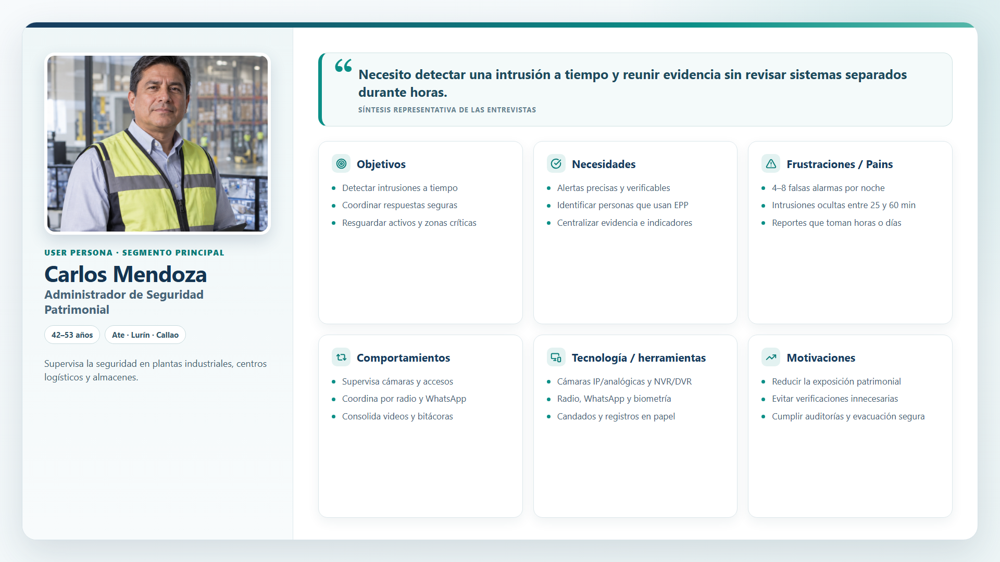
</p>

**Interpretación analítica.** Este arquetipo necesita confianza operativa antes que mayor cantidad de información: las alertas deben ser oportunas, precisas y verificables. La compatibilidad con la infraestructura existente, la reducción de falsos positivos, la trazabilidad y el cumplimiento de las normas de evacuación condicionan la aceptación de SECURIOT.

#### Personal de Vigilancia In Situ

<p align="center">
  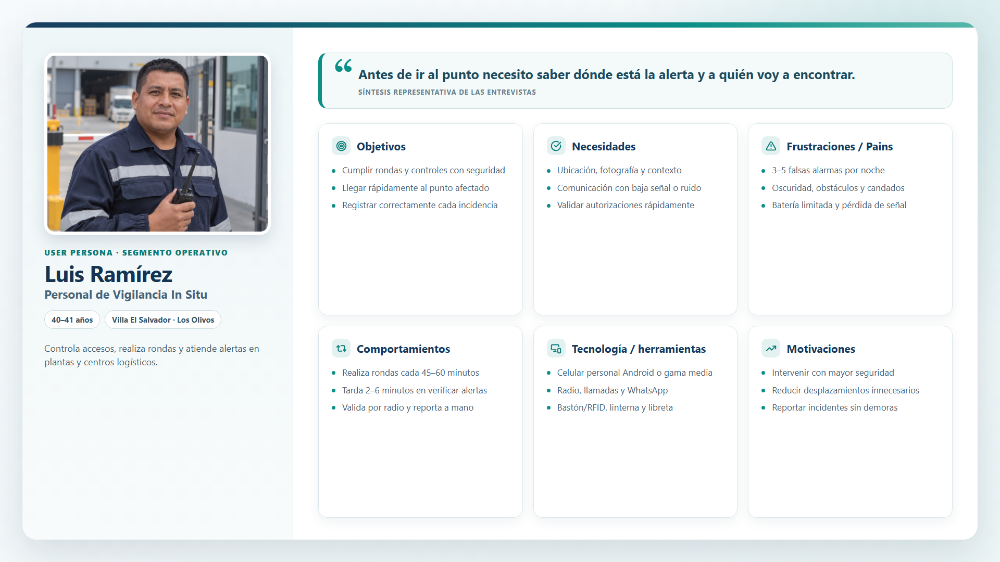
</p>

**Interpretación analítica.** Este arquetipo opera bajo presión, en movimiento y con conectividad limitada. SECURIOT debe priorizar información inmediata y fácil de interpretar, reducir los pasos durante la atención y considerar las restricciones reales de batería, señal, ruido e iluminación del entorno industrial.

#### Gerente o Dueño de Pyme Industrial

<p align="center">
  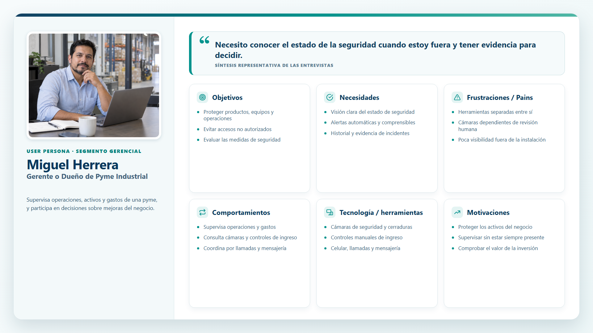
</p>

**Interpretación analítica.** Este arquetipo necesita una visión clara y consolidada de la seguridad para supervisar el negocio incluso cuando no se encuentra en las instalaciones. Las alertas comprensibles, el acceso remoto y el historial de incidentes le permiten proteger los activos y evaluar el funcionamiento y el valor de las medidas de seguridad.

### 2.3.2. User Task Matrix

La User Task Matrix compara las tareas actuales del Administrador de Seguridad Patrimonial, el Personal de Vigilancia In Situ y el Gerente o Dueño de Pyme Industrial. Cada actividad se valora cualitativamente por su frecuencia e importancia según las responsabilidades, rutinas y situaciones descritas en las entrevistas y sintetizadas en las User Personas. La frecuencia se considera alta cuando la tarea es continua o propia de cada turno, media cuando es periódica o depende de la ocurrencia de incidentes y baja cuando se realiza ocasionalmente; la importancia refleja su incidencia sobre la protección de personas, activos y operaciones.

| Task | Administrador de Seguridad Patrimonial |  | Personal de Vigilancia In Situ |  | Gerente o Dueño de Pyme Industrial |  |
|---|---:|---:|---:|---:|---:|---:|
|  | Frecuencia | Importancia | Frecuencia | Importancia | Frecuencia | Importancia |
| Supervisar instalaciones y zonas de seguridad | Alta | Alta | Alta | Alta | Media | Alta |
| Controlar accesos peatonales y vehiculares | Alta | Alta | Alta | Alta | Baja | Alta |
| Verificar identidades y autorizaciones | Media | Alta | Alta | Alta | No aplica | No aplica |
| Realizar rondas de vigilancia | No aplica | No aplica | Alta | Alta | No aplica | No aplica |
| Verificar alertas e incidentes | Alta | Alta | Alta | Alta | Baja | Alta |
| Coordinar la respuesta ante incidentes | Media | Alta | Media | Alta | Baja | Alta |
| Comunicar y escalar situaciones de riesgo | Media | Alta | Media | Alta | Baja | Alta |
| Registrar ingresos, incidencias y novedades | Media | Alta | Alta | Alta | No aplica | No aplica |
| Recopilar y revisar evidencia de incidentes | Media | Alta | Media | Media | Baja | Alta |
| Elaborar reportes e indicadores de seguridad | Media | Alta | No aplica | No aplica | No aplica | No aplica |
| Revisar resultados de las medidas de seguridad | Media | Alta | No aplica | No aplica | Media | Alta |
| Decidir gastos y mejoras de seguridad | Baja | Media | No aplica | No aplica | Media | Alta |

Las tareas de mayor frecuencia se concentran en la operación cotidiana. El Administrador de Seguridad Patrimonial supervisa continuamente instalaciones, zonas, accesos y alertas, mientras que el Personal de Vigilancia In Situ añade la ejecución de rondas, la verificación directa y el registro de novedades durante cada turno. En el caso del Gerente o Dueño de Pyme Industrial, la supervisión general y la revisión de resultados presentan una frecuencia media, pues corresponden a actividades periódicas de gestión y no a la vigilancia permanente.

Las actividades de mayor importancia son la supervisión de las instalaciones, el control y la validación de accesos, la verificación de incidentes y la coordinación de la respuesta. Estas tareas inciden directamente en la protección de personas, productos, equipos y operaciones. La supervisión, la atención de incidentes, la comunicación de riesgos y la revisión de evidencias constituyen los principales puntos de coincidencia entre dos o más arquetipos, aunque cada uno participa con un alcance diferente.

Las diferencias responden al nivel de responsabilidad. El Personal de Vigilancia In Situ concentra las tareas operativas y la intervención física; el Administrador de Seguridad Patrimonial coordina, supervisa, consolida evidencia y elabora reportes; y el Gerente o Dueño de Pyme Industrial revisa resultados y toma decisiones sobre gastos y mejoras. De esta manera, la matriz distingue la ejecución en campo, la supervisión de la operación de seguridad y la gestión estratégica del negocio sin asociar las tareas a una herramienta tecnológica específica.

### 2.3.3. User Journey Mapping

Los siguientes User Journey Maps representan el recorrido actual de los tres arquetipos definidos en la sección 2.3.1. Cada mapa describe el escenario previo a la implementación de SECURIOT, desde que aparece una posible anomalía hasta que el incidente queda registrado. Para su elaboración se tomaron como base los patrones comunes identificados en las entrevistas del apartado 2.2, especialmente los canales utilizados, los tiempos de respuesta, las limitaciones del entorno y los puntos de mayor tensión durante la atención.

#### Administrador de Seguridad Patrimonial

En el caso de Carlos Mendoza, el recorrido comienza con la supervisión de cámaras, controles de acceso y bitácoras que funcionan de manera separada. Cuando se presenta una anomalía, debe decidir si se trata de una amenaza real o de otra falsa alarma, coordinar con el personal de vigilancia y esperar la verificación física. El momento más crítico ocurre durante la validación y contención, porque la comunicación puede fallar y no existe un mecanismo centralizado que reúna el contexto del evento. Después de atenderlo, todavía debe consolidar grabaciones, registros y horarios para preparar la evidencia.

<p align="center">
  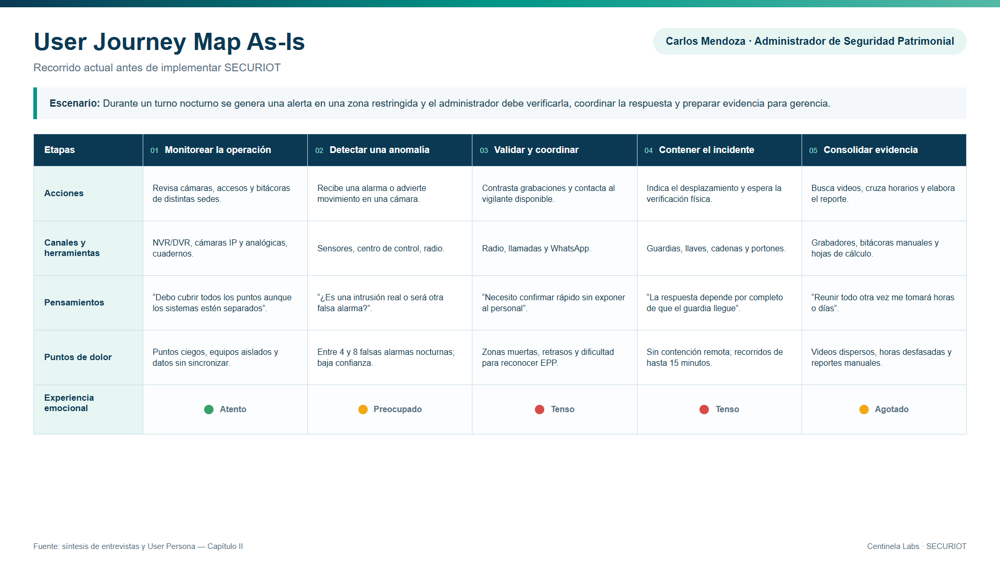
</p>

Este recorrido muestra que el problema no se limita a detectar una intrusión. La mayor carga aparece al confirmar la alerta, coordinar una respuesta segura y reconstruir posteriormente lo sucedido. Por ello, una solución para este segmento debe reducir la fragmentación de la información sin quitar al administrador el control de la validación.

#### Personal de Vigilancia In Situ

Para Luis Ramírez, el recorrido parte de una ronda habitual y cambia cuando recibe un aviso por radio, llamada o WhatsApp. En ese momento suele conocer muy poco sobre la situación y necesita pedir datos adicionales antes de desplazarse. La experiencia alcanza su punto de mayor tensión mientras interpreta el aviso y llega al lugar, pues debe enfrentar zonas oscuras, obstáculos, interferencia y una posible amenaza sin suficiente contexto. Una vez verificado el incidente, el proceso termina con un registro manual que puede tomar entre 30 y 40 minutos.

<p align="center">
  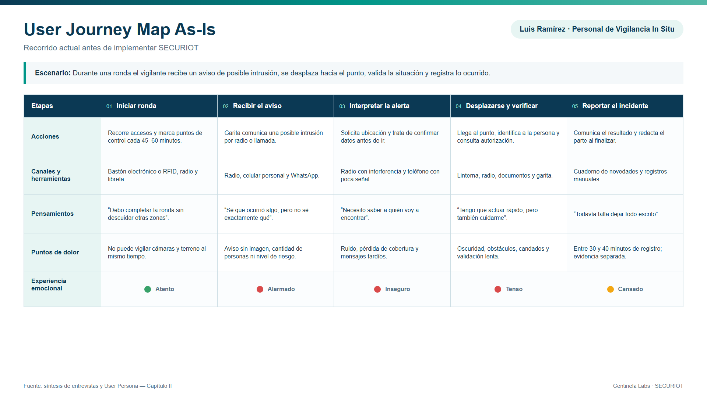
</p>

El mapa evidencia que la rapidez de una alerta no basta por sí sola. El vigilante necesita recibir ubicación, tipo de evento y una referencia visual antes de exponerse en campo. También requiere una interacción breve, perceptible en ambientes industriales y capaz de funcionar bajo restricciones de batería o conectividad.

#### Gerente o Dueño de Pyme Industrial

Para Miguel Herrera, el recorrido no ocurre en el lugar del incidente sino a la distancia. Su día transcurre supervisando la operación del negocio y, cuando surge una posible anomalía, se entera a través de una llamada o un mensaje del personal en sitio. A partir de ese aviso queda a la espera de que alguien confirme lo que sucede, con poca visibilidad directa y sin una fuente única que reúna el estado real de la seguridad. El punto de mayor tensión aparece cuando debe tomar una decisión —autorizar una acción, avisar a un tercero o acudir personalmente— con información incompleta y fragmentada. Una vez resuelto el incidente, todavía necesita reconstruir lo ocurrido a partir de reportes y grabaciones dispersas para evaluar el desempeño de sus medidas de seguridad y justificar la inversión.

<p align="center">
  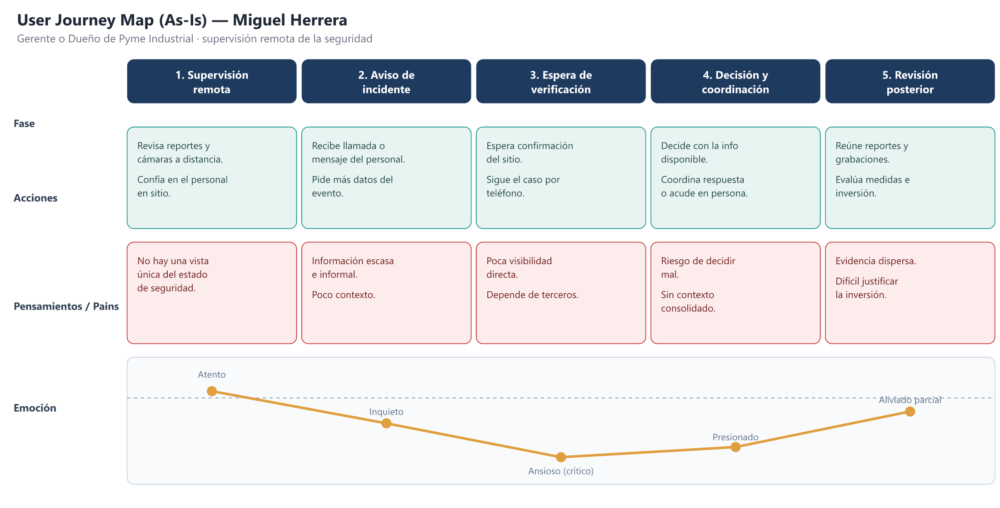
</p>

Este recorrido evidencia que la carga del gerente no está en la operación diaria sino en la falta de visibilidad remota y de evidencia consolidada. Una solución para este segmento debe ofrecerle una vista clara del estado de seguridad desde cualquier lugar, alertas comprensibles y un historial confiable que respalde sus decisiones sin exigirle presencia física.

### 2.3.4. Empathy Mapping

Los Empathy Maps reúnen lo que cada arquetipo expresa, piensa, hace y siente frente al proceso actual de seguridad patrimonial. Las frases incluidas son síntesis representativas de los hallazgos y no citas textuales de una sola entrevista. Esta distinción permite conservar los patrones compartidos por los participantes sin atribuir a una persona afirmaciones que corresponden al conjunto del segmento.

#### Administrador de Seguridad Patrimonial

Carlos busca mantener el control de la operación y responder con evidencia verificable. Aunque está dispuesto a incorporar automatización, su confianza depende de la precisión de las alertas, la compatibilidad con la infraestructura instalada y el respeto por las rutas de evacuación. Su frustración se concentra en los puntos ciegos, las falsas alarmas y el tiempo que emplea en reunir información dispersa para auditorías o reportes gerenciales.

<p align="center">
  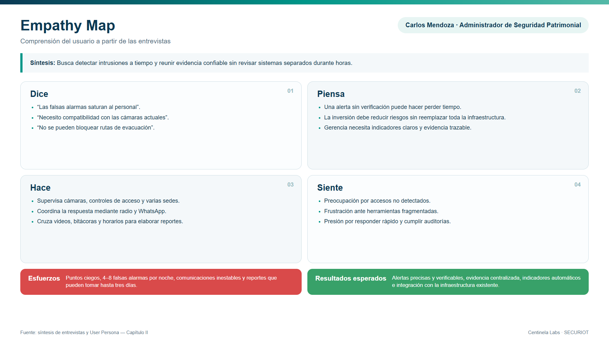
</p>

El mapa permite observar que este usuario no necesita recibir más datos, sino información mejor organizada y confiable. SECURIOT debe ayudarlo a verificar eventos, coordinar al equipo y consultar evidencia desde un mismo entorno, manteniendo siempre la posibilidad de intervención humana.

#### Personal de Vigilancia In Situ

Luis desarrolla sus tareas bajo presión y en constante movimiento. Antes de intervenir necesita entender qué está ocurriendo, dónde se encuentra el evento y qué nivel de riesgo puede enfrentar. Las alertas poco claras, la pérdida de señal y las verificaciones manuales aumentan su incertidumbre; además, las falsas alarmas y el registro posterior elevan el cansancio durante turnos extensos.

<p align="center">
  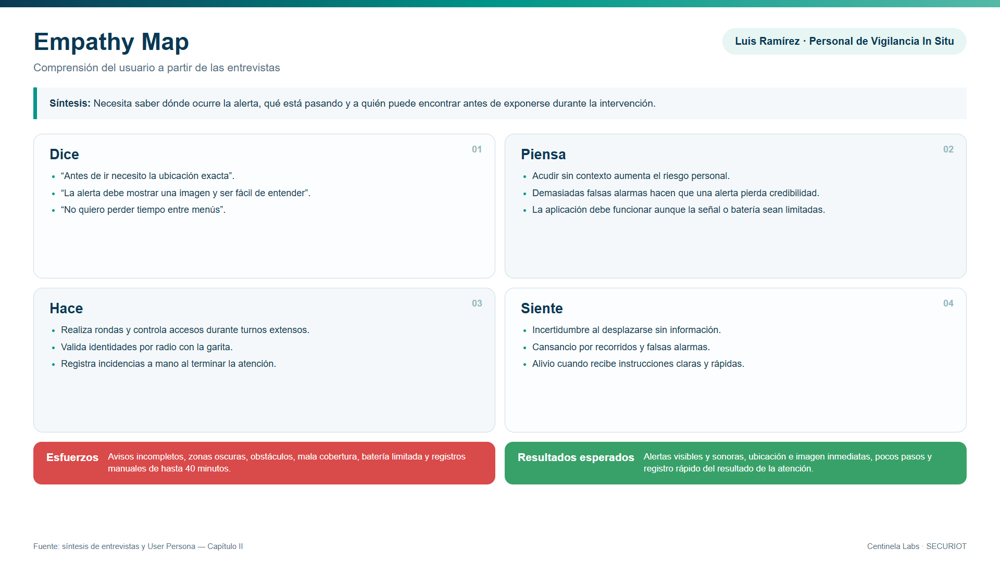
</p>

Para este arquetipo, la experiencia debe priorizar información inmediata y acciones simples. Una alerta útil debe ser visible y sonora, mostrar ubicación e imagen, y permitir registrar el resultado con pocos pasos. Estas condiciones responden directamente a las restricciones de señal, batería, ruido e iluminación descritas por los entrevistados.

#### Gerente o Dueño de Pyme Industrial

Miguel evalúa la seguridad desde una mirada de negocio: le preocupa proteger los activos y la continuidad de la operación más que la ejecución diaria del monitoreo. Está dispuesto a invertir, pero necesita comprobar que esa inversión rinde y confiar en el sistema aun cuando no está presente. Su frustración se concentra en las herramientas separadas y costosas, en la dependencia de la revisión humana y en la escasa visibilidad que tiene cuando se encuentra fuera de la instalación.

<p align="center">
  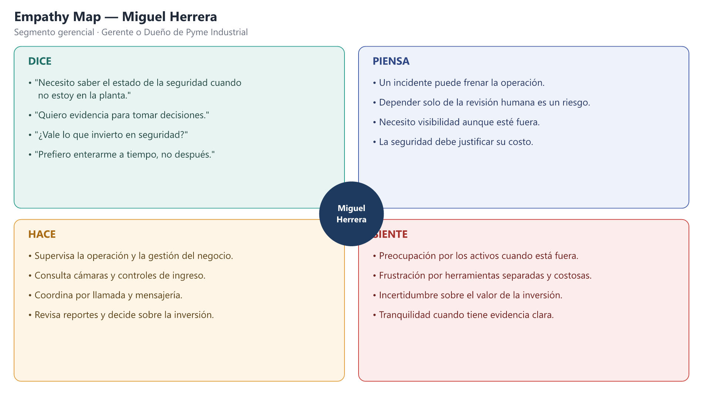
</p>

El mapa muestra que este usuario valora la tranquilidad y la evidencia por encima del detalle operativo. SECURIOT debe brindarle una visión consolidada y remota del estado de seguridad, alertas claras que no exijan interpretación técnica y un historial de incidentes que le permita decidir y demostrar el valor de la solución.

## 2.4. Big Picture EventStorming

_Pendiente de desarrollo._

## 2.5. Ubiquitous Language

El Ubiquitous Language de SECURIOT unifica los términos utilizados por el equipo y los stakeholders dentro del dominio de seguridad física, control de accesos y monitoreo de instalaciones. Este glosario establece un significado común para cada concepto y evita interpretaciones diferentes durante el análisis, diseño y validación de la solución.

| Term | Spanish Equivalent | Definition |
|---|---|---|
| Access Authorization | Autorización de acceso | Permiso vigente asignado a una persona para ingresar a una sede, zona de seguridad o área restringida bajo las condiciones establecidas por la organización. |
| Access Control | Control de accesos | Conjunto de verificaciones y medidas empleadas para regular la entrada y salida de personas o vehículos en una sede o zona. |
| Access Decision | Decisión de acceso | Resultado de una validación de acceso que determina si el ingreso se autoriza, se deniega o requiere verificación manual. |
| Access Point | Punto de acceso | Lugar físico por el que una persona o vehículo entra o sale de una sede o zona, como una puerta, portón, torniquete o bahía de carga. |
| Access Validation | Validación de acceso | Comprobación realizada ante un intento de ingreso para determinar si la persona posee una autorización de acceso válida. |
| Alarm | Alarma | Señal audible o visual activada localmente en una instalación para advertir sobre una situación que requiere atención. |
| Alert | Alerta | Notificación que requiere evaluación o acción del personal de seguridad porque una detección o lectura cumple una regla de alerta. |
| Alert Rule | Regla de alerta | Condición del negocio que determina cuándo una detección o lectura debe generar una alerta y con qué severidad. |
| Alert Severity | Severidad de alerta | Clasificación del nivel de urgencia o riesgo asociado a una alerta, utilizada para priorizar la respuesta. |
| Alert Status | Estado de alerta | Situación de una alerta dentro de su atención operativa, que permite conocer si continúa activa o ya fue atendida. |
| Authorized Person | Persona autorizada | Persona cuya identidad ha sido validada y que posee permiso vigente para ingresar a una sede o área determinada. |
| Camera | Cámara | Equipo que captura imágenes o video de una zona para apoyar la identificación de personas y la verificación de eventos. |
| Contractor | Contratista | Persona externa que realiza labores temporales dentro de una instalación y cuyo acceso debe autorizarse según la zona y actividad asignadas. |
| Detection | Detección | Identificación de la presencia de una persona, objeto o condición relevante dentro de una zona supervisada. Una detección no constituye por sí sola una intrusión. |
| Device | Dispositivo | Unidad física instalada en un punto de acceso, perímetro o zona para observar condiciones del entorno y apoyar acciones de seguridad. |
| Device Status | Estado del dispositivo | Condición operativa de un dispositivo que indica si se encuentra disponible para observar y comunicar información de la zona asignada. |
| Door Lock | Cerradura de puerta | Mecanismo físico o electromecánico que asegura un punto de acceso y puede accionarse como parte de un protocolo de respuesta sin comprometer las rutas de evacuación. |
| Event Traceability | Trazabilidad de eventos | Capacidad de reconstruir qué ocurrió, dónde, cuándo y qué acciones se realizaron durante un evento de seguridad. |
| Evidence | Evidencia | Conjunto de imágenes, videos, registros y datos horarios conservados para investigar y sustentar un incidente de seguridad. |
| False Alarm | Falsa alarma | Alerta o alarma que, luego de ser verificada, no corresponde a una intrusión ni a una amenaza real. |
| Incident Report | Reporte de incidente | Documento que reúne la secuencia de hechos, las zonas y personas involucradas, las acciones ejecutadas y la evidencia disponible de un incidente. |
| Industrial SME Manager or Owner | Gerente o dueño de pyme industrial | Responsable de supervisar el desempeño general del negocio, evaluar las medidas de seguridad y decidir sobre gastos o mejoras destinados a proteger sus activos y operaciones. |
| Intrusion | Intrusión | Presencia o ingreso no autorizado de una persona dentro del perímetro de una sede o en un área restringida. |
| Monitoring Center | Centro de monitoreo | Espacio desde el cual el personal de seguridad supervisa cámaras, zonas, alertas y comunicaciones de una o más instalaciones. |
| Multi-Site Monitoring | Monitoreo multisede | Supervisión centralizada de la seguridad de varias sedes pertenecientes a una misma organización. |
| On-Site Security Guard | Personal de vigilancia in situ | Usuario operativo que realiza rondas, verifica alertas en campo, controla accesos y ejecuta el protocolo de respuesta dentro de la instalación. |
| Perimeter | Perímetro | Límite físico exterior de una sede cuya vulneración puede representar un ingreso no autorizado. |
| Protected Asset | Activo protegido | Bien de valor que debe resguardarse frente a robos, daños o accesos indebidos, como inventario, maquinaria, insumos o equipos. |
| Reading | Lectura | Observación generada por un dispositivo en un momento determinado, como una apertura, movimiento o detección de cámara, y asociada al dispositivo y la zona donde se originó. |
| Response Protocol | Protocolo de respuesta | Secuencia de acciones que el personal responsable debe ejecutar después de detectar o confirmar una amenaza o intrusión. |
| Restricted Area | Área restringida | Zona de seguridad cuyo ingreso exige una autorización específica debido al valor de sus activos, la sensibilidad de sus operaciones o el riesgo asociado. |
| Security Administrator | Administrador de seguridad patrimonial | Responsable de supervisar la seguridad de una o más sedes, gestionar zonas y accesos, revisar alertas y consolidar evidencia e indicadores. |
| Security Event | Evento de seguridad | Hecho registrado dentro de una sede relacionado con un acceso, una detección o una condición observada por un dispositivo. |
| Security Incident | Incidente de seguridad | Evento de seguridad confirmado que compromete o pone en riesgo personas, activos u operaciones y requiere respuesta o investigación. |
| Security Patrol | Ronda de vigilancia | Recorrido periódico realizado por el personal de vigilancia para comprobar el estado de puntos de control y zonas de una instalación. |
| Security Zone | Zona de seguridad | Área física delimitada dentro de una sede que se administra y supervisa como una unidad de seguridad; puede contener uno o más dispositivos y no necesariamente es de acceso restringido. |
| Sensor | Sensor | Componente de un dispositivo que observa una condición física, como movimiento, apertura o distancia, y produce una lectura. |
| Site | Sede | Instalación física administrada como una ubicación independiente, como una planta, fábrica, almacén, centro de distribución u oficina corporativa. |
| Threat | Amenaza | Persona, presencia o situación que puede comprometer la seguridad de los activos, las personas o la continuidad de las operaciones. |
| Unauthorized Access | Acceso no autorizado | Intento o ingreso realizado por una persona que no posee autorización válida para la sede o zona correspondiente. |
| Unidentified Person | Persona no identificada | Persona detectada cuya identidad no puede determinarse con la información disponible y que debe ser validada antes de autorizar su acceso. |
| Visitor | Visitante | Persona externa que ingresa temporalmente a una instalación y requiere autorización para acceder a las zonas permitidas. |

# Capítulo III: Requirements Specification

La especificación de requisitos de SECURIOT traduce los segmentos objetivo, las Feature Assumptions y las Hypothesis Statements del Capítulo I en artefactos accionables para el desarrollo: User Stories con criterios de aceptación en formato Gherkin, un Impact Mapping que conecta el objetivo de negocio con las funcionalidades, y un Product Backlog priorizado y estimado con Story Points. Los actores considerados corresponden a los tres segmentos objetivo (ver sección 1.3): **Administrador de Seguridad Patrimonial** (usuario principal), **Personal de Vigilancia in situ** (usuario operativo) y **Gerente/Dueño de la pyme industrial** (usuario secundario), además del **Visitante** de la Landing Page y de las Technical Stories que sostienen la plataforma.

## 3.1. User Stories

Las User Stories se agrupan en ocho épicas alineadas con las seis Feature Assumptions del Lean UX Canvas (sección 1.2.2.2), más una épica de Landing Page y una de Technical Stories. Cada historia se redacta en español y sus criterios de aceptación se expresan como escenarios Gherkin en inglés (`Given / When / Then`).

### Épica EP-01: Monitoreo de estado de zonas y dispositivos (HS-01)

**US-01 — Registro de dispositivo IoT en una zona**
**Como** administrador de seguridad patrimonial **quiero** registrar un dispositivo IoT y asociarlo a una zona restringida **para** monitorear ese punto de acceso desde la plataforma.

```gherkin
Scenario: Successful device registration in a zone
  Given the administrator is authenticated on the web dashboard
  And is on the "Devices" section of a selected site
  When they register a new device with a valid identifier and assign it to a restricted zone
  Then the device appears in the zone's device list with status "online"
  And the device starts reporting telemetry to the Cloud API
```

**US-02 — Monitoreo en tiempo real del estado de zonas y dispositivos**
**Como** administrador de seguridad **quiero** ver en tiempo real el estado de las zonas y dispositivos de una sede **para** identificar de un vistazo qué punto de acceso está comprometido.

```gherkin
Scenario: Real-time status is displayed
  Given the administrator is viewing the monitoring panel of a site
  When a device changes its status from "online" to "alarm"
  Then the panel updates that device within 5 seconds without a manual refresh
  And the affected zone is highlighted as compromised
```

**US-03 — Detalle de un dispositivo**
**Como** administrador de seguridad **quiero** abrir el detalle de un dispositivo **para** revisar sus últimas lecturas y su configuración.

```gherkin
Scenario: View device detail
  Given the administrator selects a device from the list
  When the device detail view opens
  Then it shows the device identifier, zone, current status and the last telemetry readings
```

### Épica EP-02: Registro y validación de zonas y accesos restringidos (HS-02)

**US-04 — Registro de zona restringida**
**Como** administrador de seguridad **quiero** registrar una zona restringida **para** definir dónde se controlarán los accesos.

```gherkin
Scenario: Register a restricted zone
  Given the administrator is on the "Zones" section of a site
  When they create a zone with a name, location and access level
  Then the zone is saved and becomes available to associate devices and authorized people
```

**US-05 — Validación automática de acceso a zona restringida**
**Como** personal de vigilancia **quiero** que el sistema valide automáticamente si una persona detectada está autorizada **para** no depender solo de la inspección manual.

```gherkin
Scenario: Access granted for an authorized person
  Given a device detects a person entering a restricted zone
  When the person matches the zone's authorized list
  Then the event is logged as "authorized access"
  And no intrusion alert is raised

Scenario: Access denied for an unidentified person
  Given a device detects a person entering a restricted zone
  When the person does not match the zone's authorized list
  Then an intrusion alert is raised for that zone
```

**US-06 — Gestión de personas autorizadas**
**Como** administrador de seguridad **quiero** administrar la lista de personas autorizadas por zona **para** mantener actualizado quién puede ingresar.

```gherkin
Scenario: Add an authorized person to a zone
  Given the administrator is managing a restricted zone
  When they add a person with valid identification data
  Then that person is included in the zone's authorized list for future validations
```

### Épica EP-03: Motor de alertas basado en reglas (HS-03)

**US-07 — Configuración de reglas de alerta**
**Como** administrador de seguridad **quiero** configurar reglas de alerta sobre las lecturas de los sensores **para** que la notificación se dispare apenas se detecte una intrusión.

```gherkin
Scenario: Create an alert rule
  Given the administrator is on the "Alert rules" section
  When they define a rule with a condition, a target zone and a severity level
  Then the rule is activated and evaluated against incoming telemetry
```

**US-08 — Notificación inmediata de intrusión**
**Como** personal de vigilancia **quiero** recibir una notificación inmediata ante una intrusión detectada **para** trasladarme al punto de acceso comprometido sin esperar una ronda.

```gherkin
Scenario: Guard receives an intrusion notification
  Given an active alert rule for a restricted zone
  When an intrusion event matches that rule
  Then the on-site guard receives a push notification within 10 seconds
  And the notification includes the zone, device and timestamp
```

**US-09 — Atención y cierre de una alerta**
**Como** personal de vigilancia **quiero** actualizar el estado de una alerta que atendí **para** dejar registro de la respuesta ejecutada.

```gherkin
Scenario: Update alert status after response
  Given the guard opens an active alert
  When they mark it as "attended" and add a response note
  Then the alert changes to "attended" with the guard, note and timestamp recorded
```

### Épica EP-04: Registro histórico y trazabilidad (HS-04)

**US-10 — Consulta del historial de eventos**
**Como** administrador de seguridad **quiero** consultar el historial de eventos filtrado por sede, zona y fecha **para** auditar lo ocurrido.

```gherkin
Scenario: Filter the event history
  Given the administrator is on the "Event history" section
  When they filter by site, zone and a date range
  Then the list shows only the events matching the filters, ordered by most recent
```

**US-11 — Exportación de reporte de incidente**
**Como** gerente de la pyme **quiero** exportar un reporte trazable de un incidente **para** presentarlo a la aseguradora o a las autoridades.

```gherkin
Scenario: Export an incident report
  Given a logged security incident with its associated events and telemetry
  When the manager exports the incident report
  Then a document is generated with the timeline, involved devices and evidence references
```

**US-12 — Telemetría histórica por dispositivo**
**Como** administrador de seguridad **quiero** ver la telemetría histórica de un dispositivo **para** analizar su comportamiento en el tiempo.

```gherkin
Scenario: View historical telemetry
  Given the administrator opens a device detail
  When they select a past date range
  Then the historical readings for that device are displayed for the selected period
```

### Épica EP-05: Dashboard Web y aplicación Mobile (HS-05)

**US-13 — Dashboard de indicadores**
**Como** gerente de la pyme **quiero** un dashboard con indicadores agregados **para** evaluar si el servicio justifica su costo.

```gherkin
Scenario: View aggregated indicators
  Given the manager is authenticated
  When they open the dashboard
  Then it shows the number of active alerts, incidents by zone and response times for their sites
```

**US-14 — Aplicación móvil para el personal de vigilancia**
**Como** personal de vigilancia **quiero** usar la app móvil durante mis rondas **para** recibir alertas y atenderlas desde el celular.

```gherkin
Scenario: Attend an alert from the mobile app
  Given the guard is logged into the mobile app
  When an intrusion alert arrives
  Then the app shows the alert detail and lets the guard mark it as attended in the field
```

**US-15 — Autenticación de usuarios**
**Como** usuario de la plataforma **quiero** autenticarme de forma segura **para** acceder solo a la información de mi empresa.

```gherkin
Scenario: Successful authentication
  Given a registered user with valid credentials
  When they log in
  Then they access only the sites and data belonging to their organization
```

### Épica EP-06: Gestión remota multi-sede (HS-06)

**US-16 — Administración de múltiples sedes**
**Como** administrador de seguridad **quiero** gestionar varias sedes desde una sola cuenta **para** supervisar más de una planta o almacén sin cambiar de herramienta.

```gherkin
Scenario: Manage multiple sites from one account
  Given an administrator responsible for more than one site
  When they access their account
  Then they can list and manage all sites assigned to their organization
```

**US-17 — Cambio de sede activa en el panel**
**Como** administrador de seguridad **quiero** cambiar la sede activa en el panel **para** enfocar el monitoreo en una instalación específica.

```gherkin
Scenario: Switch active site
  Given the administrator manages several sites
  When they select a different site in the panel
  Then the zones, devices and alerts shown correspond to the selected site
```

### Épica EP-07: Landing Page (captación y comunicación de valor)

**US-18 — Comprensión de la propuesta de valor**
**Como** visitante de la Landing Page **quiero** entender qué resuelve SECURIOT **para** decidir si es relevante para mi empresa.

```gherkin
Scenario: Value proposition is clear
  Given a visitor opens the landing page
  When the page loads
  Then it presents the problem, the SECURIOT solution and its main benefits for industrial SMEs
```

**US-19 — Solicitud de demostración / contacto**
**Como** visitante interesado **quiero** solicitar una demo o dejar mis datos de contacto **para** que el equipo comercial se comunique conmigo.

```gherkin
Scenario: Submit a demo request
  Given a visitor is on the landing page
  When they submit the contact form with valid data
  Then the request is registered and a confirmation message is shown
```

**US-20 — Landing accesible y multilenguaje**
**Como** visitante **quiero** que la Landing Page sea accesible y esté disponible en español e inglés **para** consultarla sin barreras de idioma ni de accesibilidad.

```gherkin
Scenario: Language and accessibility support
  Given a visitor opens the landing page
  When they switch the language selector
  Then the content is shown in the chosen language (Spanish/English)
  And the page meets basic accessibility criteria (labels, contrast and keyboard navigation)
```

### Épica EP-08: Technical Stories (plataforma y cumplimiento)

**US-21 — Procesamiento en el borde tolerante a desconexión**
**Como** integrante técnico del equipo **quiero** que la Edge API procese y reencole la telemetría cuando se pierde conexión con la nube **para** no perder eventos de seguridad ante fallas de red.

```gherkin
Scenario: Edge buffers telemetry while offline
  Given the Edge API loses connection with the Cloud API
  When devices keep reporting telemetry
  Then the Edge API stores the readings locally
  And forwards them to the Cloud API once the connection is restored
```

**US-22 — Despliegue con contenedores y CI/CD**
**Como** integrante técnico del equipo **quiero** empaquetar los servicios con Docker y automatizar el despliegue **para** garantizar entornos reproducibles siguiendo GitFlow.

```gherkin
Scenario: Containerized build and deploy
  Given the source code of a service on the develop branch
  When the pipeline builds the Docker image
  Then the image is produced and the service can be deployed in a reproducible environment
```

**US-23 — Cumplimiento de protección de datos personales**
**Como** integrante técnico del equipo **quiero** tratar las imágenes y datos de personas conforme a la Ley N° 29733 y privacidad por diseño **para** cumplir la normativa peruana de protección de datos.

```gherkin
Scenario: Personal data is handled under compliance rules
  Given the platform processes images and identification data of people
  When these data are stored or transmitted
  Then access is restricted, the data are protected, and their treatment complies with Law N° 29733
```

## 3.2. Impact Mapping

El Impact Mapping (técnica de Gojko Adzic) conecta el objetivo de negocio de SECURIOT con las funcionalidades a construir, respondiendo cuatro preguntas encadenadas: **Why** (Goal) → **Who** (Actors) → **How** (Impacts, cambios de comportamiento) → **What** (Deliverables, features/User Stories). El objetivo se deriva de los *Business Outcomes* del Lean UX Canvas (sección 1.2.2.4).

> **Goal (Why):** Aumentar en un **20% las suscripciones activas** de pymes industriales y logísticas y alcanzar una **tasa de renovación del 80%** al cierre del primer periodo contratado, durante los primeros 12 meses de operación en Lima Metropolitana.

<div align="center">
  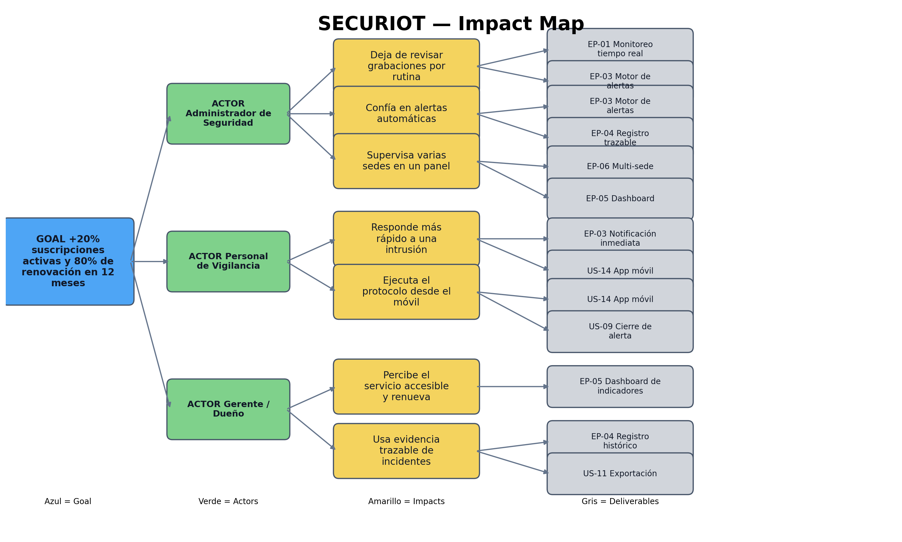
</div>

**Tablero (Miro):** https://miro.com/app/board/uXjVHpKEo50=/

El Impact Mapping se detalla en la siguiente tabla:

| Goal (Why) | Actor (Who) | Impact (How) | Deliverable (What) |
|---|---|---|---|
| **+20% suscripciones y 80% renovación en 12 meses** | Administrador de Seguridad | Deja de revisar grabaciones por rutina | EP-01 Monitoreo tiempo real · EP-03 Motor de alertas |
| | Administrador de Seguridad | Confía en alertas automáticas sin verificación previa | EP-03 Motor de alertas · EP-04 Registro trazable |
| | Administrador de Seguridad | Supervisa varias sedes desde un solo panel | EP-06 Gestión multi-sede · EP-05 Dashboard |
| | Personal de Vigilancia | Responde más rápido a una intrusión real | EP-03 Notificación inmediata · US-14 App móvil |
| | Personal de Vigilancia | Ejecuta el protocolo desde el celular en ronda | US-14 App móvil · US-09 Cierre de alerta |
| | Gerente / Dueño | Percibe el servicio como accesible y renueva | EP-05 Dashboard de indicadores |
| | Gerente / Dueño | Usa evidencia trazable con aseguradoras y autoridades | EP-04 Registro histórico · US-11 Exportación de incidente |

## 3.3. Product Backlog

El Product Backlog consolida las User Stories de la sección 3.1 priorizadas y estimadas con **Story Points** (escala de Fibonacci: 1, 2, 3, 5, 8). La prioridad usa la escala del cronograma del equipo (**P0** crítico → **P3** deseable) y se ordena de mayor a menor prioridad. El *Sprint sugerido* propone una distribución inicial para el Sprint Planning.

**Tablero del Product Backlog (Trello):** https://trello.com/b/EzAo1DBl/securiot-product-backlog

<div align="center">
  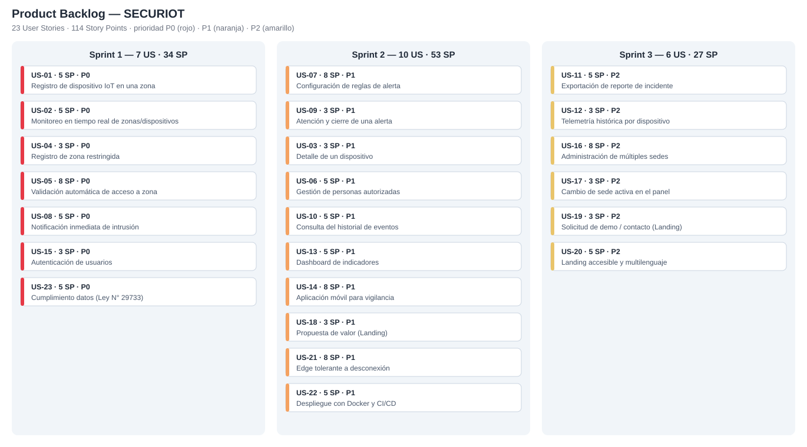
</div>

| # | Épica | ID | User Story | Prioridad | Story Points | Sprint sugerido |
|---|---|---|---|---|---|---|
| 1 | EP-01 | US-01 | Registro de dispositivo IoT en una zona | P0 | 5 | Sprint 1 |
| 2 | EP-01 | US-02 | Monitoreo en tiempo real de zonas y dispositivos | P0 | 5 | Sprint 1 |
| 3 | EP-02 | US-04 | Registro de zona restringida | P0 | 3 | Sprint 1 |
| 4 | EP-02 | US-05 | Validación automática de acceso a zona restringida | P0 | 8 | Sprint 1 |
| 5 | EP-03 | US-08 | Notificación inmediata de intrusión | P0 | 5 | Sprint 1 |
| 6 | EP-05 | US-15 | Autenticación de usuarios | P0 | 3 | Sprint 1 |
| 7 | EP-08 | US-23 | Cumplimiento de protección de datos (Ley N° 29733) | P0 | 5 | Sprint 1 |
| 8 | EP-03 | US-07 | Configuración de reglas de alerta | P1 | 8 | Sprint 2 |
| 9 | EP-03 | US-09 | Atención y cierre de una alerta | P1 | 3 | Sprint 2 |
| 10 | EP-01 | US-03 | Detalle de un dispositivo | P1 | 3 | Sprint 2 |
| 11 | EP-02 | US-06 | Gestión de personas autorizadas | P1 | 5 | Sprint 2 |
| 12 | EP-04 | US-10 | Consulta del historial de eventos | P1 | 5 | Sprint 2 |
| 13 | EP-05 | US-13 | Dashboard de indicadores | P1 | 5 | Sprint 2 |
| 14 | EP-05 | US-14 | Aplicación móvil para vigilancia | P1 | 8 | Sprint 2 |
| 15 | EP-07 | US-18 | Comprensión de la propuesta de valor (Landing) | P1 | 3 | Sprint 2 |
| 16 | EP-08 | US-21 | Procesamiento en el borde tolerante a desconexión | P1 | 8 | Sprint 2 |
| 17 | EP-08 | US-22 | Despliegue con contenedores y CI/CD | P1 | 5 | Sprint 2 |
| 18 | EP-04 | US-11 | Exportación de reporte de incidente | P2 | 5 | Sprint 3 |
| 19 | EP-04 | US-12 | Telemetría histórica por dispositivo | P2 | 3 | Sprint 3 |
| 20 | EP-06 | US-16 | Administración de múltiples sedes | P2 | 8 | Sprint 3 |
| 21 | EP-06 | US-17 | Cambio de sede activa en el panel | P2 | 3 | Sprint 3 |
| 22 | EP-07 | US-19 | Solicitud de demostración / contacto (Landing) | P2 | 3 | Sprint 3 |
| 23 | EP-07 | US-20 | Landing accesible y multilenguaje | P2 | 5 | Sprint 3 |

**Resumen de estimación**

| Prioridad | N° de historias | Story Points |
|---|---|---|
| P0 | 7 | 34 |
| P1 | 10 | 53 |
| P2 | 6 | 27 |
| **Total** | **23** | **114** |

# Capítulo IV: Solution Software Design

## 4.1. Strategic-Level Domain-Driven Design

El diseño estratégico de SecurIoT divide el dominio según la responsabilidad de negocio y el lenguaje que necesita cada parte del sistema, no según la tecnología, el repositorio o el proceso donde se ejecuta. Esta separación permite que la detección local, la gestión de dispositivos, la autenticación y el monitoreo evolucionen sin mezclar reglas que responden a objetivos distintos.

El análisis parte de los eventos, comandos, actores y políticas identificados en el EventStorming. A partir de ellos se reconocieron cuatro bounded contexts y se clasificaron según su aporte al producto:

| Bounded Context | Responsabilidad estratégica | Clasificación | Fuente de verdad |
|---|---|---|---|
| **Identidad y Acceso** | Autenticar usuarios y emitir credenciales confiables para el resto de la plataforma | Genérico | Usuarios y credenciales |
| **Gestión de Zonas y Dispositivos** | Administrar zonas, dispositivos, propietarios y claves de dispositivo | Soporte | Zonas, dispositivos y `apiKey` |
| **Monitoreo y Alertas** | Convertir lecturas de sensores en información consultable y alertas accionables | Core | Lecturas y alertas persistidas en la nube |
| **Detección y Relay de Borde** | Evaluar detecciones, ejecutar respuestas locales y asegurar la entrega posterior de telemetría | Core | Buffer local, estado de sincronización y decisiones inmediatas de borde |

Los dos contextos core concentran la ventaja diferencial de SecurIoT: responder con baja latencia aun cuando la conexión con la nube no está disponible y transformar las observaciones del entorno en alertas trazables. Los contextos genérico y de soporte aportan las capacidades necesarias para proteger, identificar y organizar esas operaciones, pero no contienen por sí mismos la lógica que diferencia al producto.

La integración entre contextos sigue cuatro principios:

1. **Propiedad explícita de la información.** Cada concepto tiene un único contexto responsable. Otros contextos consumen identificadores o contratos publicados, pero no redefinen sus reglas.
2. **Contratos pequeños y estables.** Identidad y Acceso publica un JWT; Gestión de Zonas y Dispositivos publica identificadores y claves; Detección y Relay de Borde publica lecturas compatibles con el contrato de telemetría.
3. **Consistencia acorde al riesgo.** El Edge toma decisiones inmediatas de seguridad y conserva un buffer local, mientras la nube consolida el registro histórico mediante operaciones idempotentes.
4. **Independencia lógica sobre la infraestructura actual.** Aunque varios contextos de la Cloud API comparten PostgreSQL durante el MVP, sus modelos, reglas y responsabilidades permanecen separados. Compartir una base de datos no convierte esos contextos en un único dominio.

Las siguientes subsecciones muestran cómo se descubrieron estos límites, cómo circulan los mensajes entre ellos, cuáles son sus contratos y cómo se materializan en la arquitectura de software.

### 4.1.1. Design-Level EventStorming


El Design-Level EventStorming de SecurIoT organiza los comandos, reglas de negocio, agregados y eventos que soportan sus procesos de seguridad. El modelado establece las responsabilidades y los límites de consistencia de Identidad y Acceso, Gestión de Zonas y Dispositivos, Detección y Relay de Borde y Monitoreo y Alertas, mostrando cómo colaboran desde el registro de un dispositivo y la detección local de una amenaza hasta la sincronización de lecturas y la generación de alertas.

#### 4.1.1.1. Candidate Context Discovery

Agrupamos los eventos y comandos del dominio segun quien es dueno de la decision de negocio, no segun el repositorio de codigo donde vive hoy. De ese analisis salen cuatro contextos delimitados:

1. **Identidad y Acceso**: quien puede entrar al sistema y con que credenciales.
2. **Gestion de Zonas y Dispositivos**: que zonas existen, que dispositivos estan asignados a cada una y quien es su propietario.
3. **Monitoreo y Alertas**: que paso en una zona (lecturas de sensores) y si eso amerita una alerta.
4. **Deteccion y Relay de Borde**: que ve la camara en el sitio, si eso es una persona u objeto no permitido, y como reaccionar en el momento (pan/tilt, cerradura, buzzer) sin depender de la nube.

Monitoreo y Alertas y Deteccion y Relay de Borde son los subdominios core: ahi vive la logica que distingue a SecurIoT de un CRUD generico de sensores. Identidad y Acceso es un subdominio generico (JWT estandar, sin reglas propias del negocio). Gestion de Zonas y Dispositivos es subdominio de soporte: necesario para que los otros dos tengan sentido, pero no es, por si solo, la ventaja del producto.

#### 4.1.1.2. Domain Message Flows Modeling

El modelado de mensajes conecta los resultados del EventStorming con los límites definidos para cada bounded context. Un **comando** expresa la intención de realizar una acción; un **evento de dominio** registra un hecho que ya ocurrió; y una **política** decide qué comando debe ejecutarse después de observar un evento o una condición. Los mensajes se nombran con el lenguaje ubicuo del contexto que los produce.

| Elemento | Representación | Ejemplo |
|---|---|---|
| Actor o sistema externo | Verde | Administrador de seguridad, ESP32 |
| Comando | Azul | Registrar dispositivo |
| Evento de dominio | Naranja | Dispositivo registrado |
| Política o decisión | Morado | Evaluar regla de alerta |

**Flujo 1: autenticación y aprovisionamiento de una zona**

El administrador primero obtiene una identidad autenticada. Esa identidad, publicada dentro del JWT, habilita la creación de una zona propia y el registro de un dispositivo. Gestión de Zonas y Dispositivos conserva el ownership y emite la clave que luego identifica al dispositivo físico.

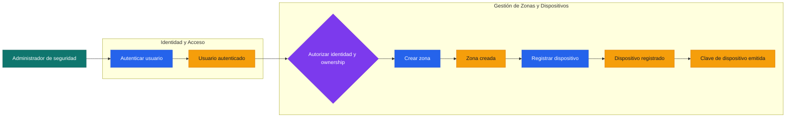
```mermaid
flowchart LR
    A1[Administrador de seguridad]

    subgraph IAM[Identidad y Acceso]
        C1[Autenticar usuario]
        E1[Usuario autenticado]
    end

    subgraph ZDM[Gestión de Zonas y Dispositivos]
        P1{Autorizar identidad y ownership}
        C2[Crear zona]
        E2[Zona creada]
        C3[Registrar dispositivo]
        E3[Dispositivo registrado]
        E4[Clave de dispositivo emitida]
    end

    A1 --> C1 --> E1 --> P1 --> C2 --> E2 --> C3 --> E3 --> E4

    classDef actor fill:#0f766e,color:#ffffff,stroke:#115e59;
    classDef command fill:#2563eb,color:#ffffff,stroke:#1d4ed8;
    classDef event fill:#f59e0b,color:#111827,stroke:#d97706;
    classDef policy fill:#7c3aed,color:#ffffff,stroke:#6d28d9;
    class A1 actor;
    class C1,C2,C3 command;
    class E1,E2,E3,E4 event;
    class P1 policy;
```

**Flujo 2: detección y respuesta inmediata en el borde**

El ESP32 envía una lectura o un frame candidato, pero no decide si existe una intrusión. Detección y Relay de Borde procesa la observación, aplica el debounce y calcula la respuesta local. Toda observación se bufferiza como una lectura; las acciones de puerta solo se solicitan cuando la detección alcanza el umbral configurado y el cooldown del dispositivo lo permite.

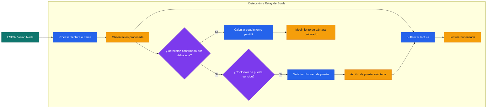
```mermaid
flowchart LR
    A2[ESP32 Vision Node]

    subgraph EDGE[Detección y Relay de Borde]
        C4[Procesar lectura o frame]
        E5[Observación procesada]
        P2{¿Detección confirmada por debounce?}
        C5[Calcular seguimiento pan/tilt]
        E6[Movimiento de cámara calculado]
        P3{¿Cooldown de puerta vencido?}
        C6[Solicitar bloqueo de puerta]
        E7[Acción de puerta solicitada]
        C7[Bufferizar lectura]
        E8[Lectura bufferizada]
    end

    A2 --> C4 --> E5
    E5 --> C7 --> E8
    E5 --> P2
    P2 -->|Sí| C5 --> E6
    P2 -->|Sí| P3
    P3 -->|Sí| C6 --> E7 --> C7

    classDef actor fill:#0f766e,color:#ffffff,stroke:#115e59;
    classDef command fill:#2563eb,color:#ffffff,stroke:#1d4ed8;
    classDef event fill:#f59e0b,color:#111827,stroke:#d97706;
    classDef policy fill:#7c3aed,color:#ffffff,stroke:#6d28d9;
    class A2 actor;
    class C4,C5,C6,C7 command;
    class E5,E6,E7,E8 event;
    class P2,P3 policy;
```

**Flujo 3: relay confiable y generación de alertas**

El scheduler del Edge intenta entregar cada lectura pendiente usando el contrato de telemetría de la nube y la `apiKey` emitida por Gestión de Zonas y Dispositivos. Si la entrega falla, la lectura permanece en SQLite y una política de backoff programa el siguiente intento. Cuando la Cloud API la acepta, Monitoreo y Alertas la registra de forma idempotente y evalúa sus reglas. Una lectura riesgosa genera como máximo una alerta gracias a la unicidad de `reading_id`.

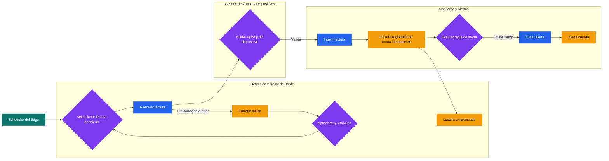
```mermaid
flowchart LR
    A3[Scheduler del Edge]

    subgraph EDGE2[Detección y Relay de Borde]
        P4{Seleccionar lectura pendiente}
        C8[Reenviar lectura]
        E9[Entrega fallida]
        P5{Aplicar retry y backoff}
        E10[Lectura sincronizada]
    end

    subgraph ZDM2[Gestión de Zonas y Dispositivos]
        P6{Validar apiKey del dispositivo}
    end

    subgraph MON[Monitoreo y Alertas]
        C9[Ingerir lectura]
        E11[Lectura registrada de forma idempotente]
        P7{Evaluar regla de alerta}
        C10[Crear alerta]
        E12[Alerta creada]
    end

    A3 --> P4 --> C8 --> P6
    P6 -->|Válida| C9 --> E11 --> E10
    E11 --> P7
    P7 -->|Existe riesgo| C10 --> E12
    C8 -->|Sin conexión o error| E9 --> P5 --> P4

    classDef actor fill:#0f766e,color:#ffffff,stroke:#115e59;
    classDef command fill:#2563eb,color:#ffffff,stroke:#1d4ed8;
    classDef event fill:#f59e0b,color:#111827,stroke:#d97706;
    classDef policy fill:#7c3aed,color:#ffffff,stroke:#6d28d9;
    class A3 actor;
    class C8,C9,C10 command;
    class E9,E10,E11,E12 event;
    class P4,P5,P6,P7 policy;
```

Los flujos establecen dos dependencias principales. Detección y Relay de Borde actúa como upstream de Monitoreo y Alertas y adapta sus lecturas locales al contrato de telemetría mediante una Anticorruption Layer. Gestión de Zonas y Dispositivos también es upstream de Monitoreo y Alertas porque publica los identificadores y las credenciales de dispositivo que permiten aceptar una lectura. Identidad y Acceso no participa en la ingesta desde el hardware: su JWT protege las operaciones ejecutadas por usuarios en las aplicaciones Web y Mobile.

#### 4.1.1.3. Bounded Context Canvases

**Identidad y Acceso**

| Campo | Detalle |
|---|---|
| Proposito | Autenticar usuarios y emitir el token que el resto de la plataforma confia sin volver a consultar este contexto |
| Clasificacion estrategica | Generico |
| Lenguaje ubicuo | Usuario, credenciales, token de acceso |
| Entidad raiz | `User` (email, passwordHash) |
| Contrato publicado | `POST /auth/login` devuelve un `access_token` JWT firmado; los demas contextos lo validan localmente contra `JWT_SECRET`, sin llamada de vuelta |
| Implementado en | `securiot-cloud-api/src/auth`, `src/users` |

**Gestion de Zonas y Dispositivos**

| Campo | Detalle |
|---|---|
| Proposito | Mantener el catalogo de zonas del cliente y los dispositivos IoT asignados a cada una, incluyendo la emision del `apiKey` de dispositivo |
| Clasificacion estrategica | Soporte |
| Lenguaje ubicuo | Zona, Dispositivo, Propietario, apiKey |
| Entidades raiz | `Zone`, `Device` |
| Reglas de negocio | Un dispositivo pertenece a una unica zona; una zona pertenece a un unico usuario propietario; el `apiKey` se muestra completo una sola vez, al crear el dispositivo |
| Implementado en | `securiot-cloud-api/src/zones`, `src/devices` |

**Monitoreo y Alertas** (core)

| Campo | Detalle |
|---|---|
| Proposito | Ingerir lecturas de sensores de forma idempotente y evaluar reglas de negocio que conviertan una lectura riesgosa en una alerta accionable |
| Clasificacion estrategica | Core |
| Lenguaje ubicuo | Lectura (Reading), Alerta (Alert), Regla de alerta, Severidad, Estado |
| Entidades raiz | `Reading`, `Alert` |
| Reglas de negocio | Ingestion idempotente por `reading_id` (constraint unica); cada lectura dispara `evaluateRule`, que hoy cubre `door_contact_open` y esta pensada para crecer a mas reglas por tipo de sensor; una alerta es unica por lectura |
| Implementado en | `securiot-cloud-api/src/telemetry`, `src/alerts` |

**Deteccion y Relay de Borde** (core)

| Campo | Detalle |
|---|---|
| Proposito | Recibir lecturas y frames de camara del dispositivo fisico, correr deteccion local con debounce, decidir la accion inmediata (pan/tilt, cerradura, alerta local) y reenviar las lecturas a la nube tolerando cortes de red |
| Clasificacion estrategica | Core |
| Lenguaje ubicuo | Frame, Deteccion, Debounce, Buffer, Relay, Cooldown |
| Entidades raiz (locales, SQLite) | Lectura bufferizada, Evento de deteccion |
| Reglas de negocio | Buffer local con reintento y backoff cuando la nube no responde; relay idempotente por `reading_id`; cooldown entre acciones de cerradura para el mismo dispositivo |
| Implementado en | `securiot-edge-api/app` (`ingest.py`, `detection.py`, `debounce.py`, `relay.py`, `frames.py`, `pan_tilt.py`) |

### 4.1.2. Context Mapping

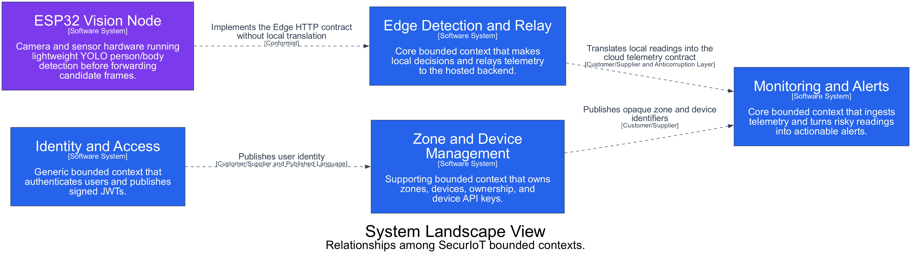

Ningun contexto llama al de Identidad y Acceso en tiempo de ejecucion mas alla del login: el JWT es autocontenido y cada contexto lo valida por su cuenta contra el mismo secreto compartido, asi que la relacion con Identidad y Acceso es de tipo Published Language mas que de llamada activa. Monitoreo y Alertas y Gestion de Zonas y Dispositivos hoy comparten una unica base PostgreSQL, lo cual simplifica el MVP pero es una decision a revisar si el sistema crece a multiples clientes con aislamiento de datos mas estricto.

### 4.1.3. Software Architecture

SecurIoT es un sistema distribuido de cuatro capas: aplicaciones cliente (Web App en Angular y Mobile App en Flutter), un backend hospedado (Cloud API en NestJS con PostgreSQL), un servicio de borde por instalacion (Edge API en Flask con buffer local SQLite y reconocimiento ArcFace) y firmware embebido (ESP32-S3 con deteccion corporal YOLO). Los siguientes diagramas siguen el modelo C4 y se generan exclusivamente desde el modelo [Structurizr DSL](docs/architecture/workspace.dsl). El ESP32 ejecuta la deteccion corporal antes de enviar frames candidatos al Edge; el Edge ejecuta ArcFace, conserva los embeddings biometricos localmente y solo inicia conexiones salientes hacia el backend hospedado.

#### 4.1.3.1. Software Architecture System Landscape Diagram

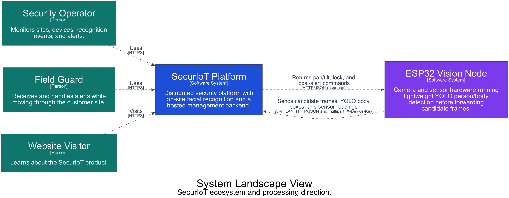

La plataforma no depende de sistemas externos de terceros (sin pasarelas de pago, SMS o email en el alcance actual). La Landing Page es un sitio informativo aislado, sin llamadas a la API.

#### 4.1.3.2. Software Architecture Context Level Diagrams

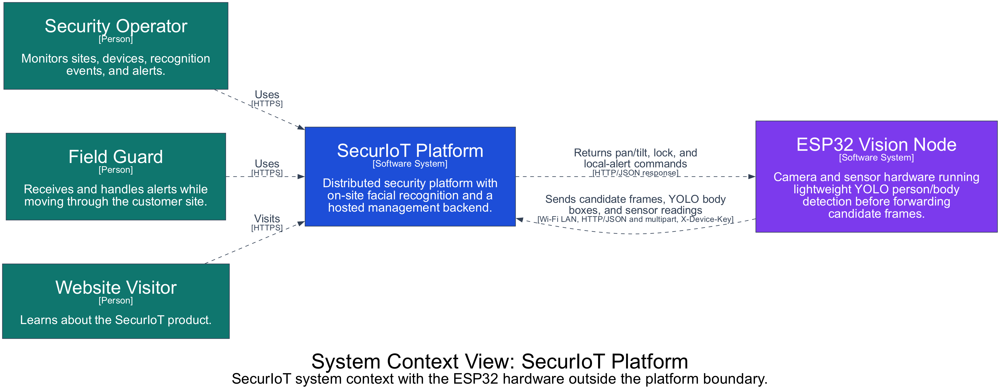

#### 4.1.3.3. Software Architecture Container Level Diagrams

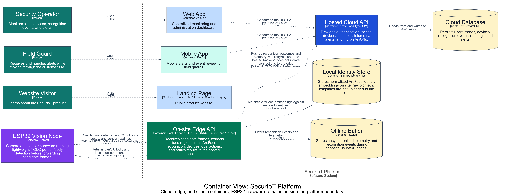

El hardware ESP32 queda fuera del limite punteado de la plataforma. Dentro del dispositivo se ejecuta YOLO para detectar personas/cuerpos y reducir el volumen de frames enviados. Dentro del Edge se ejecuta ArcFace para producir y comparar embeddings; el buffer SQLite y el repositorio local de identidades permiten seguir operando sin conectividad.

#### 4.1.3.4. Software Architecture Deployment Diagrams

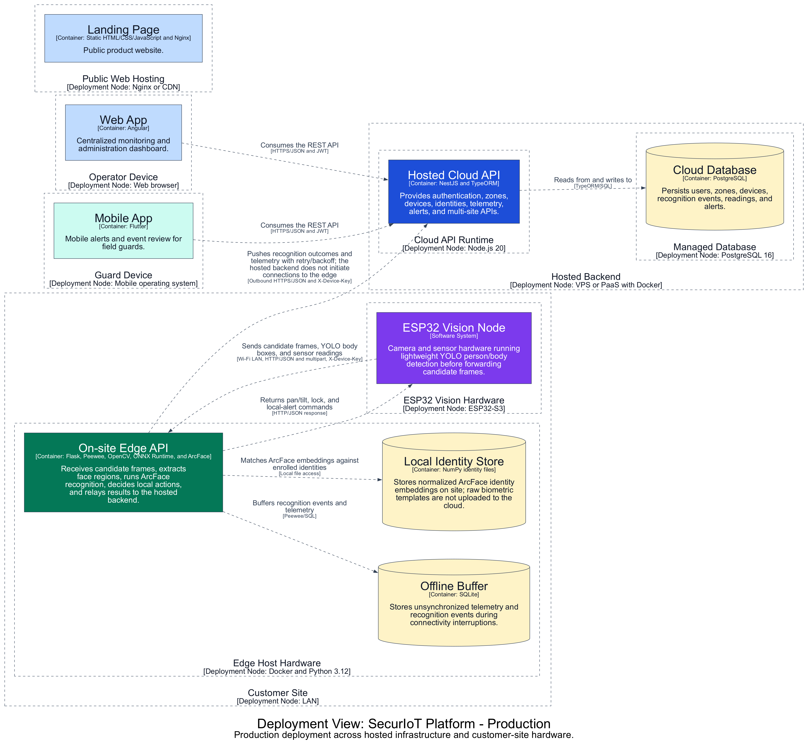

El diagrama de despliegue separa explicitamente el hardware ESP32, el Edge Host de la instalacion y la infraestructura hospedada. El backend no abre conexiones hacia la red local: el Edge inicia el envio de resultados y telemetria por HTTPS con retry/backoff.

## 4.2. Tactical-Level Domain-Driven Design

Esta sección detalla, para cada uno de los cuatro bounded contexts identificados en 4.1.1.1, sus capas de Domain, Interface, Application e Infrastructure, más los diagramas de componentes, clases y base de datos a nivel de código. Todos los diagramas tácticos se definen en el mismo modelo [Structurizr DSL](docs/architecture/workspace.dsl), se renderizan con fondo blanco y mantienen sus etiquetas en inglés.

### 4.2.1. Bounded Context: Monitoreo y Alertas

Elegimos este contexto para el detalle tactico porque es el subdominio core de la Cloud API: convierte lecturas crudas de sensores en alertas que el operador realmente usa. Vive en `securiot-cloud-api/src/telemetry` y `src/alerts`.

#### 4.2.1.1. Domain Layer

- `Reading` (raiz de agregado): `readingId` (unico), `deviceId`, `zoneId`, `sensorType`, `value`, `recordedAt`. La unicidad de `readingId` es el invariante central: garantiza que reenviar la misma lectura, algo que pasa seguido por el retry del relay de borde, nunca la duplica.
- `Alert` (raiz de agregado): referencia a `zone`, `device` y, opcionalmente, a la `reading` que la origino; ademas `ruleType`, `severity`, `status` y `message`. Tambien tiene `readingId` unico, asi que una lectura genera como maximo una alerta.
- Regla de dominio `evaluateRule`: hoy implementa una unica regla, `door_contact_open` (sensor `door_contact` con valor `open` genera una alerta de severidad `medium`). El metodo esta separado de la insercion de la lectura justamente para poder agregar mas reglas sin tocar el flujo de ingestion.

#### 4.2.1.2. Interface Layer

| Endpoint | Guard | Descripcion |
|---|---|---|
| `POST /api/v1/telemetry` | `DeviceApiKeyGuard` (header `X-Device-Key`) | Ingesta una lectura, idempotente por `reading_id` |
| `GET /api/v1/telemetry` | `JwtAuthGuard` | Lista lecturas filtrables por `device_id`, `zone_id` y rango de fechas |
| `GET /api/v1/alerts` | `JwtAuthGuard` | Lista alertas de las zonas del usuario autenticado, filtrables por zona, dispositivo y estado |

Los cuerpos de request se validan con DTOs de `class-validator` (`CreateReadingDto`, `QueryReadingsDto`, `QueryAlertsDto`) y cada endpoint esta documentado con decoradores de `@nestjs/swagger`.

#### 4.2.1.3. Application Layer

- `TelemetryService.ingest(dto, device)`: inserta la lectura con `INSERT ... ON CONFLICT DO NOTHING` (`orIgnore`) y delega la evaluacion de reglas a `AlertsService.evaluateRule`. Ambos pasos ocurren en la misma llamada, para que el operador vea la alerta apenas el dispositivo reporta.
- `TelemetryService.findAll(query)`: consulta de lecturas con filtros opcionales.
- `AlertsService.evaluateRule(reading)`: aplica la regla de dominio y persiste la alerta si corresponde, tambien con `orIgnore` para respetar la unicidad por `readingId`.
- `AlertsService.findAllForOwner(ownerId, query)`: hace join contra `Zone` para devolver solo alertas de zonas del usuario autenticado, sin exponer datos de otros clientes.

#### 4.2.1.4. Infrastructure Layer

- `Repository<Reading>` y `Repository<Alert>` de TypeORM, sobre PostgreSQL en produccion (SQLite como fallback de desarrollo local, ver `src/config/typeorm.config.ts`).
- `DeviceApiKeyGuard`: valida el header `X-Device-Key` contra la tabla `devices`, cruzando hacia el contexto de Gestion de Zonas y Dispositivos.
- `JwtAuthGuard` + `JwtStrategy`: validan el JWT emitido por Identidad y Acceso sin llamarlo en tiempo de ejecucion.

#### 4.2.1.5. Bounded Context Software Architecture Component Level Diagrams

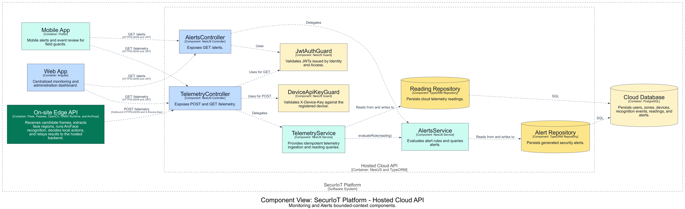

#### 4.2.1.6. Bounded Context Software Architecture Code Level Diagrams

#### 4.2.1.6.1. Bounded Context Domain Layer Class Diagrams

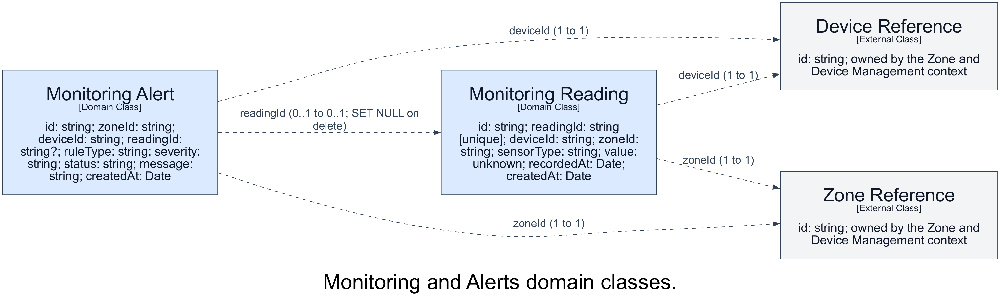

#### 4.2.1.6.2. Bounded Context Database Design Diagram

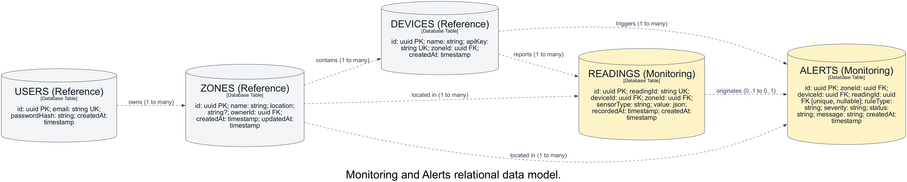

`USERS`, `ZONES` y `DEVICES` pertenecen a otros bounded contexts (Identidad y Acceso, y Gestion de Zonas y Dispositivos) y se muestran aqui solo como referencia, porque hoy las cinco tablas viven en la misma base PostgreSQL. `READINGS` y `ALERTS` son las tablas propias de este contexto.

### 4.2.2. Bounded Context: Identidad y Acceso

Este contexto es el subdominio generico de la Cloud API: no tiene reglas de negocio propias del dominio de seguridad patrimonial, solo autentica y emite el token que el resto de la plataforma confia sin volver a consultarlo. Se incluye en el detalle tactico porque cada uno de los otros tres contextos depende de el para proteger sus propios endpoints. Vive en `securiot-cloud-api/src/auth` y `src/users`.

#### 4.2.2.1. Domain Layer

- `User` (raiz de agregado): `id` (uuid), `email`, `passwordHash`, `createdAt`. Constraint de unicidad sobre `email` a nivel de entidad (`@Unique(['email'])`), sin otros campos, no hay roles ni soft-delete.
- Invariante de dominio: la contrasena nunca se compara ni se guarda en texto plano. `AuthService.validateUser` usa `bcrypt.compare` contra `passwordHash`; el hashing en si ocurre antes de llegar a `UsersService.create`, no dentro del servicio.
- No existe endpoint de registro publico: `UsersService.create` existe a nivel de servicio pero ningun controller lo expone, lo que sugiere un flujo de alta de usuarios administrado fuera de la API publica (seed o proceso interno).

#### 4.2.2.2. Interface Layer

| Endpoint | Guard | DTO | Descripcion |
|---|---|---|---|
| `POST /api/v1/auth/login` | Ninguno (publico) | `LoginDto` (`email`, `password`) | Autentica con email y password, retorna `{ access_token }` |

El unico controller (`AuthController`) fuerza `200 OK` en la respuesta del login en vez del `201` por defecto de un POST, y documenta con `@nestjs/swagger` las respuestas 200, 400 y 401. `JwtAuthGuard` se define y exporta desde este contexto, pero no protege ningun endpoint propio: su rol es proteger endpoints de los otros tres bounded contexts (tal como se ve en `jwtGuard` dentro de Monitoreo y Alertas, seccion 4.2.1.5).

#### 4.2.2.3. Application Layer

- `AuthService.validateUser(email, password)`: busca el usuario por email vía `UsersService.findByEmail`; si no existe o falla la comparacion `bcrypt`, lanza `UnauthorizedException`; si es valido, retorna el `User` completo.
- `AuthService.login(email, password)`: llama a `validateUser`, arma el payload `{ sub: user.id, email: user.email }` y lo firma con `jwtService.sign`. Efecto secundario unico: la emision del JWT, sin registro de sesion ni persistencia adicional.
- `UsersService.findByEmail` / `UsersService.create`: metodos casi passthrough sobre el repositorio, sin logica de negocio propia mas alla de asumir que `passwordHash` ya llega hasheado.

#### 4.2.2.4. Infrastructure Layer

- Repositorio TypeORM estandar (`Repository<User>`) sobre la misma base de datos que el resto de contextos (Postgres en produccion, SQLite via `better-sqlite3` como fallback local, `synchronize: true`, confirmado en `src/config/typeorm.config.ts`).
- `JwtStrategy` extrae el token del header `Authorization: Bearer`, valida su expiracion (`ignoreExpiration: false`) y su firma contra `JWT_SECRET` (con un valor de respaldo hardcodeado si la variable de entorno no esta configurada, algo a corregir antes de un despliegue real). `JwtModule` firma con `JWT_EXPIRES_IN` (por defecto una hora).
- `JwtAuthGuard` es una clase minima que delega toda la validacion en la estrategia passport-jwt registrada, sin logica propia.

#### 4.2.2.5. Bounded Context Software Architecture Component Level Diagrams

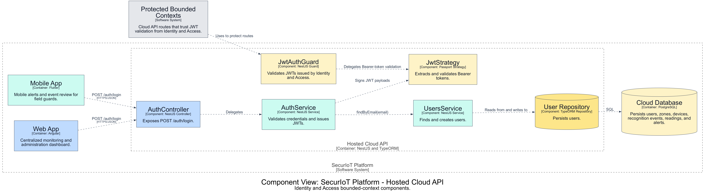

#### 4.2.2.6. Bounded Context Software Architecture Code Level Diagrams

#### 4.2.2.6.1. Bounded Context Domain Layer Class Diagrams

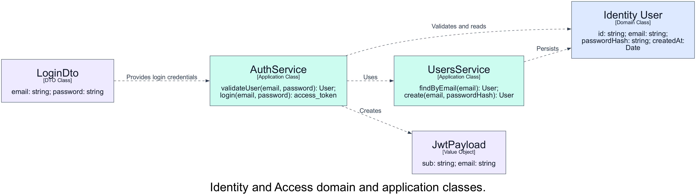

`User` no tiene relaciones de asociacion de TypeORM hacia `Device` o `Zone`; no se incluyen en el diagrama porque compartir la misma base de datos no crea una relacion de dominio ni una FK explicita en `User`.

#### 4.2.2.6.2. Bounded Context Database Design Diagram

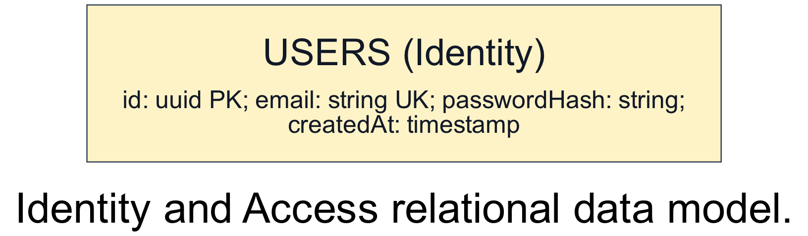

Unica tabla del contexto: PK `id` (uuid), `email` con constraint unico, `passwordHash`, `createdAt`. Sin columnas adicionales ni foreign keys.

### 4.2.3. Bounded Context: Gestion de Zonas y Dispositivos

Este es el subdominio de soporte: mantiene el catalogo de zonas de cada cliente y los dispositivos IoT asignados a cada una, incluyendo la emision del `apiKey` que un dispositivo fisico usa para autenticarse ante el resto de la plataforma. Es necesario para que Monitoreo y Alertas y Deteccion y Relay de Borde tengan sentido, pero no es, por si solo, la ventaja diferencial del producto. Vive en `securiot-cloud-api/src/zones` y `src/devices`.

#### 4.2.3.1. Domain Layer

- `Zone` (raiz de agregado): `id`, `name`, `location` (opcional), `ownerId`, relacion `ManyToOne` a `User` con `onDelete: 'CASCADE'`, `createdAt`, `updatedAt`.
- `Device` (raiz de agregado): `id`, `name`, `apiKey` (unico, `@Unique(['apiKey'])`), relacion `ManyToOne` a `Zone` con `onDelete: 'CASCADE'`, `zoneId`, `createdAt`.
- Invariantes verificados en codigo: un dispositivo pertenece a exactamente una zona; una zona pertenece a exactamente un usuario dueno; el `apiKey` se genera con `crypto.randomBytes(24).toString('hex')` al crear el dispositivo y se persiste en texto plano.
- El `apiKey` se muestra completo solo una vez: `DeviceResponseDto` (usado en las listas y el detalle) no incluye `apiKey`; solo `DeviceCreatedResponseDto`, que extiende al anterior y es el tipo de retorno exclusivo de `POST /devices`, lo incluye. El propio codigo lo documenta en un comentario: "The response apiKey is shown in full only here. It is never returned again by any other endpoint."

#### 4.2.3.2. Interface Layer

| Endpoint | Guard | DTO / Query | Descripcion |
|---|---|---|---|
| `POST /api/v1/zones` | `JwtAuthGuard` | `CreateZoneDto` | Crea una zona para el usuario autenticado |
| `GET /api/v1/zones` | `JwtAuthGuard` | — | Lista zonas del usuario autenticado |
| `GET /api/v1/zones/:id` | `JwtAuthGuard` | — | Obtiene una zona por id, solo si pertenece al usuario |
| `PATCH /api/v1/zones/:id` | `JwtAuthGuard` | `UpdateZoneDto` | Actualiza una zona propia |
| `DELETE /api/v1/zones/:id` | `JwtAuthGuard` | — | Elimina una zona propia |
| `POST /api/v1/devices` | `JwtAuthGuard` | `CreateDeviceDto` | Registra un dispositivo bajo una zona propia; retorna el apiKey por unica vez |
| `GET /api/v1/devices` | `JwtAuthGuard` | query opcional `zone_id` | Lista dispositivos del usuario, sin apiKey |
| `GET /api/v1/devices/:id` | `JwtAuthGuard` | — | Detalle de un dispositivo con estado online/offline y ultima lectura |

Todos protegidos por `JwtAuthGuard` (contexto Identidad y Acceso) y documentados con `@ApiBearerAuth()`.

#### 4.2.3.3. Application Layer

- `ZonesService.create/findAllForOwner/findOneForOwner/update/remove`: el ownership se resuelve filtrando siempre por `ownerId` en la consulta (`findOne({ where: { id, ownerId } })`), de forma que una zona ajena nunca se distingue de una zona inexistente (ambas devuelven `NotFoundException`).
- `DevicesService.create(dto, ownerId)`: primero busca la zona con `{ id: dto.zoneId, ownerId }` para verificar que existe y pertenece al usuario; si pasa, genera el `apiKey` y crea el dispositivo; retorna la respuesta que incluye el apiKey una unica vez.
- `DevicesService.findAllForOwner`: usa `createQueryBuilder` con `leftJoin` a `Zone` y filtra por `zone.ownerId`, es decir el ownership de un dispositivo se resuelve siempre a traves de su zona, nunca con una columna de dueno directa en `Device`.
- `DevicesService.getStatus(device)`: busca la ultima `Reading` del dispositivo por `deviceId` y calcula `isOnline` comparando su antigüedad contra `DEVICE_ONLINE_WINDOW_SECONDS` (variable de entorno, 300 segundos por defecto). Este es el unico punto donde el contexto consulta directamente una entidad de Monitoreo y Alertas.

#### 4.2.3.4. Infrastructure Layer

- Repositorios TypeORM estandar para `Zone` y `Device`. `DevicesModule` registra ademas la entidad `Reading` (de `src/telemetry`) para poder resolver `getStatus`, un acoplamiento directo y explicito entre este contexto y Monitoreo y Alertas.
- Relacion con Identidad y Acceso: `Zone.ownerId` es FK a `User`, con `onDelete: 'CASCADE'` (si se elimina el usuario dueno, se eliminan sus zonas y, en cascada, sus dispositivos).
- Relacion con Monitoreo y Alertas: `Reading`/`Alert` referencian `zoneId`/`deviceId` como FK hacia este contexto; el limite se cruza en la direccion opuesta solo para el calculo de estado online/offline.

#### 4.2.3.5. Bounded Context Software Architecture Component Level Diagrams

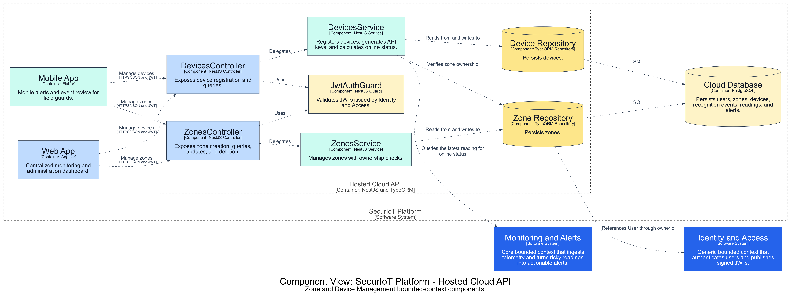

#### 4.2.3.6. Bounded Context Software Architecture Code Level Diagrams

#### 4.2.3.6.1. Bounded Context Domain Layer Class Diagrams

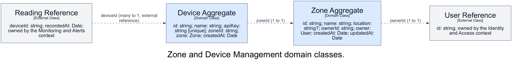

#### 4.2.3.6.2. Bounded Context Database Design Diagram

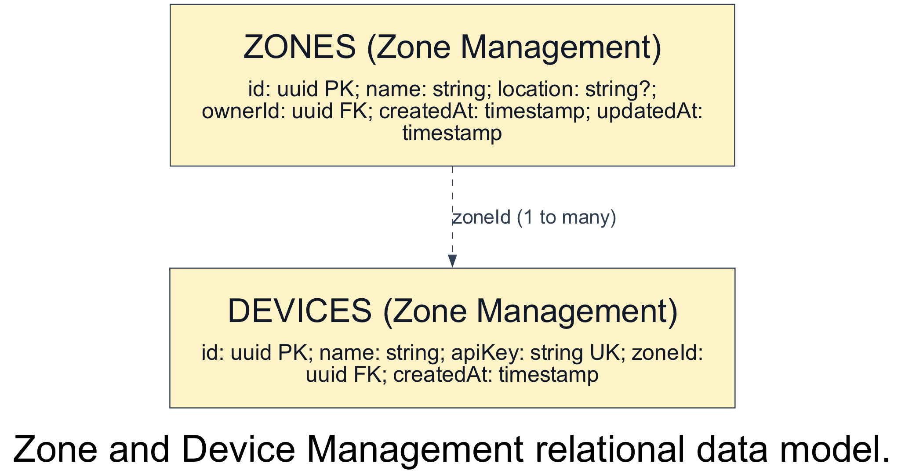

`location` es nullable en la entidad `Zone`; `apiKey` no lo es, siempre se genera al crear el dispositivo y nunca queda vacio.

### 4.2.4. Bounded Context: Deteccion y Relay de Borde

Junto con Monitoreo y Alertas, este es el otro subdominio core del producto: decide en el sitio, sin depender de la nube, si lo que ve la camara amerita una reaccion inmediata, y despues reenvia esa informacion a la nube tolerando cortes de red. Vive en `securiot-edge-api/app` (Flask + Peewee, buffer local en SQLite).

#### 4.2.4.1. Domain Layer

- Unico modelo Peewee, `Reading`: `reading_id` (unico), `device_id`, `zone_id`, `sensor_type`, `value`, `recorded_at`, `synced` (booleano, `False` por defecto), `sync_attempts` (entero, `0` por defecto), `next_attempt_at`, `created_at`. No existe una tabla separada de "evento de deteccion": una deteccion de camara se guarda como un `Reading` mas, con `sensor_type="camera_detection"`.
- Relay idempotente por `reading_id`: `reading_buffer.buffer_reading()` inserta con `on_conflict_ignore()`, apoyado en el constraint `unique=True` de `reading_id`, de forma que reenviar la misma lectura (algo frecuente por el reintento del propio relay) nunca la duplica.
- Backoff exponencial: `_backoff_seconds(sync_attempts) = min(2 ** sync_attempts, 300)`, techo de 300 segundos. El ciclo de relay solo selecciona lecturas no sincronizadas cuyo `next_attempt_at` ya vencio (o es nulo).
- Debounce de detecciones: `debounce.record(device_id, qualifying)` lleva un contador en memoria por dispositivo (umbral por defecto de 2, configurable via `DETECTION_DEBOUNCE_COUNT`) y devuelve `escalate=True` una sola vez, exactamente en el frame donde el contador alcanza el umbral, no en los siguientes.
- Cooldown del actuador de puerta: un dispositivo no vuelve a disparar `door_action` para el mismo device hasta que pasan `DOOR_ACTION_COOLDOWN_SECONDS` (30 segundos por defecto) desde el ultimo disparo, aunque el tracking de camara (pan/tilt) sigue activo durante todo el episodio.

#### 4.2.4.2. Interface Layer

| Endpoint | Auth | Acepta | Retorna | Descripcion |
|---|---|---|---|---|
| `POST /ingest` | Header `X-Device-Key` contra un secreto compartido | JSON: `reading_id, device_id, zone_id, sensor_type, value, recorded_at` | `201 {"status":"buffered"}` | Ingesta generica de lecturas de sensores (PIR, reed switch, ultrasonico) |
| `POST /frames` | Header `X-Device-Key` | `multipart/form-data`: `device_id`, `zone_id`, `frame` (imagen), opcional ancho/alto | `200 {"pan_delta","tilt_delta","door_action","alert"}` | Recibe un frame de la camara, corre deteccion y debounce, decide la reaccion inmediata |

`/frames` valida que la imagen sea decodificable antes de invocar el detector, como mitigacion explicita frente a un ataque de denegacion de servicio con archivos malformados.

#### 4.2.4.3. Application Layer

Flujo de `/frames`, de principio a fin: valida la clave del dispositivo, valida y guarda la imagen recibida, obtiene un detector (mock o YOLO segun configuracion), filtra las detecciones a las clases que importan (persona, o un objeto permitido configurable), pasa el resultado por `debounce.record` para decidir si escala, y si el episodio esta activo calcula el desplazamiento de pan/tilt hacia la persona detectada. En paralelo, siempre bufferiza una lectura `camera_detection`, y si el cooldown de puerta ya vencio, bufferiza tambien una lectura `door_contact` y devuelve la orden de bloqueo. El relay hacia la nube no ocurre dentro de esta peticion: un `BackgroundScheduler` (APScheduler) dispara `relay_cycle()` cada `RELAY_INTERVAL_SECONDS` (10 segundos por defecto), que selecciona las lecturas pendientes de sincronizar y las envia una por una.

#### 4.2.4.4. Infrastructure Layer

- Persistencia local: SQLite (Peewee), unica tabla `Reading`, que actua como buffer de tolerancia a desconexion. Todo lo que entra por `/ingest` o `/frames` se guarda localmente antes de intentar llegar a la nube, lo que permite operar sin conexion y reintentar despues.
- Cliente de relay: `POST {CLOUD_API_URL}/api/v1/telemetry` con header `X-Device-Key: CLOUD_DEVICE_API_KEY`, hacia el endpoint de ingesta de Monitoreo y Alertas en la Cloud API. Un 2xx marca la lectura como sincronizada; cualquier otro resultado incrementa `sync_attempts` y aplica el backoff descrito en la capa de dominio.
- Configuracion relevante via variables de entorno: `DEVICE_SHARED_SECRET`, `CLOUD_API_URL`, `CLOUD_DEVICE_API_KEY`, `RELAY_INTERVAL_SECONDS`, `DETECTION_BACKEND` (mock o yolo), `DETECTION_DEBOUNCE_COUNT`, `DOOR_ACTION_COOLDOWN_SECONDS`, `MAX_CONTENT_LENGTH` (2 MB por defecto, otro limite anti-DoS).

#### 4.2.4.5. Bounded Context Software Architecture Component Level Diagrams

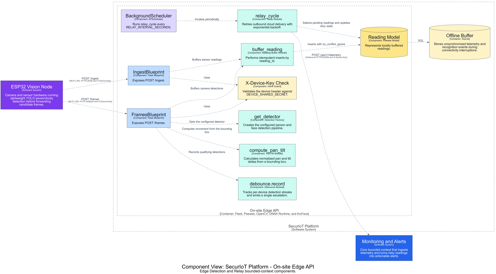

#### 4.2.4.6. Bounded Context Software Architecture Code Level Diagrams

#### 4.2.4.6.1. Bounded Context Domain Layer Class Diagrams

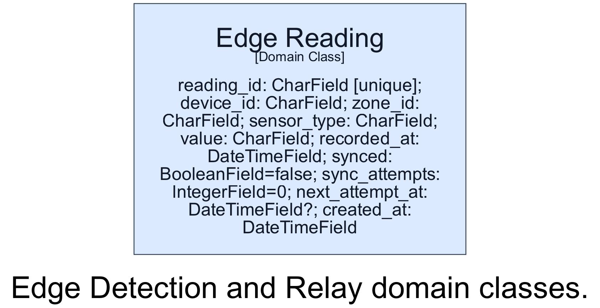

#### 4.2.4.6.2. Bounded Context Database Design Diagram

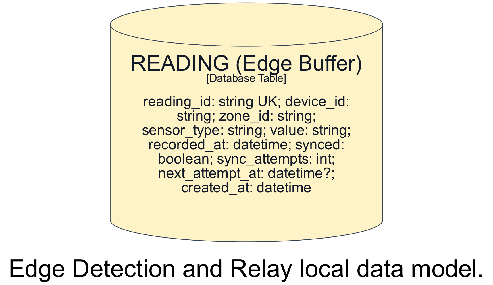

Esta tabla vive unicamente en el SQLite local del Edge API. Es distinta de `READINGS`, la tabla de Postgres del contexto Monitoreo y Alertas (seccion 4.2.1.6.2): la del Edge es un buffer temporal de transito, la de la nube es el registro persistente que consultan el Web App y el Mobile App.

