

<h3>Universidad Peruana de Ciencias Aplicadas</h3>

 

<strong>Ingeniería de Software - 2026-02</strong> 
<strong>1ASI0572 - Desarrollo de Soluciones IOT</strong> 
<strong>NRC: 8729</strong> 
<strong>Profesor: Marco Antonio Leon Baca</strong> 

 <strong>Informe del Trabajo Final</strong>  

<strong>Startup: Centinela Labs </strong> 
<strong>Producto: SECURIOT </strong> 

### Team Members:

Hurtado Balcazar Rommel Daniel     u202517474

<strong> 19 de Septiembre de 2026</strong> 

# Registro de Versiones del Informe

| Versión | Fecha | Autor | Descripción de modificación |
|---|---|---|---|

# Project Report Collaboration Insights

URL del repositorio: _Pendiente de agregar_

_Pendiente de desarrollo._

# Contenido

- [Registro de Versiones del Informe](#registro-de-versiones-del-informe)
- [Project Report Collaboration Insights](#project-report-collaboration-insights)
- [Student Outcome](#student-outcome)
- [Capítulo I: Introducción](#capítulo-i-introducción)
  - [1.1. Startup Profile](#11-startup-profile)
    - [1.1.1. Descripción de la Startup](#111-descripción-de-la-startup)
    - [1.1.2. Perfiles de integrantes del equipo](#112-perfiles-de-integrantes-del-equipo)
  - [1.2. Solution Profile](#12-solution-profile)
    - [1.2.1. Antecedentes y problemática](#121-antecedentes-y-problemática)
    - [1.2.2. Lean UX Process](#122-lean-ux-process)
      - [1.2.2.1. Lean UX Problem Statements](#1221-lean-ux-problem-statements)
      - [1.2.2.2. Lean UX Assumptions](#1222-lean-ux-assumptions)
      - [1.2.2.3. Lean UX Hypothesis Statements](#1223-lean-ux-hypothesis-statements)
      - [1.2.2.4. Lean UX Canvas](#1224-lean-ux-canvas)
  - [1.3. Segmentos objetivo](#13-segmentos-objetivo)
- [Capítulo II: Requirements Elicitation & Analysis](#capítulo-ii-requirements-elicitation--analysis)
  - [2.1. Competidores](#21-competidores)
    - [2.1.1. Análisis competitivo](#211-análisis-competitivo)
    - [2.1.2. Estrategias y tácticas frente a competidores](#212-estrategias-y-tácticas-frente-a-competidores)
  - [2.2. Entrevistas](#22-entrevistas)
    - [2.2.1. Diseño de entrevistas](#221-diseño-de-entrevistas)
    - [2.2.2. Registro de entrevistas](#222-registro-de-entrevistas)
    - [2.2.3. Análisis de entrevistas](#223-análisis-de-entrevistas)
  - [2.3. Needfinding](#23-needfinding)
    - [2.3.1. User Personas](#231-user-personas)
    - [2.3.2. User Task Matrix](#232-user-task-matrix)
    - [2.3.3. User Journey Mapping](#233-user-journey-mapping)
    - [2.3.4. Empathy Mapping](#234-empathy-mapping)
  - [2.4. Big Picture EventStorming](#24-big-picture-eventstorming)
  - [2.5. Ubiquitous Language](#25-ubiquitous-language)
- [Capítulo III: Requirements Specification](#capítulo-iii-requirements-specification)
  - [3.1. User Stories](#31-user-stories)
  - [3.2. Impact Mapping](#32-impact-mapping)
  - [3.3. Product Backlog](#33-product-backlog)
- [Capítulo IV: Solution Software Design](#capítulo-iv-solution-software-design)
  - [4.1. Strategic-Level Domain-Driven Design](#41-strategic-level-domain-driven-design)
    - [4.1.1. Design-Level EventStorming](#411-design-level-eventstorming)
      - [4.1.1.1. Candidate Context Discovery](#4111-candidate-context-discovery)
      - [4.1.1.2. Domain Message Flows Modeling](#4112-domain-message-flows-modeling)
      - [4.1.1.3. Bounded Context Canvases](#4113-bounded-context-canvases)
    - [4.1.2. Context Mapping](#412-context-mapping)
    - [4.1.3. Software Architecture](#413-software-architecture)
      - [4.1.3.1. Software Architecture System Landscape Diagram](#4131-software-architecture-system-landscape-diagram)
      - [4.1.3.2. Software Architecture Context Level Diagrams](#4132-software-architecture-context-level-diagrams)
      - [4.1.3.3. Software Architecture Container Level Diagrams](#4133-software-architecture-container-level-diagrams)
      - [4.1.3.4. Software Architecture Deployment Diagrams](#4134-software-architecture-deployment-diagrams)
  - [4.2. Tactical-Level Domain-Driven Design](#42-tactical-level-domain-driven-design)
    - [4.2.1. Bounded Context: Monitoreo y Alertas](#421-bounded-context-monitoreo-y-alertas)
      - [4.2.1.1. Domain Layer](#4211-domain-layer)
      - [4.2.1.2. Interface Layer](#4212-interface-layer)
      - [4.2.1.3. Application Layer](#4213-application-layer)
      - [4.2.1.4. Infrastructure Layer](#4214-infrastructure-layer)
      - [4.2.1.5. Bounded Context Software Architecture Component Level Diagrams](#4215-bounded-context-software-architecture-component-level-diagrams)
      - [4.2.1.6. Bounded Context Software Architecture Code Level Diagrams](#4216-bounded-context-software-architecture-code-level-diagrams)
      - [4.2.1.6.1. Bounded Context Domain Layer Class Diagrams](#42161-bounded-context-domain-layer-class-diagrams)
      - [4.2.1.6.2. Bounded Context Database Design Diagram](#42162-bounded-context-database-design-diagram)
    - [4.2.2. Bounded Context: Identidad y Acceso](#422-bounded-context-identidad-y-acceso)
      - [4.2.2.1. Domain Layer](#4221-domain-layer)
      - [4.2.2.2. Interface Layer](#4222-interface-layer)
      - [4.2.2.3. Application Layer](#4223-application-layer)
      - [4.2.2.4. Infrastructure Layer](#4224-infrastructure-layer)
      - [4.2.2.5. Bounded Context Software Architecture Component Level Diagrams](#4225-bounded-context-software-architecture-component-level-diagrams)
      - [4.2.2.6. Bounded Context Software Architecture Code Level Diagrams](#4226-bounded-context-software-architecture-code-level-diagrams)
      - [4.2.2.6.1. Bounded Context Domain Layer Class Diagrams](#42261-bounded-context-domain-layer-class-diagrams)
      - [4.2.2.6.2. Bounded Context Database Design Diagram](#42262-bounded-context-database-design-diagram)
    - [4.2.3. Bounded Context: Gestion de Zonas y Dispositivos](#423-bounded-context-gestion-de-zonas-y-dispositivos)
      - [4.2.3.1. Domain Layer](#4231-domain-layer)
      - [4.2.3.2. Interface Layer](#4232-interface-layer)
      - [4.2.3.3. Application Layer](#4233-application-layer)
      - [4.2.3.4. Infrastructure Layer](#4234-infrastructure-layer)
      - [4.2.3.5. Bounded Context Software Architecture Component Level Diagrams](#4235-bounded-context-software-architecture-component-level-diagrams)
      - [4.2.3.6. Bounded Context Software Architecture Code Level Diagrams](#4236-bounded-context-software-architecture-code-level-diagrams)
      - [4.2.3.6.1. Bounded Context Domain Layer Class Diagrams](#42361-bounded-context-domain-layer-class-diagrams)
      - [4.2.3.6.2. Bounded Context Database Design Diagram](#42362-bounded-context-database-design-diagram)
    - [4.2.4. Bounded Context: Deteccion y Relay de Borde](#424-bounded-context-deteccion-y-relay-de-borde)
      - [4.2.4.1. Domain Layer](#4241-domain-layer)
      - [4.2.4.2. Interface Layer](#4242-interface-layer)
      - [4.2.4.3. Application Layer](#4243-application-layer)
      - [4.2.4.4. Infrastructure Layer](#4244-infrastructure-layer)
      - [4.2.4.5. Bounded Context Software Architecture Component Level Diagrams](#4245-bounded-context-software-architecture-component-level-diagrams)
      - [4.2.4.6. Bounded Context Software Architecture Code Level Diagrams](#4246-bounded-context-software-architecture-code-level-diagrams)
      - [4.2.4.6.1. Bounded Context Domain Layer Class Diagrams](#42461-bounded-context-domain-layer-class-diagrams)
      - [4.2.4.6.2. Bounded Context Database Design Diagram](#42462-bounded-context-database-design-diagram)
- [Capítulo V: Solution UI/UX Design](#capítulo-v-solution-uiux-design)
  - [5.1. Style Guidelines](#51-style-guidelines)
    - [5.1.1. General Style Guidelines](#511-general-style-guidelines)
    - [5.1.2. Web, Mobile and IoT Style Guidelines](#512-web-mobile-and-iot-style-guidelines)
  - [5.2. Information Architecture](#52-information-architecture)
    - [5.2.1. Organization Systems](#521-organization-systems)
    - [5.2.2. Labeling Systems](#522-labeling-systems)
    - [5.2.3. SEO Tags and Meta Tags](#523-seo-tags-and-meta-tags)
    - [5.2.4. Searching Systems](#524-searching-systems)
    - [5.2.5. Navigation Systems](#525-navigation-systems)
  - [5.3. Landing Page UI Design](#53-landing-page-ui-design)
    - [5.3.1. Landing Page Wireframe](#531-landing-page-wireframe)
    - [5.3.2. Landing Page Mock-up](#532-landing-page-mock-up)
  - [5.4. Applications UX/UI Design](#54-applications-uxui-design)
    - [5.4.1. Applications Wireframes](#541-applications-wireframes)
    - [5.4.2. Applications Wireflow Diagrams](#542-applications-wireflow-diagrams)
    - [5.4.3. Applications Mock-ups](#543-applications-mock-ups)
    - [5.4.4. Applications User Flow Diagrams](#544-applications-user-flow-diagrams)
  - [5.5. Applications Prototyping](#55-applications-prototyping)
  - [5.6. IoT Device Design](#56-iot-device-design)
- [Capítulo VI: Product Implementation, Validation & Deployment](#capítulo-vi-product-implementation-validation--deployment)
  - [6.1. Software Configuration Management](#61-software-configuration-management)
    - [6.1.1. Software Development Environment Configuration](#611-software-development-environment-configuration)
    - [6.1.2. Source Code Management](#612-source-code-management)
    - [6.1.3. Source Code Style Guide & Conventions](#613-source-code-style-guide--conventions)
    - [6.1.4. Software Deployment Configuration](#614-software-deployment-configuration)
  - [6.2. Landing Page, Services & Applications Implementation](#62-landing-page-services--applications-implementation)
    - [6.2.1. Sprint 1](#621-sprint-1)
      - [6.2.1.1. Sprint Planning 1](#6211-sprint-planning-1)
      - [6.2.1.2. Aspect Leaders and Collaborators](#6212-aspect-leaders-and-collaborators)
      - [6.2.1.3. Sprint Backlog 1](#6213-sprint-backlog-1)
      - [6.2.1.4. Development Evidence for Sprint Review](#6214-development-evidence-for-sprint-review)
      - [6.2.1.5. Testing Suite Evidence for Sprint Review](#6215-testing-suite-evidence-for-sprint-review)
      - [6.2.1.6. Execution Evidence for Sprint Review](#6216-execution-evidence-for-sprint-review)
      - [6.2.1.7. Services Documentation Evidence for Sprint Review](#6217-services-documentation-evidence-for-sprint-review)
      - [6.2.1.8. Software Deployment Evidence for Sprint Review](#6218-software-deployment-evidence-for-sprint-review)
      - [6.2.1.9. Team Collaboration Insights during Sprint](#6219-team-collaboration-insights-during-sprint)
    - [6.2.2. Sprint 2](#622-sprint-2)
      - [6.2.2.1. Sprint Planning 2](#6221-sprint-planning-2)
      - [6.2.2.2. Aspect Leaders and Collaborators](#6222-aspect-leaders-and-collaborators)
      - [6.2.2.3. Sprint Backlog 2](#6223-sprint-backlog-2)
      - [6.2.2.4. Development Evidence for Sprint Review](#6224-development-evidence-for-sprint-review)
      - [6.2.2.5. Testing Suite Evidence for Sprint Review](#6225-testing-suite-evidence-for-sprint-review)
      - [6.2.2.6. Execution Evidence for Sprint Review](#6226-execution-evidence-for-sprint-review)
      - [6.2.2.7. Services Documentation Evidence for Sprint Review](#6227-services-documentation-evidence-for-sprint-review)
      - [6.2.2.8. Software Deployment Evidence for Sprint Review](#6228-software-deployment-evidence-for-sprint-review)
      - [6.2.2.9. Team Collaboration Insights during Sprint](#6229-team-collaboration-insights-during-sprint)
    - [6.2.3. Sprint 3](#623-sprint-3)
      - [6.2.3.1. Sprint Planning 3](#6231-sprint-planning-3)
      - [6.2.3.2. Aspect Leaders and Collaborators](#6232-aspect-leaders-and-collaborators)
      - [6.2.3.3. Sprint Backlog 3](#6233-sprint-backlog-3)
      - [6.2.3.4. Development Evidence for Sprint Review](#6234-development-evidence-for-sprint-review)
      - [6.2.3.5. Testing Suite Evidence for Sprint Review](#6235-testing-suite-evidence-for-sprint-review)
      - [6.2.3.6. Execution Evidence for Sprint Review](#6236-execution-evidence-for-sprint-review)
      - [6.2.3.7. Services Documentation Evidence for Sprint Review](#6237-services-documentation-evidence-for-sprint-review)
      - [6.2.3.8. Software Deployment Evidence for Sprint Review](#6238-software-deployment-evidence-for-sprint-review)
      - [6.2.3.9. Team Collaboration Insights during Sprint](#6239-team-collaboration-insights-during-sprint)
  - [6.3. Validation Interviews](#63-validation-interviews)
    - [6.3.1. Diseño de Entrevistas](#631-diseño-de-entrevistas)
    - [6.3.2. Registro de Entrevistas](#632-registro-de-entrevistas)
    - [6.3.3. Evaluaciones según heurísticas](#633-evaluaciones-según-heurísticas)
  - [6.4. Video About-the-Product](#64-video-about-the-product)
- [Conclusiones](#conclusiones)
  - [Conclusiones y recomendaciones](#conclusiones-y-recomendaciones)
  - [Video About-the-Team](#video-about-the-team)
- [Bibliografía](#bibliografía)
- [Anexos](#anexos)

# Student Outcome

_Pendiente de desarrollo._

# Capítulo I: Introducción

## 1.1. Startup Profile

### 1.1.1. Descripción de la Startup

Centinela Labs es una startup peruana de base tecnológica especializada en soluciones de seguridad patrimonial inteligente para el sector empresarial e industrial, mediante la integración de Internet de las Cosas (IoT), Edge Computing, Cloud Computing e Inteligencia Artificial. Nace de identificar una brecha crítica en la protección de activos productivos: las fábricas, almacenes, plantas industriales y oficinas corporativas dependen mayoritariamente de personal de vigilancia y videovigilancia pasiva, esquemas que reaccionan tarde frente a un intento de intrusión y que resultan costosos de escalar a medida que la empresa crece o abre nuevas sedes.

Su producto insignia, SECURIOT, es una plataforma de monitoreo de seguridad patrimonial dirigida a empresas, que utiliza visión por computadora e IA para identificar personas dentro de instalaciones productivas y administrativas, validar en tiempo real si su ingreso está autorizado, y activar de forma automática protocolos de respuesta ante una intrusión detectada: alarmas locales, notificación inmediata al personal de seguridad y a los responsables designados por la empresa, registro trazable del evento con fines de investigación y reporte a autoridades, y activación de controles de acceso en zonas restringidas (almacenes, líneas de producción, áreas de carga y descarga), siempre en cumplimiento de la normativa de seguridad y evacuación vigente.

La misión de Centinela Labs es reducir el tiempo entre la detección de una amenaza y la respuesta efectiva dentro de instalaciones empresariales, combinando dispositivos embebidos de bajo costo instalados en puntos críticos (accesos, perímetros, zonas de almacenamiento), procesamiento en el borde (edge) para decisiones de baja latencia, y una nube centralizada que permite gestión remota multi-sede, útil para empresas con más de una planta o almacén. Su visión es convertirse en la alternativa peruana de seguridad patrimonial inteligente para pequeñas y medianas empresas industriales y logísticas, un segmento históricamente desatendido por las soluciones de seguridad de gama alta orientadas solo a grandes corporaciones.

Como startup, Centinela Labs opera bajo un modelo de negocio escalable basado en suscripción (SaaS) por sede o perímetro monitoreado, complementado con la venta del hardware IoT (el dispositivo prototipo de la solución), apoyándose en tecnologías open-source y una arquitectura distribuida que facilita la incorporación de nuevos clientes empresariales sin rediseñar la solución.

### 1.1.2. Perfiles de integrantes del equipo

| Miembro | Descripción|
|---|---|
|  |**Hurtado Balcazar Rommel Daniel - U202517474**    Soy Rommel Hurtado Balcázar, tengo 23 años y estudio Ingeniería de Software en el 7to ciclo. Me considero un líder técnico orientado a la resolución de problemas, con capacidad para tomar decisiones y guiar al equipo hacia los objetivos del proyecto.  Cuento con experiencia en desarrollo fullstack, manejando tanto frontend como backend. En el lado del servidor trabajo principalmente con Java, y en el frontend utilizo React. Además, tengo conocimientos en bases de datos relacionales con SQL y no relacionales con MongoDB, así como experiencia con Node.js, Python y HTML/CSS.  He desarrollado proyectos propios fuera del ámbito universitario, lo que me ha dado una visión completa del ciclo de desarrollo de software. También me desenvuelvo en inglés a nivel intermedio-avanzado, lo que me permite acceder a documentación técnica y comunicarme en entornos internacionales. |
| member 2| -Descripcion- |
| member 3| -Descripcion-|
| member 4| -Descripcion-|
| member 5| -Descripcion-|
| memberv 6| -Descripcion-|
| member 7| -Descripcion-|

## 1.2. Solution Profile

### 1.2.1. Antecedentes y problemática

#### Antecedentes

La seguridad patrimonial se ha convertido en una preocupación creciente para el sector empresarial peruano, particularmente para la industria y la logística. Según la Encuesta de Opinión Industrial de la Sociedad Nacional de Industrias (SNI), una de cada cinco industrias fue víctima de la delincuencia, considerando robos, intentos de robo, extorsión, amenazas y otros delitos, durante el tercer trimestre de 2024. A nivel nacional, el 27.7% de los peruanos en zonas urbanas fue víctima de algún delito en los últimos seis meses, y de forma específica, los delitos contra el patrimonio representan la categoría de mayor incidencia delictiva en el país.

A pesar de este panorama, la mayoría de empresas peruanas continúa desprotegida financieramente frente al riesgo: solo el 5% de las pymes en Perú cuenta con un seguro patrimonial que las proteja frente a incendios, terremotos y robos, lo que agrava el impacto económico de cualquier incidente de seguridad no prevenido. En respuesta a esta exposición, las fábricas y plantas industriales han incrementado su inversión en seguridad para proteger instalaciones y maquinaria, y dicha inversión ya no se limita a personal de vigilancia, sino que abarca también tecnología avanzada como sistemas de control de acceso y software de gestión. Sin embargo, este tipo de tecnología suele estar disponible principalmente para grandes corporaciones con presupuestos de seguridad elevados, dejando a las pequeñas y medianas empresas industriales dependiendo de medidas más básicas como cercos eléctricos, candados de alta seguridad o vigilancia humana tradicional.

El resultado es una brecha entre la magnitud del riesgo patrimonial que enfrentan las empresas —especialmente las industriales, con instalaciones extensas, múltiples puntos de acceso y activos de alto valor como maquinaria e inventario— y la capacidad real de estas empresas, sobre todo las de menor tamaño, para acceder a sistemas de seguridad proactivos, escalables y económicamente viables.

#### Aplicación de la técnica 5W + 2H

| Pregunta| Respuesta |
|--|--|
| **Who**   (¿Quién?)| Empresas industriales, logísticas y comerciales de mediana escala en el Perú (fábricas, plantas de producción, almacenes, centros de distribución, oficinas corporativas), con foco inicial en Lima Metropolitana. |
| **What**   (¿Qué?) | Ausencia de un sistema de seguridad patrimonial accesible que identifique amenazas en tiempo real dentro de instalaciones empresariales y active una respuesta automática, en lugar de depender exclusivamente de vigilancia humana o revisión posterior de grabaciones. |
| **Where**   (¿Dónde?) | Parques industriales, zonas logísticas y corredores comerciales/empresariales de Lima Metropolitana, con potencial de escalar a otras ciudades del país. |
| **When**   (¿Cuándo?) | El problema se ha agravado de forma sostenida en los últimos años, con un incremento en la inversión en seguridad por parte de las industrias reportado durante 2024-2026. |
| **Why**   (¿Por qué?) | Porque los esquemas de seguridad tradicionales (vigilancia humana, CCTV pasivo) no logran anticipar ni contener una intrusión en el momento en que ocurre, y las soluciones tecnológicas avanzadas existentes suelen ser costosas y orientadas a grandes corporaciones, dejando desprotegidas a las pymes industriales. |
| **How**   (¿Cómo?) | A través de una plataforma IoT que combina dispositivos embebidos instalados en accesos y perímetros, procesamiento en el borde (edge computing) para decisiones de baja latencia, inteligencia artificial para identificación y validación de accesos, y una nube centralizada para gestión remota multi-sede, alertas y analítica histórica de incidentes. |
| **How Much**   (¿Cuánto?) | El costo de no resolver el problema incluye pérdidas directas de inventario y maquinaria, interrupción de operaciones productivas, y una exposición financiera agravada por el bajo nivel de aseguramiento patrimonial en el sector (solo 5% de pymes aseguradas), afectando la continuidad del negocio. |

#### Problematica

Las empresas industriales, logísticas y comerciales de mediana escala en el Perú enfrentan un nivel significativo de exposición a robos e intrusiones dentro de sus instalaciones, mientras que los sistemas de seguridad tecnológicamente avanzados disponibles en el mercado están mayormente orientados a grandes corporaciones con altos presupuestos, dejando a las pymes industriales dependiendo de esquemas de seguridad reactivos y de bajo nivel de automatización, lo que se traduce en pérdidas patrimoniales, interrupción de operaciones y una persistente vulnerabilidad frente a la delincuencia.

#### Puntos más importantes a resolver

> Identificación de personas en tiempo real dentro de instalaciones empresariales, distinguiendo entre personal autorizado, proveedores/visitantes y personas no identificadas.

> Validación automática de accesos a zonas restringidas (almacenes, líneas de producción, áreas de carga y descarga), reduciendo la dependencia exclusiva de personal de vigilancia.

> Activación inmediata de protocolos de respuesta ante una intrusión detectada (alarmas, notificación al personal de seguridad y a los responsables de la empresa), sin comprometer las rutas de evacuación del personal.

> Registro y trazabilidad de los eventos de seguridad, generando evidencia auditable para investigación interna y reporte a autoridades.

> Visualización de información cuantitativa (incidentes por sede, tiempos de respuesta, patrones de acceso) para la toma de decisiones de los administradores de seguridad de la empresa.

> Gestión remota multi-sede, para empresas con más de una planta, almacén u oficina.

> Un modelo de costo accesible para pequeñas y medianas empresas industriales, no solo para grandes corporaciones.

#### Objetivos

- Reducir el tiempo de detección y respuesta ante un intento de intrusión no autorizada dentro de instalaciones empresariales, respecto a los sistemas de vigilancia tradicionales.
- Brindar a los administradores de seguridad de la empresa una herramienta centralizada de monitoreo y control de accesos, accesible desde Web y dispositivos móviles.
- Proveer evidencia confiable y trazable de los incidentes de seguridad patrimonial para su reporte a autoridades y aseguradoras.
- Ofrecer un modelo de suscripción escalable y accesible económicamente para pymes industriales y logísticas.

#### Restricciones

- La solución se enfoca en el segmento empresarial e industrial (fábricas, almacenes, plantas de producción, oficinas corporativas), quedando fuera de alcance el segmento residencial.
- El mercado inicial de validación es Lima Metropolitana, considerando su alta concentración de parques industriales y zonas logísticas.
- El prototipo físico del dispositivo IoT cubrirá un subconjunto relevante de funcionalidades (captura de imagen/video, procesamiento básico en el borde, comunicación con el Edge API), no la totalidad de un sistema de seguridad industrial completo.
- Cualquier protocolo de control de accesos debe respetar la normativa vigente de seguridad y evacuación del personal, priorizando siempre su integridad física.
- El tratamiento de datos biométricos e imágenes de personas debe cumplir con la normativa peruana de protección de datos personales (Ley N° 29733) y principios de privacidad por diseño.
- El desarrollo debe realizarse utilizando exclusivamente las tecnologías, lenguajes y herramientas open-source indicadas en el curso.

### 1.2.2. Lean UX Process

El Lean UX Process de Jeff Gothelf y Josh Seiden convierte la problemática de la sección anterior en creencias explícitas (assumptions) sobre el negocio y los usuarios, y esas creencias en hypothesis statements que se pueden verificar con experimentos concretos. El análisis cubre todo el dominio del problema (seguridad patrimonial industrial y logística) y no un segmento por separado, porque el curso pide la versión del template para una iniciativa nueva (brand new initiative), pensada justamente para esa mirada agregada.

#### 1.2.2.1. Lean UX Problem Statements

El proyecto tiene un único Problem Statement, que agrupa a todos los segmentos identificados (fábricas, plantas de producción, almacenes, centros de distribución y oficinas corporativas de empresas industriales, logísticas y comerciales de mediana escala). El template exigido por el curso para una iniciativa nueva se completa en inglés, tal como aparece en el enunciado del proyecto:

> The current state of **industrial and logistics asset security in Peru** has focused mainly on **medium-sized industrial, logistics and commercial companies that protect their facilities through human surveillance and passive CCTV, reviewing footage only after an incident has already occurred**.
>
> What existing products/services fail to address is **the gap between the magnitude of the patrimonial risk these companies face (extensive facilities, multiple access points, high-value machinery and inventory) and their real capacity to access proactive, scalable and economically viable security systems, which today are priced and designed mainly for large corporations**.
>
> Our product/service will address this gap by **combining low-cost IoT devices installed at critical points (access points, perimeters, storage zones), edge computing for low-latency local decisions, and a centralized cloud platform that enables real-time threat identification, automatic access validation to restricted zones, and immediate activation of response protocols**.
>
> Our initial focus will be **medium-sized industrial and logistics companies located in Lima Metropolitana, with physical facilities that include restricted-access zones such as warehouses, production lines, and loading/unloading areas**.
>
> We'll know we are successful when we see **these companies subscribing to and renewing the platform, a measurable reduction in the time between an intrusion attempt and the activation of a response protocol, and an increase in the number of security events that are correctly logged, notified and resolved compared to their previous manual process**.

En español, el mismo Problem Statement dice lo siguiente. Hoy la seguridad patrimonial industrial y logística en el Perú descansa casi por completo en vigilancia humana y CCTV pasivo, que reacciona revisando grabaciones después de ocurrido el incidente, nunca antes. Lo que el mercado no resuelve es la brecha entre el tamaño real del riesgo que enfrentan estas empresas (instalaciones extensas, múltiples accesos, maquinaria e inventario de alto valor) y su capacidad real de pagar por sistemas de seguridad proactivos y escalables, que hoy están diseñados y con precios pensados solo para grandes corporaciones. SecurIoT cierra esa brecha combinando dispositivos IoT de bajo costo en los puntos críticos, edge computing para decisiones locales de baja latencia, y una nube centralizada que identifica amenazas en tiempo real, valida accesos a zonas restringidas y activa protocolos de respuesta de forma automática. El foco inicial son empresas industriales y logísticas medianas de Lima Metropolitana, con zonas de acceso restringido como almacenes, líneas de producción y áreas de carga y descarga. El éxito se mide en suscripciones que se renuevan, en menos tiempo entre una intrusión y la activación del protocolo de respuesta, y en más eventos de seguridad correctamente registrados, notificados y resueltos frente al proceso manual anterior.

#### 1.2.2.2. Lean UX Assumptions

El curso pide organizar los assumptions en 5 tipos. Cada uno se redacta como una creencia afirmativa, no como la pregunta que la originó.

**Business Assumptions**

- Centinela Labs puede posicionarse como la alternativa peruana de seguridad patrimonial inteligente para pymes industriales, un segmento que las soluciones de gama alta no atienden hoy.
- El modelo de suscripción por sede o perímetro monitoreado, sumado a la venta del dispositivo IoT, alcanza para sostener el crecimiento del negocio sin necesidad de una ronda de inversión inicial grande.
- El equipo tiene las capacidades técnicas (IoT, edge computing, inteligencia artificial, desarrollo fullstack web y mobile) para construir y operar la plataforma sin depender de un proveedor externo crítico.
- Se puede cobrar bastante menos que los sistemas de seguridad avanzados orientados a grandes corporaciones y aun así mantener un margen operativo sano.
- Apoyarse en tecnologías open-source y una arquitectura distribuida deja incorporar nuevas empresas cliente sin rediseñar la solución, así que el costo de sumar una sede o un cliente nuevo no crece al mismo ritmo.

**Business Outcome Assumptions**

- El número de empresas industriales y logísticas suscritas crece mes a mes durante los primeros meses de operación comercial.
- La tasa de cancelación (churn) de los clientes suscritos queda por debajo del nivel de rotación típico de los contratos de seguridad tradicionales en pymes.
- El costo de adquisición de cliente (CAC) baja conforme la plataforma se hace conocida en el sector industrial y logístico de Lima Metropolitana.
- Los clientes existentes suman más sedes a la misma cuenta con el tiempo, en vez de contratar un proveedor distinto por cada planta.
- La tasa de renovación al terminar el primer periodo contratado es alta.

**User Assumptions**

- Los administradores de seguridad patrimonial son el usuario principal: configuran zonas y dispositivos, y revisan las alertas.
- El personal de vigilancia in situ es el usuario operativo, el que recibe y atiende en campo lo que el sistema le notifica.
- Los gerentes o dueños de la pyme industrial son un usuario secundario, más interesados en el reporte agregado y en si la suscripción vale lo que cuesta que en la operación día a día.
- La mayoría del uso ocurre desde el celular durante las rondas de vigilancia en planta, y desde el dashboard web cuando el administrador está en oficina o supervisando de forma remota.
- Proveedores y visitantes son actores que el sistema identifica, pero no usan la plataforma directamente.

**User Outcome and Benefit Assumptions**

- El administrador de seguridad deja de revisar grabaciones por rutina, porque el sistema solo le avisa cuando pasa algo relevante.
- El personal de vigilancia llega más rápido a una intrusión real porque la alerta es inmediata, no producto de una ronda que puede tardar.
- El gerente de la pyme industrial cuenta con evidencia trazable y auditable de cada incidente, lo que reduce su exposición legal y agiliza el reporte a aseguradoras y autoridades.
- Un mismo administrador supervisa varias sedes desde un solo panel, sin tener que contratar seguridad adicional en cada una.
- El usuario percibe la plataforma como accesible frente a lo que cuesta una solución de seguridad de gama alta.

**Feature Assumptions**

- Monitorear el estado de zonas y dispositivos casi en tiempo real deja ver de un vistazo qué punto de acceso está comprometido dentro de las instalaciones.
- Registrar y validar zonas y dispositivos restringidos quita la dependencia exclusiva del personal de vigilancia para controlar quién entra a un área crítica.
- Un motor de alertas basado en reglas sobre las lecturas de los sensores activa la notificación apenas se detecta una intrusión, sin esperar a que alguien revise nada.
- Un registro histórico y trazable de eventos y lecturas de telemetría es la base para auditar un incidente o armar el reporte a autoridades y aseguradoras.
- Un dashboard Web, y más adelante una aplicación Mobile, centraliza el estado de zonas, dispositivos y alertas en un solo lugar.
- Gestionar varias sedes de forma remota desde la misma Cloud API permite que un administrador supervise más de una planta o almacén sin cambiar de herramienta.

#### 1.2.2.3. Lean UX Hypothesis Statements

Cada Feature Assumption tiene su hypothesis statement correspondiente, siguiendo el template del curso (también en inglés):

> **HS-01: Identificación de accesos y monitoreo de dispositivos**
> We believe we will achieve **an increase in the number of industrial and logistics companies subscribed to the platform**
> If **security administrators and on-site guards**
> Attain **real-time visibility of the status of critical access points and devices within their facilities**
> With **a device and access-point status monitoring module integrated with the Cloud API**.
>
> *Creemos que lograremos más empresas industriales y logísticas suscritas si los administradores de seguridad y el personal de vigilancia obtienen visibilidad en tiempo real del estado de los puntos de acceso y dispositivos críticos, con un módulo de monitoreo de estado integrado a la Cloud API.*

> **HS-02: Validación de zonas y dispositivos**
> We believe we will achieve **a reduction in customer churn among subscribed companies**
> If **security administrators**
> Attain **a decrease in unauthorized access incidents to restricted zones without relying exclusively on human guards**
> With **a zone and device registration module for restricted areas and access points**.
>
> *Creemos que lograremos menor cancelación de clientes suscritos si los administradores de seguridad reducen los accesos no autorizados a zonas restringidas sin depender solo de personal de vigilancia, con un módulo de registro de zonas y dispositivos.*

> **HS-03: Alertas basadas en reglas**
> We believe we will achieve **an increase in subscription renewal rate at the end of the first contracted period**
> If **on-site security personnel and designated company officers**
> Attain **a faster response time to a detected intrusion compared to traditional passive surveillance**
> With **a rule-based alert engine that automatically notifies stakeholders when a security event is detected**.
>
> *Creemos que lograremos más renovaciones al cierre del primer periodo contratado si el personal de vigilancia y los responsables designados responden más rápido a una intrusión que con vigilancia pasiva tradicional, con un motor de alertas basado en reglas que notifica automáticamente al detectar el evento.*

> **HS-04: Registro histórico y trazable**
> We believe we will achieve **a decrease in the legal and financial exposure of subscribed companies**
> If **company managers and security administrators**
> Attain **trustworthy, auditable evidence of security incidents for internal investigation and reporting to authorities and insurers**
> With **a traceable historical event and telemetry log persisted per device and zone**.
>
> *Creemos que lograremos menor exposición legal y financiera para las empresas suscritas si gerentes y administradores de seguridad cuentan con evidencia confiable y auditable de cada incidente, con un registro histórico trazable de eventos y telemetría por dispositivo y zona.*

> **HS-05: Dashboard de monitoreo**
> We believe we will achieve **an increase in the number of sites managed per client account**
> If **security administrators**
> Attain **centralized visibility of the status of zones, devices, and alerts without needing dedicated on-site staff at every location**
> With **a Web monitoring dashboard integrated with the Cloud API, extended later with a Mobile application**.
>
> *Creemos que lograremos más sedes gestionadas por cada cuenta cliente si los administradores de seguridad obtienen visibilidad centralizada del estado de zonas, dispositivos y alertas sin necesitar personal dedicado en cada sede, con un dashboard Web integrado a la Cloud API, extendido después con una aplicación Mobile.*

> **HS-06: Gestión remota multi-sede**
> We believe we will achieve **an increase in monthly recurring revenue per client through account expansion**
> If **company managers overseeing more than one facility**
> Attain **the ability to supervise multiple plants or warehouses from a single account**
> With **a multi-site remote management architecture built on the Cloud API**.
>
> *Creemos que lograremos más ingreso recurrente mensual por cliente vía expansión de cuenta si los gerentes que supervisan más de una instalación pueden monitorear varias plantas o almacenes desde una sola cuenta, con una arquitectura de gestión remota multi-sede construida sobre la Cloud API.*

#### 1.2.2.4. Lean UX Canvas

| Elemento | Contenido |
|---|---|
| **1. Business Problem**   (Problema de negocio) | Las pymes industriales y logísticas de Lima Metropolitana están expuestas a un nivel significativo de robos e intrusiones patrimoniales, pero dependen de esquemas de seguridad reactivos (vigilancia humana, CCTV pasivo) porque los sistemas tecnológicos avanzados del mercado están orientados y priceados para grandes corporaciones. |
| **2. Business Outcomes**   (Resultados de negocio) | Incremento en el número de empresas suscritas y en sedes gestionadas por cuenta; reducción de la tasa de cancelación (churn); disminución del costo de adquisición de cliente (CAC); aumento en la tasa de renovación de suscripción. |
| **3. Users**   (Usuarios) | Administradores de seguridad patrimonial (usuario principal), personal de vigilancia in situ (usuario operativo), gerentes/dueños de la pyme industrial (usuario secundario). |
| **4. User Outcomes & Benefits**   (Resultados y beneficios para el usuario) | Menor tiempo dedicado a revisión pasiva de grabaciones; respuesta más rápida ante intrusiones reales; evidencia trazable y auditable de incidentes; supervisión centralizada de múltiples sedes sin personal adicional. |
| **5. Solutions**   (Soluciones / Features) | Monitoreo de estado de zonas y dispositivos; registro/validación de zonas y dispositivos restringidos; motor de alertas basado en reglas; registro histórico trazable de eventos; dashboard Web (y luego Mobile); gestión remota multi-sede. |
| **6. Hypotheses**   (Hipótesis) | HS-01 a HS-06 (ver sección 1.2.2.3), una por cada Feature Assumption identificada. |
| **7. What's the most important thing we need to learn first?**   (Lo más importante que aprender primero) | Si un administrador de seguridad de una pyme industrial confía lo suficiente en una alerta generada automáticamente por sensores IoT como para activar un protocolo de respuesta sin verificación humana previa, y si el precio de suscripción propuesto es percibido como accesible frente a la vigilancia tradicional. |
| **8. What's the least amount of work we can do to learn the next most important thing?**   (El experimento mínimo viable) | Un prototipo de la cadena dispositivo → Edge API → Cloud API → dashboard Web, con un solo tipo de sensor y una sola zona simulada, presentado a administradores de seguridad de 2 o 3 pymes industriales para validar percepción de confianza y de precio, sin necesidad de desplegar el hardware final ni la aplicación móvil. |

## 1.3. Segmentos objetivo

Los segmentos objetivo de SECURIOT se derivan directamente de los User Assumptions definidos en el Lean UX Canvas (ver sección 1.2.2.2): dentro de cada empresa industrial, logística o comercial mediana que contrata la plataforma existen tres roles distintos que interactúan con la solución, y a los que se dirigirá el proceso de Needfinding y la construcción posterior de los User Persona (Capítulo II). Cada segmento se describe a continuación considerando sus características demográficas y la información estadística que sustenta su relevancia dentro del dominio del problema.

#### Segmento 1: Administrador de Seguridad Patrimonial (segmento principal)

**Descripción.** Es el responsable de la seguridad física de una o más sedes de la empresa cliente (fábrica, almacén, planta de producción u oficina corporativa). Configura zonas y dispositivos dentro de la plataforma, revisa las alertas generadas y es quien evalúa y recomienda la renovación de la suscripción junto con la gerencia.

**Características demográficas.** Adultos entre 28 y 55 años, con formación técnica o universitaria en seguridad industrial, administración, ingeniería industrial o carreras afines; ocupación mayoritariamente masculina, aunque con una participación femenina creciente en el sector de seguridad privada del Perú. Se ubican en Lima Metropolitana, principalmente en distritos con alta concentración de parques industriales y zonas logísticas, como Ate, Los Olivos, Villa El Salvador, Lurín, Callao y Santa Anita.

**Información estadística de sustento.** Según el INEI, Lima Metropolitana concentra 86,636 unidades manufactureras, equivalentes al 10.28% del total de empresas de la ciudad y al 55.18% de las empresas manufactureras del país (INEI, s.f.), lo que da una idea de la magnitud del universo de empresas industriales que requerirían de este rol. De acuerdo con la Encuesta de Opinión Industrial del III trimestre de 2024 de la Sociedad Nacional de Industrias (SNI), el 21% de las empresas del sector industrial fue víctima de algún hecho delictivo entre julio y setiembre de dicho año, y el 45% de los empresarios industriales incrementó su gasto en seguridad (videovigilancia, personal, alarmas, ciberseguridad) como respuesta (SNI, 2024). Asimismo, solo el 5% de las pymes en el Perú cuenta con un seguro patrimonial que las proteja frente a robos, incendios o terremotos, sobre un universo estimado de 3 millones de negocios (Infobae, 2025), lo que evidencia el nivel de exposición financiera que enfrenta este segmento y el vacío que SECURIOT busca cubrir.

#### Segmento 2: Personal de Vigilancia In Situ (segmento operativo)

**Descripción.** Es quien atiende en campo las alertas generadas por la plataforma: verifica el estado de zonas y dispositivos, se traslada al punto de acceso comprometido y ejecuta el protocolo de respuesta ante una intrusión detectada. Es el usuario que interactúa con mayor frecuencia con la aplicación móvil de SECURIOT durante sus rondas de vigilancia.

**Características demográficas.** Adultos entre 20 y 45 años (rango de edad típico exigido por las empresas de seguridad privada para el puesto), con secundaria completa como mínimo educativo y, en algunos casos, formación técnica en seguridad; ocupación mayoritariamente masculina. Trabajan en turnos rotativos dentro o alrededor de las instalaciones de la empresa cliente, por lo que su interacción con la plataforma ocurre principalmente desde dispositivos móviles de gama media durante sus rondas.

**Información estadística de sustento.** Según SUCAMEC, entidad encargada de regular y supervisar los servicios de seguridad privada en el país, más de 125,546 personas se encuentran acreditadas como agentes de seguridad a nivel nacional, respaldadas por más de 4,319 empresas de seguridad acreditadas (El Peruano, s.f.), lo que confirma que este segmento representa un volumen considerable de usuarios operativos potenciales dentro de las empresas cliente de SECURIOT.

#### Segmento 3: Gerente o Dueño de Pyme Industrial (segmento secundario)

**Descripción.** Es el responsable final de la decisión de negocio: aprueba la contratación y renovación de la suscripción, y utiliza principalmente el reporte agregado de incidentes y el dashboard de indicadores para evaluar si el servicio justifica su costo, más que la operación diaria de la plataforma.

**Características demográficas.** Adultos entre 35 y 60 años, en su mayoría con estudios superiores en administración, ingeniería o carreras afines a la actividad de la empresa que dirigen; su interacción directa con la plataforma es esporádica y está orientada a la revisión de métricas desde Web o, eventualmente, desde dispositivos móviles cuando supervisan más de una sede.

**Información estadística de sustento.** Según el INEI, al 31 de marzo de 2024 el Perú registraba 3'375,115 empresas activas, con una tasa de natalidad empresarial de 2.11% y una tasa de mortalidad de 0.31% para el primer trimestre del año (INEI, 2024), lo que refleja un universo amplio y dinámico de gerentes y dueños de pyme que constituyen el mercado potencial de decisores para el modelo de suscripción de SECURIOT.

Estos tres segmentos son la base sobre la que se construirán, en el Capítulo II, los User Persona, el User Task Matrix, los User Journey Map y los Empathy Map correspondientes.

# Capítulo II: Requirements Elicitation & Analysis

_Pendiente de desarrollo._

## 2.1. Competidores

_Pendiente de desarrollo._

### 2.1.1. Análisis competitivo

_Pendiente de desarrollo._

### 2.1.2. Estrategias y tácticas frente a competidores

_Pendiente de desarrollo._

## 2.2. Entrevistas

_Pendiente de desarrollo._

### 2.2.1. Diseño de entrevistas

_Pendiente de desarrollo._

### 2.2.2. Registro de entrevistas

_Pendiente de desarrollo._

### 2.2.3. Análisis de entrevistas

_Pendiente de desarrollo._

## 2.3. Needfinding

_Pendiente de desarrollo._

### 2.3.1. User Personas

_Pendiente de desarrollo._

### 2.3.2. User Task Matrix

_Pendiente de desarrollo._

### 2.3.3. User Journey Mapping

_Pendiente de desarrollo._

### 2.3.4. Empathy Mapping

_Pendiente de desarrollo._

## 2.4. Big Picture EventStorming

_Pendiente de desarrollo._

## 2.5. Ubiquitous Language

_Pendiente de desarrollo._

# Capítulo III: Requirements Specification

_Pendiente de desarrollo._

## 3.1. User Stories

_Pendiente de desarrollo._

## 3.2. Impact Mapping

_Pendiente de desarrollo._

## 3.3. Product Backlog

_Pendiente de desarrollo._

# Capítulo IV: Solution Software Design

_Pendiente de desarrollo._

## 4.1. Strategic-Level Domain-Driven Design

_Pendiente de desarrollo._

### 4.1.1. Design-Level EventStorming

_Pendiente de desarrollo._

#### 4.1.1.1. Candidate Context Discovery

Agrupamos los eventos y comandos del dominio segun quien es dueno de la decision de negocio, no segun el repositorio de codigo donde vive hoy. De ese analisis salen cuatro contextos delimitados:

1. **Identidad y Acceso**: quien puede entrar al sistema y con que credenciales.
2. **Gestion de Zonas y Dispositivos**: que zonas existen, que dispositivos estan asignados a cada una y quien es su propietario.
3. **Monitoreo y Alertas**: que paso en una zona (lecturas de sensores) y si eso amerita una alerta.
4. **Deteccion y Relay de Borde**: que ve la camara en el sitio, si eso es una persona u objeto no permitido, y como reaccionar en el momento (pan/tilt, cerradura, buzzer) sin depender de la nube.

Monitoreo y Alertas y Deteccion y Relay de Borde son los subdominios core: ahi vive la logica que distingue a SecurIoT de un CRUD generico de sensores. Identidad y Acceso es un subdominio generico (JWT estandar, sin reglas propias del negocio). Gestion de Zonas y Dispositivos es subdominio de soporte: necesario para que los otros dos tengan sentido, pero no es, por si solo, la ventaja del producto.

#### 4.1.1.2. Domain Message Flows Modeling

_Pendiente de desarrollo._

#### 4.1.1.3. Bounded Context Canvases

**Identidad y Acceso**

| Campo | Detalle |
|---|---|
| Proposito | Autenticar usuarios y emitir el token que el resto de la plataforma confia sin volver a consultar este contexto |
| Clasificacion estrategica | Generico |
| Lenguaje ubicuo | Usuario, credenciales, token de acceso |
| Entidad raiz | `User` (email, passwordHash) |
| Contrato publicado | `POST /auth/login` devuelve un `access_token` JWT firmado; los demas contextos lo validan localmente contra `JWT_SECRET`, sin llamada de vuelta |
| Implementado en | `securiot-cloud-api/src/auth`, `src/users` |

**Gestion de Zonas y Dispositivos**

| Campo | Detalle |
|---|---|
| Proposito | Mantener el catalogo de zonas del cliente y los dispositivos IoT asignados a cada una, incluyendo la emision del `apiKey` de dispositivo |
| Clasificacion estrategica | Soporte |
| Lenguaje ubicuo | Zona, Dispositivo, Propietario, apiKey |
| Entidades raiz | `Zone`, `Device` |
| Reglas de negocio | Un dispositivo pertenece a una unica zona; una zona pertenece a un unico usuario propietario; el `apiKey` se muestra completo una sola vez, al crear el dispositivo |
| Implementado en | `securiot-cloud-api/src/zones`, `src/devices` |

**Monitoreo y Alertas** (core)

| Campo | Detalle |
|---|---|
| Proposito | Ingerir lecturas de sensores de forma idempotente y evaluar reglas de negocio que conviertan una lectura riesgosa en una alerta accionable |
| Clasificacion estrategica | Core |
| Lenguaje ubicuo | Lectura (Reading), Alerta (Alert), Regla de alerta, Severidad, Estado |
| Entidades raiz | `Reading`, `Alert` |
| Reglas de negocio | Ingestion idempotente por `reading_id` (constraint unica); cada lectura dispara `evaluateRule`, que hoy cubre `door_contact_open` y esta pensada para crecer a mas reglas por tipo de sensor; una alerta es unica por lectura |
| Implementado en | `securiot-cloud-api/src/telemetry`, `src/alerts` |

**Deteccion y Relay de Borde** (core)

| Campo | Detalle |
|---|---|
| Proposito | Recibir lecturas y frames de camara del dispositivo fisico, correr deteccion local con debounce, decidir la accion inmediata (pan/tilt, cerradura, alerta local) y reenviar las lecturas a la nube tolerando cortes de red |
| Clasificacion estrategica | Core |
| Lenguaje ubicuo | Frame, Deteccion, Debounce, Buffer, Relay, Cooldown |
| Entidades raiz (locales, SQLite) | Lectura bufferizada, Evento de deteccion |
| Reglas de negocio | Buffer local con reintento y backoff cuando la nube no responde; relay idempotente por `reading_id`; cooldown entre acciones de cerradura para el mismo dispositivo |
| Implementado en | `securiot-edge-api/app` (`ingest.py`, `detection.py`, `debounce.py`, `relay.py`, `frames.py`, `pan_tilt.py`) |

### 4.1.2. Context Mapping

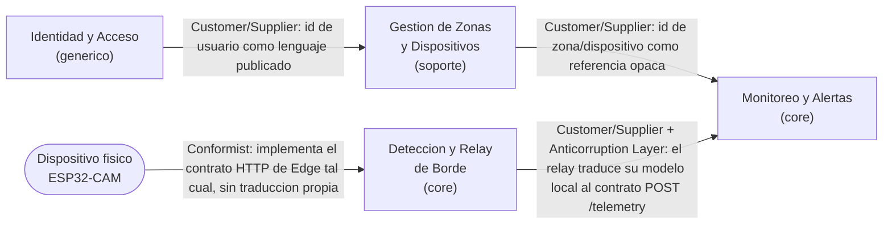

Ningun contexto llama al de Identidad y Acceso en tiempo de ejecucion mas alla del login: el JWT es autocontenido y cada contexto lo valida por su cuenta contra el mismo secreto compartido, asi que la relacion con Identidad y Acceso es de tipo Published Language mas que de llamada activa. Monitoreo y Alertas y Gestion de Zonas y Dispositivos hoy comparten una unica base PostgreSQL, lo cual simplifica el MVP pero es una decision a revisar si el sistema crece a multiples clientes con aislamiento de datos mas estricto.

### 4.1.3. Software Architecture

SecurIoT es un sistema distribuido de cuatro capas: aplicaciones cliente (Web App en Angular y Mobile App en Flutter), un backend hospedado (Cloud API en NestJS con PostgreSQL), un servicio de borde por instalacion (Edge API en Flask con buffer local SQLite y reconocimiento ArcFace) y firmware embebido (ESP32-S3 con deteccion corporal YOLO). Los siguientes diagramas siguen el modelo C4 y se generan exclusivamente desde el modelo [Structurizr DSL](docs/architecture/workspace.dsl). El ESP32 ejecuta la deteccion corporal antes de enviar frames candidatos al Edge; el Edge ejecuta ArcFace, conserva los embeddings biometricos localmente y solo inicia conexiones salientes hacia el backend hospedado.

#### 4.1.3.1. Software Architecture System Landscape Diagram

La plataforma no depende de sistemas externos de terceros (sin pasarelas de pago, SMS o email en el alcance actual). La Landing Page es un sitio informativo aislado, sin llamadas a la API.

#### 4.1.3.2. Software Architecture Context Level Diagrams

#### 4.1.3.3. Software Architecture Container Level Diagrams

El hardware ESP32 queda fuera del limite punteado de la plataforma. Dentro del dispositivo se ejecuta YOLO para detectar personas/cuerpos y reducir el volumen de frames enviados. Dentro del Edge se ejecuta ArcFace para producir y comparar embeddings; el buffer SQLite y el repositorio local de identidades permiten seguir operando sin conectividad.

#### 4.1.3.4. Software Architecture Deployment Diagrams

El diagrama de despliegue separa explicitamente el hardware ESP32, el Edge Host de la instalacion y la infraestructura hospedada. El backend no abre conexiones hacia la red local: el Edge inicia el envio de resultados y telemetria por HTTPS con retry/backoff.

## 4.2. Tactical-Level Domain-Driven Design

Esta sección detalla, para cada uno de los cuatro bounded contexts identificados en 4.1.1.1, sus capas de Domain, Interface, Application e Infrastructure, más los diagramas de componentes, clases y base de datos a nivel de código.

### 4.2.1. Bounded Context: Monitoreo y Alertas

Elegimos este contexto para el detalle tactico porque es el subdominio core de la Cloud API: convierte lecturas crudas de sensores en alertas que el operador realmente usa. Vive en `securiot-cloud-api/src/telemetry` y `src/alerts`.

#### 4.2.1.1. Domain Layer

- `Reading` (raiz de agregado): `readingId` (unico), `deviceId`, `zoneId`, `sensorType`, `value`, `recordedAt`. La unicidad de `readingId` es el invariante central: garantiza que reenviar la misma lectura, algo que pasa seguido por el retry del relay de borde, nunca la duplica.
- `Alert` (raiz de agregado): referencia a `zone`, `device` y, opcionalmente, a la `reading` que la origino; ademas `ruleType`, `severity`, `status` y `message`. Tambien tiene `readingId` unico, asi que una lectura genera como maximo una alerta.
- Regla de dominio `evaluateRule`: hoy implementa una unica regla, `door_contact_open` (sensor `door_contact` con valor `open` genera una alerta de severidad `medium`). El metodo esta separado de la insercion de la lectura justamente para poder agregar mas reglas sin tocar el flujo de ingestion.

#### 4.2.1.2. Interface Layer

| Endpoint | Guard | Descripcion |
|---|---|---|
| `POST /api/v1/telemetry` | `DeviceApiKeyGuard` (header `X-Device-Key`) | Ingesta una lectura, idempotente por `reading_id` |
| `GET /api/v1/telemetry` | `JwtAuthGuard` | Lista lecturas filtrables por `device_id`, `zone_id` y rango de fechas |
| `GET /api/v1/alerts` | `JwtAuthGuard` | Lista alertas de las zonas del usuario autenticado, filtrables por zona, dispositivo y estado |

Los cuerpos de request se validan con DTOs de `class-validator` (`CreateReadingDto`, `QueryReadingsDto`, `QueryAlertsDto`) y cada endpoint esta documentado con decoradores de `@nestjs/swagger`.

#### 4.2.1.3. Application Layer

- `TelemetryService.ingest(dto, device)`: inserta la lectura con `INSERT ... ON CONFLICT DO NOTHING` (`orIgnore`) y delega la evaluacion de reglas a `AlertsService.evaluateRule`. Ambos pasos ocurren en la misma llamada, para que el operador vea la alerta apenas el dispositivo reporta.
- `TelemetryService.findAll(query)`: consulta de lecturas con filtros opcionales.
- `AlertsService.evaluateRule(reading)`: aplica la regla de dominio y persiste la alerta si corresponde, tambien con `orIgnore` para respetar la unicidad por `readingId`.
- `AlertsService.findAllForOwner(ownerId, query)`: hace join contra `Zone` para devolver solo alertas de zonas del usuario autenticado, sin exponer datos de otros clientes.

#### 4.2.1.4. Infrastructure Layer

- `Repository<Reading>` y `Repository<Alert>` de TypeORM, sobre PostgreSQL en produccion (SQLite como fallback de desarrollo local, ver `src/config/typeorm.config.ts`).
- `DeviceApiKeyGuard`: valida el header `X-Device-Key` contra la tabla `devices`, cruzando hacia el contexto de Gestion de Zonas y Dispositivos.
- `JwtAuthGuard` + `JwtStrategy`: validan el JWT emitido por Identidad y Acceso sin llamarlo en tiempo de ejecucion.

#### 4.2.1.5. Bounded Context Software Architecture Component Level Diagrams

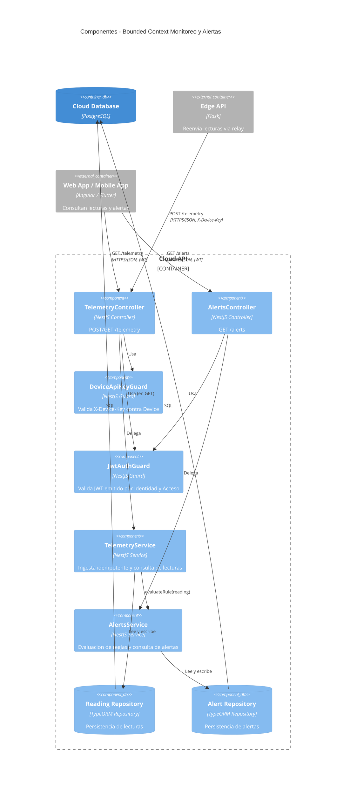

#### 4.2.1.6. Bounded Context Software Architecture Code Level Diagrams

#### 4.2.1.6.1. Bounded Context Domain Layer Class Diagrams

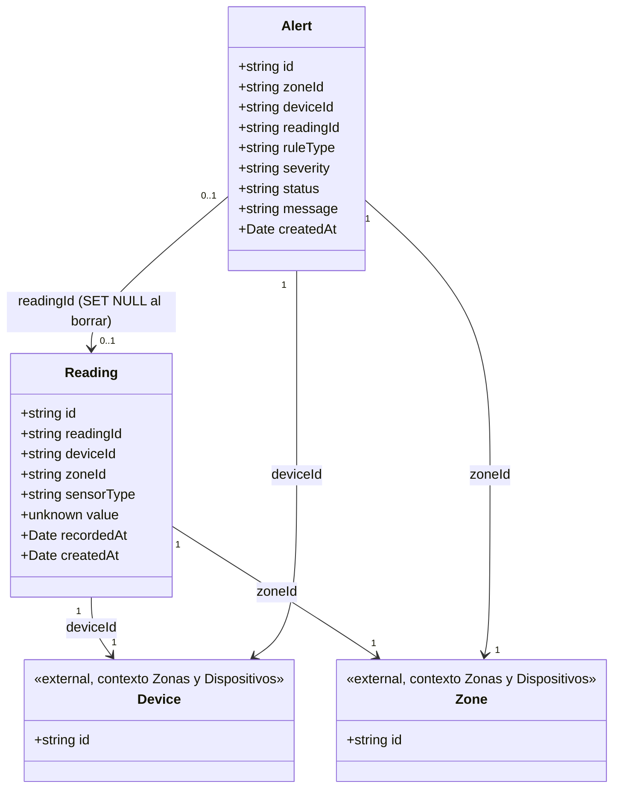

#### 4.2.1.6.2. Bounded Context Database Design Diagram

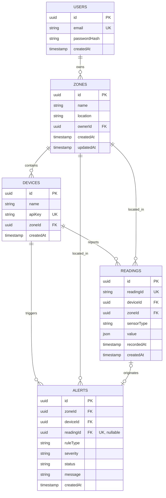

`USERS`, `ZONES` y `DEVICES` pertenecen a otros bounded contexts (Identidad y Acceso, y Gestion de Zonas y Dispositivos) y se muestran aqui solo como referencia, porque hoy las cinco tablas viven en la misma base PostgreSQL. `READINGS` y `ALERTS` son las tablas propias de este contexto.

### 4.2.2. Bounded Context: Identidad y Acceso

Este contexto es el subdominio generico de la Cloud API: no tiene reglas de negocio propias del dominio de seguridad patrimonial, solo autentica y emite el token que el resto de la plataforma confia sin volver a consultarlo. Se incluye en el detalle tactico porque cada uno de los otros tres contextos depende de el para proteger sus propios endpoints. Vive en `securiot-cloud-api/src/auth` y `src/users`.

#### 4.2.2.1. Domain Layer

- `User` (raiz de agregado): `id` (uuid), `email`, `passwordHash`, `createdAt`. Constraint de unicidad sobre `email` a nivel de entidad (`@Unique(['email'])`), sin otros campos, no hay roles ni soft-delete.
- Invariante de dominio: la contrasena nunca se compara ni se guarda en texto plano. `AuthService.validateUser` usa `bcrypt.compare` contra `passwordHash`; el hashing en si ocurre antes de llegar a `UsersService.create`, no dentro del servicio.
- No existe endpoint de registro publico: `UsersService.create` existe a nivel de servicio pero ningun controller lo expone, lo que sugiere un flujo de alta de usuarios administrado fuera de la API publica (seed o proceso interno).

#### 4.2.2.2. Interface Layer

| Endpoint | Guard | DTO | Descripcion |
|---|---|---|---|
| `POST /api/v1/auth/login` | Ninguno (publico) | `LoginDto` (`email`, `password`) | Autentica con email y password, retorna `{ access_token }` |

El unico controller (`AuthController`) fuerza `200 OK` en la respuesta del login en vez del `201` por defecto de un POST, y documenta con `@nestjs/swagger` las respuestas 200, 400 y 401. `JwtAuthGuard` se define y exporta desde este contexto, pero no protege ningun endpoint propio: su rol es proteger endpoints de los otros tres bounded contexts (tal como se ve en `jwtGuard` dentro de Monitoreo y Alertas, seccion 4.2.1.5).

#### 4.2.2.3. Application Layer

- `AuthService.validateUser(email, password)`: busca el usuario por email vía `UsersService.findByEmail`; si no existe o falla la comparacion `bcrypt`, lanza `UnauthorizedException`; si es valido, retorna el `User` completo.
- `AuthService.login(email, password)`: llama a `validateUser`, arma el payload `{ sub: user.id, email: user.email }` y lo firma con `jwtService.sign`. Efecto secundario unico: la emision del JWT, sin registro de sesion ni persistencia adicional.
- `UsersService.findByEmail` / `UsersService.create`: metodos casi passthrough sobre el repositorio, sin logica de negocio propia mas alla de asumir que `passwordHash` ya llega hasheado.

#### 4.2.2.4. Infrastructure Layer

- Repositorio TypeORM estandar (`Repository<User>`) sobre la misma base de datos que el resto de contextos (Postgres en produccion, SQLite via `better-sqlite3` como fallback local, `synchronize: true`, confirmado en `src/config/typeorm.config.ts`).
- `JwtStrategy` extrae el token del header `Authorization: Bearer`, valida su expiracion (`ignoreExpiration: false`) y su firma contra `JWT_SECRET` (con un valor de respaldo hardcodeado si la variable de entorno no esta configurada, algo a corregir antes de un despliegue real). `JwtModule` firma con `JWT_EXPIRES_IN` (por defecto una hora).
- `JwtAuthGuard` es una clase minima que delega toda la validacion en la estrategia passport-jwt registrada, sin logica propia.

#### 4.2.2.5. Bounded Context Software Architecture Component Level Diagrams

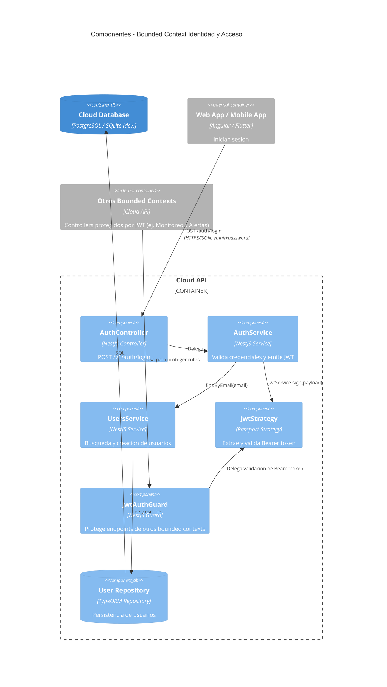

#### 4.2.2.6. Bounded Context Software Architecture Code Level Diagrams

#### 4.2.2.6.1. Bounded Context Domain Layer Class Diagrams

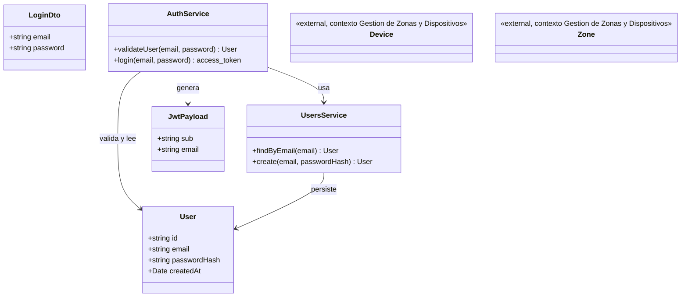

`User` no tiene relaciones de asociacion de TypeORM hacia `Device` o `Zone`; se incluyen como stubs externos solo porque comparten la misma base de datos, no porque exista una FK explicita en `User`.

#### 4.2.2.6.2. Bounded Context Database Design Diagram

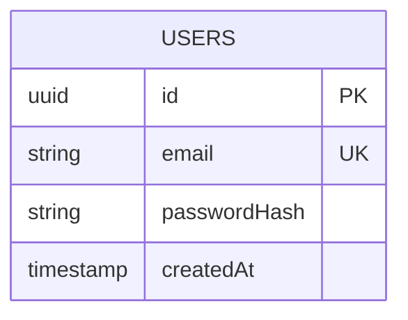

Unica tabla del contexto: PK `id` (uuid), `email` con constraint unico, `passwordHash`, `createdAt`. Sin columnas adicionales ni foreign keys.

### 4.2.3. Bounded Context: Gestion de Zonas y Dispositivos

Este es el subdominio de soporte: mantiene el catalogo de zonas de cada cliente y los dispositivos IoT asignados a cada una, incluyendo la emision del `apiKey` que un dispositivo fisico usa para autenticarse ante el resto de la plataforma. Es necesario para que Monitoreo y Alertas y Deteccion y Relay de Borde tengan sentido, pero no es, por si solo, la ventaja diferencial del producto. Vive en `securiot-cloud-api/src/zones` y `src/devices`.

#### 4.2.3.1. Domain Layer

- `Zone` (raiz de agregado): `id`, `name`, `location` (opcional), `ownerId`, relacion `ManyToOne` a `User` con `onDelete: 'CASCADE'`, `createdAt`, `updatedAt`.
- `Device` (raiz de agregado): `id`, `name`, `apiKey` (unico, `@Unique(['apiKey'])`), relacion `ManyToOne` a `Zone` con `onDelete: 'CASCADE'`, `zoneId`, `createdAt`.
- Invariantes verificados en codigo: un dispositivo pertenece a exactamente una zona; una zona pertenece a exactamente un usuario dueno; el `apiKey` se genera con `crypto.randomBytes(24).toString('hex')` al crear el dispositivo y se persiste en texto plano.
- El `apiKey` se muestra completo solo una vez: `DeviceResponseDto` (usado en las listas y el detalle) no incluye `apiKey`; solo `DeviceCreatedResponseDto`, que extiende al anterior y es el tipo de retorno exclusivo de `POST /devices`, lo incluye. El propio codigo lo documenta en un comentario: "The response apiKey is shown in full only here. It is never returned again by any other endpoint."

#### 4.2.3.2. Interface Layer

| Endpoint | Guard | DTO / Query | Descripcion |
|---|---|---|---|
| `POST /api/v1/zones` | `JwtAuthGuard` | `CreateZoneDto` | Crea una zona para el usuario autenticado |
| `GET /api/v1/zones` | `JwtAuthGuard` | — | Lista zonas del usuario autenticado |
| `GET /api/v1/zones/:id` | `JwtAuthGuard` | — | Obtiene una zona por id, solo si pertenece al usuario |
| `PATCH /api/v1/zones/:id` | `JwtAuthGuard` | `UpdateZoneDto` | Actualiza una zona propia |
| `DELETE /api/v1/zones/:id` | `JwtAuthGuard` | — | Elimina una zona propia |
| `POST /api/v1/devices` | `JwtAuthGuard` | `CreateDeviceDto` | Registra un dispositivo bajo una zona propia; retorna el apiKey por unica vez |
| `GET /api/v1/devices` | `JwtAuthGuard` | query opcional `zone_id` | Lista dispositivos del usuario, sin apiKey |
| `GET /api/v1/devices/:id` | `JwtAuthGuard` | — | Detalle de un dispositivo con estado online/offline y ultima lectura |

Todos protegidos por `JwtAuthGuard` (contexto Identidad y Acceso) y documentados con `@ApiBearerAuth()`.

#### 4.2.3.3. Application Layer

- `ZonesService.create/findAllForOwner/findOneForOwner/update/remove`: el ownership se resuelve filtrando siempre por `ownerId` en la consulta (`findOne({ where: { id, ownerId } })`), de forma que una zona ajena nunca se distingue de una zona inexistente (ambas devuelven `NotFoundException`).
- `DevicesService.create(dto, ownerId)`: primero busca la zona con `{ id: dto.zoneId, ownerId }` para verificar que existe y pertenece al usuario; si pasa, genera el `apiKey` y crea el dispositivo; retorna la respuesta que incluye el apiKey una unica vez.
- `DevicesService.findAllForOwner`: usa `createQueryBuilder` con `leftJoin` a `Zone` y filtra por `zone.ownerId`, es decir el ownership de un dispositivo se resuelve siempre a traves de su zona, nunca con una columna de dueno directa en `Device`.
- `DevicesService.getStatus(device)`: busca la ultima `Reading` del dispositivo por `deviceId` y calcula `isOnline` comparando su antigüedad contra `DEVICE_ONLINE_WINDOW_SECONDS` (variable de entorno, 300 segundos por defecto). Este es el unico punto donde el contexto consulta directamente una entidad de Monitoreo y Alertas.

#### 4.2.3.4. Infrastructure Layer

- Repositorios TypeORM estandar para `Zone` y `Device`. `DevicesModule` registra ademas la entidad `Reading` (de `src/telemetry`) para poder resolver `getStatus`, un acoplamiento directo y explicito entre este contexto y Monitoreo y Alertas.
- Relacion con Identidad y Acceso: `Zone.ownerId` es FK a `User`, con `onDelete: 'CASCADE'` (si se elimina el usuario dueno, se eliminan sus zonas y, en cascada, sus dispositivos).
- Relacion con Monitoreo y Alertas: `Reading`/`Alert` referencian `zoneId`/`deviceId` como FK hacia este contexto; el limite se cruza en la direccion opuesta solo para el calculo de estado online/offline.

#### 4.2.3.5. Bounded Context Software Architecture Component Level Diagrams

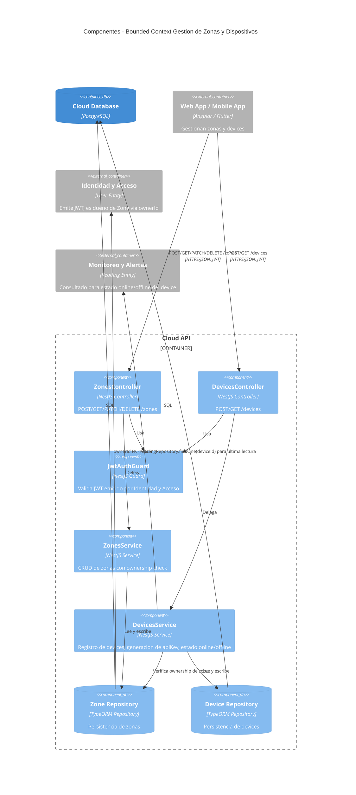

#### 4.2.3.6. Bounded Context Software Architecture Code Level Diagrams

#### 4.2.3.6.1. Bounded Context Domain Layer Class Diagrams

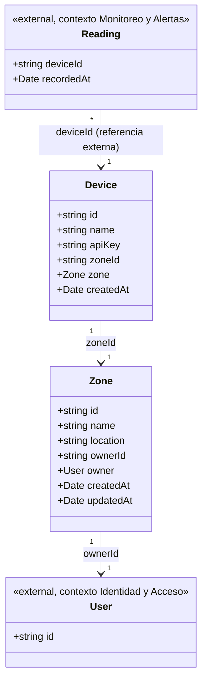

#### 4.2.3.6.2. Bounded Context Database Design Diagram

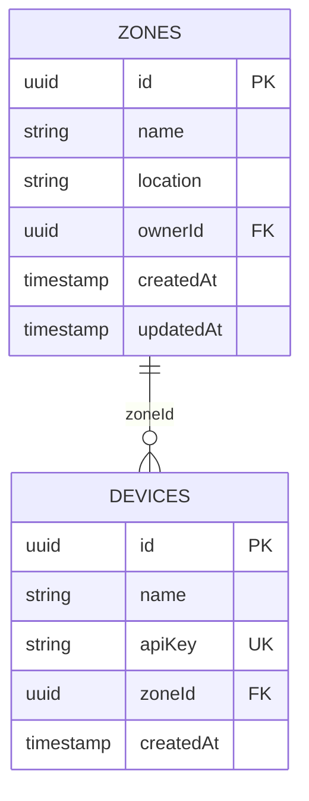

`location` es nullable en la entidad `Zone`; `apiKey` no lo es, siempre se genera al crear el dispositivo y nunca queda vacio.

### 4.2.4. Bounded Context: Deteccion y Relay de Borde

Junto con Monitoreo y Alertas, este es el otro subdominio core del producto: decide en el sitio, sin depender de la nube, si lo que ve la camara amerita una reaccion inmediata, y despues reenvia esa informacion a la nube tolerando cortes de red. Vive en `securiot-edge-api/app` (Flask + Peewee, buffer local en SQLite).

#### 4.2.4.1. Domain Layer

- Unico modelo Peewee, `Reading`: `reading_id` (unico), `device_id`, `zone_id`, `sensor_type`, `value`, `recorded_at`, `synced` (booleano, `False` por defecto), `sync_attempts` (entero, `0` por defecto), `next_attempt_at`, `created_at`. No existe una tabla separada de "evento de deteccion": una deteccion de camara se guarda como un `Reading` mas, con `sensor_type="camera_detection"`.
- Relay idempotente por `reading_id`: `reading_buffer.buffer_reading()` inserta con `on_conflict_ignore()`, apoyado en el constraint `unique=True` de `reading_id`, de forma que reenviar la misma lectura (algo frecuente por el reintento del propio relay) nunca la duplica.
- Backoff exponencial: `_backoff_seconds(sync_attempts) = min(2 ** sync_attempts, 300)`, techo de 300 segundos. El ciclo de relay solo selecciona lecturas no sincronizadas cuyo `next_attempt_at` ya vencio (o es nulo).
- Debounce de detecciones: `debounce.record(device_id, qualifying)` lleva un contador en memoria por dispositivo (umbral por defecto de 2, configurable via `DETECTION_DEBOUNCE_COUNT`) y devuelve `escalate=True` una sola vez, exactamente en el frame donde el contador alcanza el umbral, no en los siguientes.
- Cooldown del actuador de puerta: un dispositivo no vuelve a disparar `door_action` para el mismo device hasta que pasan `DOOR_ACTION_COOLDOWN_SECONDS` (30 segundos por defecto) desde el ultimo disparo, aunque el tracking de camara (pan/tilt) sigue activo durante todo el episodio.

#### 4.2.4.2. Interface Layer

| Endpoint | Auth | Acepta | Retorna | Descripcion |
|---|---|---|---|---|
| `POST /ingest` | Header `X-Device-Key` contra un secreto compartido | JSON: `reading_id, device_id, zone_id, sensor_type, value, recorded_at` | `201 {"status":"buffered"}` | Ingesta generica de lecturas de sensores (PIR, reed switch, ultrasonico) |
| `POST /frames` | Header `X-Device-Key` | `multipart/form-data`: `device_id`, `zone_id`, `frame` (imagen), opcional ancho/alto | `200 {"pan_delta","tilt_delta","door_action","alert"}` | Recibe un frame de la camara, corre deteccion y debounce, decide la reaccion inmediata |

`/frames` valida que la imagen sea decodificable antes de invocar el detector, como mitigacion explicita frente a un ataque de denegacion de servicio con archivos malformados.

#### 4.2.4.3. Application Layer

Flujo de `/frames`, de principio a fin: valida la clave del dispositivo, valida y guarda la imagen recibida, obtiene un detector (mock o YOLO segun configuracion), filtra las detecciones a las clases que importan (persona, o un objeto permitido configurable), pasa el resultado por `debounce.record` para decidir si escala, y si el episodio esta activo calcula el desplazamiento de pan/tilt hacia la persona detectada. En paralelo, siempre bufferiza una lectura `camera_detection`, y si el cooldown de puerta ya vencio, bufferiza tambien una lectura `door_contact` y devuelve la orden de bloqueo. El relay hacia la nube no ocurre dentro de esta peticion: un `BackgroundScheduler` (APScheduler) dispara `relay_cycle()` cada `RELAY_INTERVAL_SECONDS` (10 segundos por defecto), que selecciona las lecturas pendientes de sincronizar y las envia una por una.

#### 4.2.4.4. Infrastructure Layer

- Persistencia local: SQLite (Peewee), unica tabla `Reading`, que actua como buffer de tolerancia a desconexion. Todo lo que entra por `/ingest` o `/frames` se guarda localmente antes de intentar llegar a la nube, lo que permite operar sin conexion y reintentar despues.
- Cliente de relay: `POST {CLOUD_API_URL}/api/v1/telemetry` con header `X-Device-Key: CLOUD_DEVICE_API_KEY`, hacia el endpoint de ingesta de Monitoreo y Alertas en la Cloud API. Un 2xx marca la lectura como sincronizada; cualquier otro resultado incrementa `sync_attempts` y aplica el backoff descrito en la capa de dominio.
- Configuracion relevante via variables de entorno: `DEVICE_SHARED_SECRET`, `CLOUD_API_URL`, `CLOUD_DEVICE_API_KEY`, `RELAY_INTERVAL_SECONDS`, `DETECTION_BACKEND` (mock o yolo), `DETECTION_DEBOUNCE_COUNT`, `DOOR_ACTION_COOLDOWN_SECONDS`, `MAX_CONTENT_LENGTH` (2 MB por defecto, otro limite anti-DoS).

#### 4.2.4.5. Bounded Context Software Architecture Component Level Diagrams

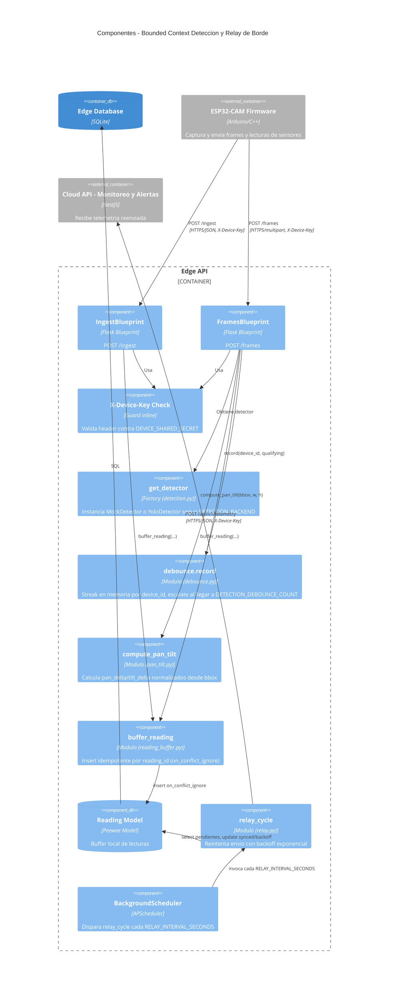

#### 4.2.4.6. Bounded Context Software Architecture Code Level Diagrams

#### 4.2.4.6.1. Bounded Context Domain Layer Class Diagrams

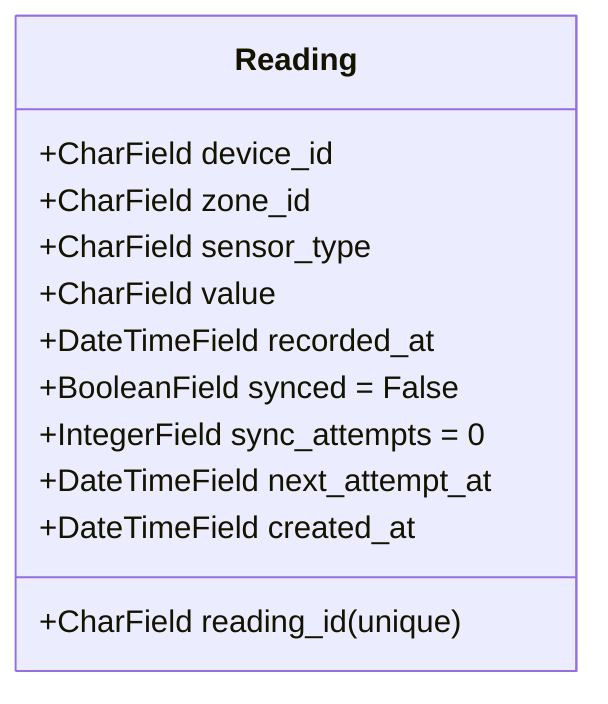

#### 4.2.4.6.2. Bounded Context Database Design Diagram

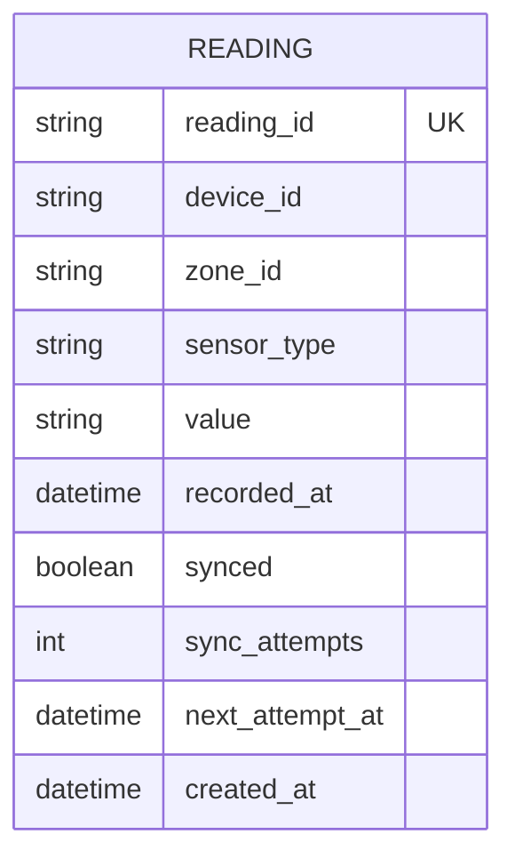

Esta tabla vive unicamente en el SQLite local del Edge API. Es distinta de `READINGS`, la tabla de Postgres del contexto Monitoreo y Alertas (seccion 4.2.1.6.2): la del Edge es un buffer temporal de transito, la de la nube es el registro persistente que consultan el Web App y el Mobile App.

# Capítulo V: Solution UI/UX Design

_Pendiente de desarrollo._

## 5.1. Style Guidelines

_Pendiente de desarrollo._

### 5.1.1. General Style Guidelines

_Pendiente de desarrollo._

### 5.1.2. Web, Mobile and IoT Style Guidelines

_Pendiente de desarrollo._

## 5.2. Information Architecture

_Pendiente de desarrollo._

### 5.2.1. Organization Systems

_Pendiente de desarrollo._

### 5.2.2. Labeling Systems

_Pendiente de desarrollo._

### 5.2.3. SEO Tags and Meta Tags

_Pendiente de desarrollo._

### 5.2.4. Searching Systems

_Pendiente de desarrollo._

### 5.2.5. Navigation Systems

_Pendiente de desarrollo._

## 5.3. Landing Page UI Design

_Pendiente de desarrollo._

### 5.3.1. Landing Page Wireframe

_Pendiente de desarrollo._

### 5.3.2. Landing Page Mock-up

_Pendiente de desarrollo._

## 5.4. Applications UX/UI Design

_Pendiente de desarrollo._

### 5.4.1. Applications Wireframes

_Pendiente de desarrollo._

### 5.4.2. Applications Wireflow Diagrams

_Pendiente de desarrollo._

### 5.4.3. Applications Mock-ups

_Pendiente de desarrollo._

### 5.4.4. Applications User Flow Diagrams

_Pendiente de desarrollo._

## 5.5. Applications Prototyping

_Pendiente de desarrollo._

## 5.6. IoT Device Design

_Pendiente de desarrollo._

# Capítulo VI: Product Implementation, Validation & Deployment

_Pendiente de desarrollo._

## 6.1. Software Configuration Management

_Pendiente de desarrollo._

### 6.1.1. Software Development Environment Configuration

_Pendiente de desarrollo._

### 6.1.2. Source Code Management

_Pendiente de desarrollo._

### 6.1.3. Source Code Style Guide & Conventions

_Pendiente de desarrollo._

### 6.1.4. Software Deployment Configuration

_Pendiente de desarrollo._

## 6.2. Landing Page, Services & Applications Implementation

_Pendiente de desarrollo._

### 6.2.1. Sprint 1

_Pendiente de desarrollo._

#### 6.2.1.1. Sprint Planning 1

_Pendiente de desarrollo._

#### 6.2.1.2. Aspect Leaders and Collaborators

_Pendiente de desarrollo._

#### 6.2.1.3. Sprint Backlog 1

_Pendiente de desarrollo._

#### 6.2.1.4. Development Evidence for Sprint Review

_Pendiente de desarrollo._

#### 6.2.1.5. Testing Suite Evidence for Sprint Review

_Pendiente de desarrollo._

#### 6.2.1.6. Execution Evidence for Sprint Review

_Pendiente de desarrollo._

#### 6.2.1.7. Services Documentation Evidence for Sprint Review

_Pendiente de desarrollo._

#### 6.2.1.8. Software Deployment Evidence for Sprint Review

_Pendiente de desarrollo._

#### 6.2.1.9. Team Collaboration Insights during Sprint

_Pendiente de desarrollo._

### 6.2.2. Sprint 2

_Pendiente de desarrollo._

#### 6.2.2.1. Sprint Planning 2

_Pendiente de desarrollo._

#### 6.2.2.2. Aspect Leaders and Collaborators

_Pendiente de desarrollo._

#### 6.2.2.3. Sprint Backlog 2

_Pendiente de desarrollo._

#### 6.2.2.4. Development Evidence for Sprint Review

_Pendiente de desarrollo._

#### 6.2.2.5. Testing Suite Evidence for Sprint Review

_Pendiente de desarrollo._

#### 6.2.2.6. Execution Evidence for Sprint Review

_Pendiente de desarrollo._

#### 6.2.2.7. Services Documentation Evidence for Sprint Review

_Pendiente de desarrollo._

#### 6.2.2.8. Software Deployment Evidence for Sprint Review

_Pendiente de desarrollo._

#### 6.2.2.9. Team Collaboration Insights during Sprint

_Pendiente de desarrollo._

### 6.2.3. Sprint 3

_Pendiente de desarrollo._

#### 6.2.3.1. Sprint Planning 3

_Pendiente de desarrollo._

#### 6.2.3.2. Aspect Leaders and Collaborators

_Pendiente de desarrollo._

#### 6.2.3.3. Sprint Backlog 3

_Pendiente de desarrollo._

#### 6.2.3.4. Development Evidence for Sprint Review

_Pendiente de desarrollo._

#### 6.2.3.5. Testing Suite Evidence for Sprint Review

_Pendiente de desarrollo._

#### 6.2.3.6. Execution Evidence for Sprint Review

_Pendiente de desarrollo._

#### 6.2.3.7. Services Documentation Evidence for Sprint Review

_Pendiente de desarrollo._

#### 6.2.3.8. Software Deployment Evidence for Sprint Review

_Pendiente de desarrollo._

#### 6.2.3.9. Team Collaboration Insights during Sprint

_Pendiente de desarrollo._

## 6.3. Validation Interviews

_Pendiente de desarrollo._

### 6.3.1. Diseño de Entrevistas

_Pendiente de desarrollo._

### 6.3.2. Registro de Entrevistas

_Pendiente de desarrollo._

### 6.3.3. Evaluaciones según heurísticas

_Pendiente de desarrollo._

## 6.4. Video About-the-Product

_Pendiente de desarrollo._

# Conclusiones

_Pendiente de desarrollo._

## Conclusiones y recomendaciones

_Pendiente de desarrollo._

## Video About-the-Team

_Pendiente de desarrollo._

# Bibliografía

_Pendiente de desarrollo._

# Anexos

_Pendiente de desarrollo._
